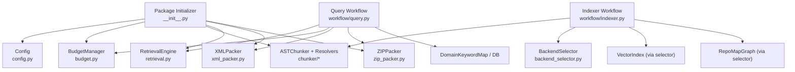
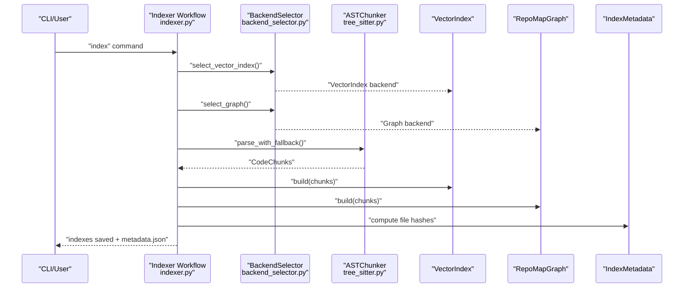
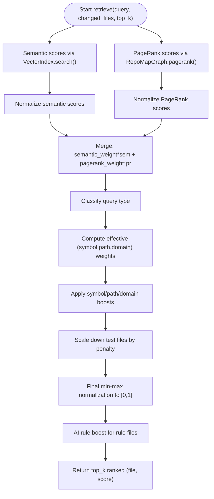
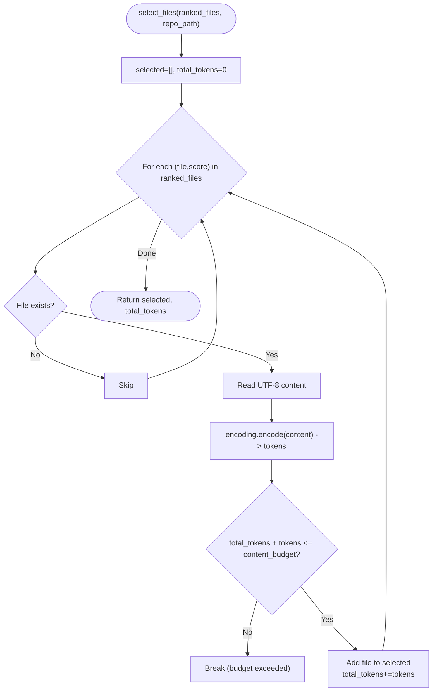
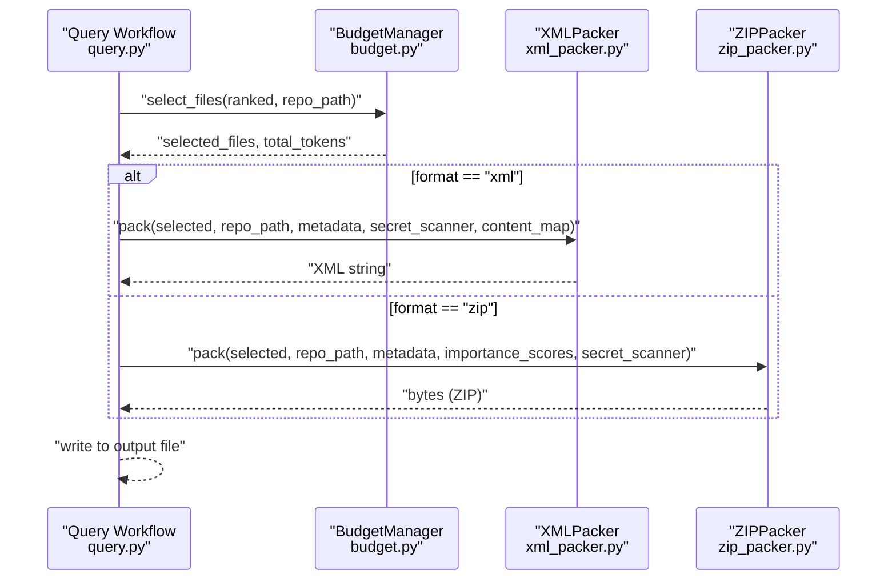
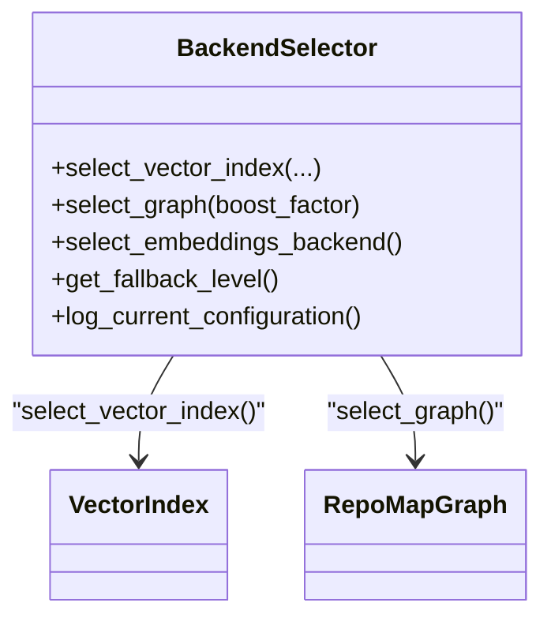
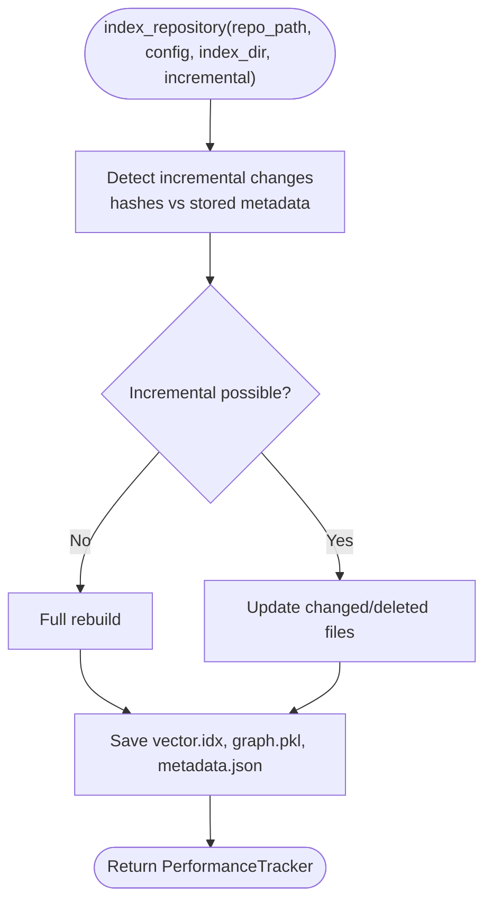
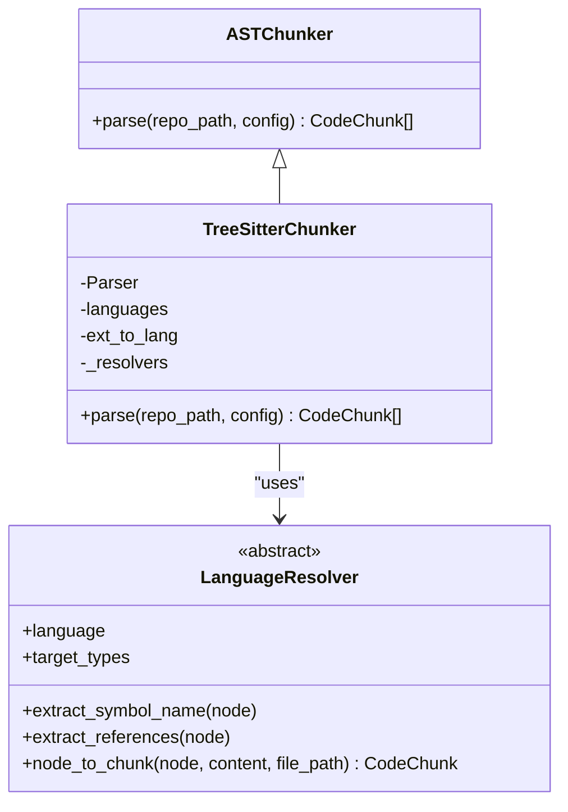
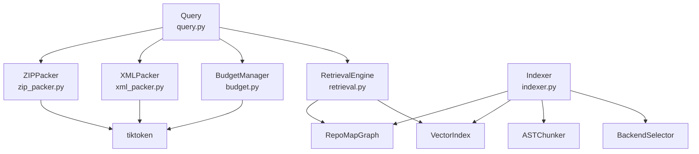

# Feature Highlights

<cite>
**Referenced Files in This Document**
- [__init__.py](file://src/ws_ctx_engine/__init__.py)
- [ranker.py](file://src/ws_ctx_engine/ranking/ranker.py)
- [phase_ranker.py](file://src/ws_ctx_engine/ranking/phase_ranker.py)
- [budget.py](file://src/ws_ctx_engine/budget/budget.py)
- [xml_packer.py](file://src/ws_ctx_engine/packer/xml_packer.py)
- [zip_packer.py](file://src/ws_ctx_engine/packer/zip_packer.py)
- [config.py](file://src/ws_ctx_engine/config/config.py)
- [indexer.py](file://src/ws_ctx_engine/workflow/indexer.py)
- [query.py](file://src/ws_ctx_engine/workflow/query.py)
- [tree_sitter.py](file://src/ws_ctx_engine/chunker/tree_sitter.py)
- [base.py](file://src/ws_ctx_engine/chunker/base.py)
- [base.py](file://src/ws_ctx_engine/chunker/resolvers/base.py)
- [backend_selector.py](file://src/ws_ctx_engine/backend_selector/backend_selector.py)
- [retrieval.py](file://src/ws_ctx_engine/retrieval/retrieval.py)
- [models.py](file://src/ws_ctx_engine/models/models.py)
</cite>

## Table of Contents
1. [Introduction](#introduction)
2. [Project Structure](#project-structure)
3. [Core Components](#core-components)
4. [Architecture Overview](#architecture-overview)
5. [Detailed Component Analysis](#detailed-component-analysis)
6. [Dependency Analysis](#dependency-analysis)
7. [Performance Considerations](#performance-considerations)
8. [Troubleshooting Guide](#troubleshooting-guide)
9. [Conclusion](#conclusion)

## Introduction
This document highlights the key features and capabilities of ws-ctx-engine that together deliver production-grade, AI-assisted development workflows. It focuses on:
- Hybrid ranking combining semantic search with PageRank for superior code relevance
- Token budget management with precise tiktoken counting and greedy selection
- Dual output format system supporting XML for paste workflows and ZIP for upload workflows, with format-specific optimizations
- Production-ready fallback strategy ensuring reliability even with missing dependencies
- Incremental indexing for fast repeated queries
- Flexible configuration options including custom weights, file filters, and backend selection
- AST parsing capabilities with tree-sitter support for 40+ languages and fallback regex parsing

## Project Structure
At a high level, ws-ctx-engine is organized around workflows (index and query), retrieval and ranking, chunking and parsing, budgeting, packaging, configuration, and backend selection. The public API surface is exposed via the package initializer.

**Diagram sources**
- [__init__.py:8-32](file://src/ws_ctx_engine/__init__.py#L8-L32)
- [config.py:16-110](file://src/ws_ctx_engine/config/config.py#L16-L110)
- [budget.py:8-105](file://src/ws_ctx_engine/budget/budget.py#L8-L105)
- [tree_sitter.py:15-160](file://src/ws_ctx_engine/chunker/tree_sitter.py#L15-L160)
- [base.py:7-70](file://src/ws_ctx_engine/chunker/resolvers/base.py#L7-L70)
- [retrieval.py:140-368](file://src/ws_ctx_engine/retrieval/retrieval.py#L140-L368)
- [xml_packer.py:51-239](file://src/ws_ctx_engine/packer/xml_packer.py#L51-L239)
- [zip_packer.py:17-254](file://src/ws_ctx_engine/packer/zip_packer.py#L17-L254)
- [indexer.py:72-371](file://src/ws_ctx_engine/workflow/indexer.py#L72-L371)
- [query.py:230-617](file://src/ws_ctx_engine/workflow/query.py#L230-L617)
- [backend_selector.py:13-191](file://src/ws_ctx_engine/backend_selector/backend_selector.py#L13-L191)

**Section sources**
- [__init__.py:1-33](file://src/ws_ctx_engine/__init__.py#L1-L33)
- [config.py:16-110](file://src/ws_ctx_engine/config/config.py#L16-L110)

## Core Components
- Hybrid ranking: RetrievalEngine merges semantic similarity and PageRank scores, then applies symbol/path/domain boosts and test penalties, finally normalizing to [0, 1].
- Token budgeting: BudgetManager greedily selects files up to a content budget derived from the total token budget, using tiktoken for precise counting.
- Dual output formats: XMLPacker produces Repomix-style XML with metadata and file contents; ZIPPacker creates archives with preserved structure and a REVIEW_CONTEXT.md manifest.
- Production fallback: BackendSelector implements a graceful fallback chain across vector index, graph, and embeddings backends; indexing gracefully handles missing dependencies and falls back to minimal modes.
- Incremental indexing: Indexer detects changed/deleted files and updates only those, preserving unchanged embeddings via an embedding cache.
- Flexible configuration: Config supports output format, token budget, semantic/pagerank weights, include/exclude patterns, backend selection, embeddings, performance flags, and AI rule persistence.
- AST parsing: TreeSitterChunker parses supported languages with resolvers; fallback regex parsing ensures broader coverage; base chunker utilities handle ignore specs and file inclusion decisions.

**Section sources**
- [retrieval.py:140-368](file://src/ws_ctx_engine/retrieval/retrieval.py#L140-L368)
- [budget.py:8-105](file://src/ws_ctx_engine/budget/budget.py#L8-L105)
- [xml_packer.py:51-239](file://src/ws_ctx_engine/packer/xml_packer.py#L51-L239)
- [zip_packer.py:17-254](file://src/ws_ctx_engine/packer/zip_packer.py#L17-L254)
- [backend_selector.py:13-191](file://src/ws_ctx_engine/backend_selector/backend_selector.py#L13-L191)
- [indexer.py:72-371](file://src/ws_ctx_engine/workflow/indexer.py#L72-L371)
- [config.py:16-110](file://src/ws_ctx_engine/config/config.py#L16-L110)
- [tree_sitter.py:15-160](file://src/ws_ctx_engine/chunker/tree_sitter.py#L15-L160)
- [base.py:118-176](file://src/ws_ctx_engine/chunker/base.py#L118-L176)

## Architecture Overview
The system orchestrates indexing and querying phases. Indexing builds AST chunks, vector index, graph, and metadata; querying retrieves hybrid-ranked files, enforces token budget, and packs outputs.

**Diagram sources**
- [indexer.py:72-371](file://src/ws_ctx_engine/workflow/indexer.py#L72-L371)
- [backend_selector.py:36-110](file://src/ws_ctx_engine/backend_selector/backend_selector.py#L36-L110)
- [tree_sitter.py:57-89](file://src/ws_ctx_engine/chunker/tree_sitter.py#L57-L89)

**Section sources**
- [indexer.py:72-371](file://src/ws_ctx_engine/workflow/indexer.py#L72-L371)
- [backend_selector.py:13-191](file://src/ws_ctx_engine/backend_selector/backend_selector.py#L13-L191)

## Detailed Component Analysis

### Hybrid Ranking: Semantic + PageRank + Signals
Hybrid ranking combines semantic similarity and structural PageRank, then enriches with symbol/path/domain signals and test penalties. Scores are normalized to [0, 1].

**Diagram sources**
- [retrieval.py:250-368](file://src/ws_ctx_engine/retrieval/retrieval.py#L250-L368)
- [ranker.py:28-86](file://src/ws_ctx_engine/ranking/ranker.py#L28-L86)

**Section sources**
- [retrieval.py:140-368](file://src/ws_ctx_engine/retrieval/retrieval.py#L140-L368)
- [ranker.py:28-86](file://src/ws_ctx_engine/ranking/ranker.py#L28-L86)

### Token Budget Management: Greedy Knapsack with tiktoken
BudgetManager reserves 20% for metadata and selects files greedily by descending importance score until the content budget is exhausted. tiktoken is used for precise token counting.

**Diagram sources**
- [budget.py:50-105](file://src/ws_ctx_engine/budget/budget.py#L50-L105)

**Section sources**
- [budget.py:8-105](file://src/ws_ctx_engine/budget/budget.py#L8-L105)
- [models.py:60-84](file://src/ws_ctx_engine/models/models.py#L60-L84)

### Dual Output Formats: XML and ZIP
- XMLPacker: Generates Repomix-style XML with metadata and file entries, including token counts and optional secret redaction. Includes a shuffle strategy to improve model recall by placing top-ranked files at both ends.
- ZIPPacker: Creates a ZIP archive with preserved directory structure under files/, and a REVIEW_CONTEXT.md manifest summarizing repository info, selected files with importance scores, and suggested reading order.

**Diagram sources**
- [query.py:381-587](file://src/ws_ctx_engine/workflow/query.py#L381-L587)
- [budget.py:50-105](file://src/ws_ctx_engine/budget/budget.py#L50-L105)
- [xml_packer.py:85-137](file://src/ws_ctx_engine/packer/xml_packer.py#L85-L137)
- [zip_packer.py:49-90](file://src/ws_ctx_engine/packer/zip_packer.py#L49-L90)

**Section sources**
- [xml_packer.py:51-239](file://src/ws_ctx_engine/packer/xml_packer.py#L51-L239)
- [zip_packer.py:17-254](file://src/ws_ctx_engine/packer/zip_packer.py#L17-L254)
- [query.py:413-587](file://src/ws_ctx_engine/workflow/query.py#L413-L587)

### Production-Ready Fallback Strategy
BackendSelector chooses optimal backends with graceful fallback:
- Vector index: NativeLEANN → LEANN → FAISS
- Graph: igraph → NetworkX → file-size ranking fallback
- Embeddings: local → API

Indexer and retrieval gracefully degrade when components fail, logging warnings and continuing with reduced functionality.

**Diagram sources**
- [backend_selector.py:13-191](file://src/ws_ctx_engine/backend_selector/backend_selector.py#L13-L191)

**Section sources**
- [backend_selector.py:13-191](file://src/ws_ctx_engine/backend_selector/backend_selector.py#L13-L191)
- [indexer.py:178-282](file://src/ws_ctx_engine/workflow/indexer.py#L178-L282)
- [retrieval.py:290-307](file://src/ws_ctx_engine/retrieval/retrieval.py#L290-L307)

### Incremental Indexing
Indexer detects changed/deleted files via SHA256 hashes and updates only those, leveraging an embedding cache to avoid re-embedding unchanged files. Metadata tracks staleness and supports auto-rebuild.

**Diagram sources**
- [indexer.py:27-69](file://src/ws_ctx_engine/workflow/indexer.py#L27-L69)
- [indexer.py:210-234](file://src/ws_ctx_engine/workflow/indexer.py#L210-L234)

**Section sources**
- [indexer.py:72-371](file://src/ws_ctx_engine/workflow/indexer.py#L72-L371)
- [models.py:87-152](file://src/ws_ctx_engine/models/models.py#L87-L152)

### Flexible Configuration Options
Config centralizes settings for:
- Output: format, token_budget, output_path
- Scoring: semantic_weight, pagerank_weight
- Filtering: include_tests, respect_gitignore, include_patterns, exclude_patterns
- Backends: vector_index, graph, embeddings
- Embeddings: model, device, batch_size, provider, API key env
- Performance: max_workers, cache_embeddings, incremental_index
- AI rule persistence: auto_detect, extra_files, boost

Validation ensures robust defaults and warnings for out-of-range values.

**Section sources**
- [config.py:16-399](file://src/ws_ctx_engine/config/config.py#L16-L399)

### AST Parsing with tree-sitter and Regex Fallback
TreeSitterChunker integrates py-tree-sitter with language-specific resolvers for Python, JavaScript, TypeScript, and Rust. Base utilities handle .gitignore compliance, file inclusion, and fallback warnings for unsupported extensions. Resolvers define target AST node types and extract symbols and references.

**Diagram sources**
- [tree_sitter.py:15-160](file://src/ws_ctx_engine/chunker/tree_sitter.py#L15-L160)
- [base.py:7-70](file://src/ws_ctx_engine/chunker/resolvers/base.py#L7-L70)

**Section sources**
- [tree_sitter.py:15-160](file://src/ws_ctx_engine/chunker/tree_sitter.py#L15-L160)
- [base.py:7-70](file://src/ws_ctx_engine/chunker/resolvers/base.py#L7-L70)
- [base.py:118-176](file://src/ws_ctx_engine/chunker/base.py#L118-L176)

### Phase-Aware Ranking for Agent Workflows
PhaseWeightConfig adjusts weights and behaviors per agent phase (Discovery, Edit, Test), including test/mock file boosts and token density caps. apply_phase_weights re-ranks results accordingly.

**Section sources**
- [phase_ranker.py:25-138](file://src/ws_ctx_engine/ranking/phase_ranker.py#L25-L138)

## Dependency Analysis
Key internal dependencies and coupling:
- RetrievalEngine depends on VectorIndex and RepoMapGraph; it normalizes and merges scores, then applies additional signals.
- BudgetManager depends on tiktoken for token counting and operates on lists of (file, score) tuples.
- XMLPacker and ZIPPacker both depend on tiktoken for token counting and on secret scanning when enabled.
- Indexer coordinates BackendSelector, ASTChunker, VectorIndex, Graph, and metadata persistence.
- Config drives weights, filters, and backend choices across components.

**Diagram sources**
- [retrieval.py:140-368](file://src/ws_ctx_engine/retrieval/retrieval.py#L140-L368)
- [budget.py:8-105](file://src/ws_ctx_engine/budget/budget.py#L8-L105)
- [xml_packer.py:51-239](file://src/ws_ctx_engine/packer/xml_packer.py#L51-L239)
- [zip_packer.py:17-254](file://src/ws_ctx_engine/packer/zip_packer.py#L17-L254)
- [indexer.py:72-371](file://src/ws_ctx_engine/workflow/indexer.py#L72-L371)
- [query.py:230-617](file://src/ws_ctx_engine/workflow/query.py#L230-L617)

**Section sources**
- [retrieval.py:140-368](file://src/ws_ctx_engine/retrieval/retrieval.py#L140-L368)
- [budget.py:8-105](file://src/ws_ctx_engine/budget/budget.py#L8-L105)
- [xml_packer.py:51-239](file://src/ws_ctx_engine/packer/xml_packer.py#L51-L239)
- [zip_packer.py:17-254](file://src/ws_ctx_engine/packer/zip_packer.py#L17-L254)
- [indexer.py:72-371](file://src/ws_ctx_engine/workflow/indexer.py#L72-L371)
- [query.py:230-617](file://src/ws_ctx_engine/workflow/query.py#L230-L617)

## Performance Considerations
- Greedy budget selection minimizes overruns by early stopping when content budget is exceeded.
- Incremental indexing reduces rebuild time by updating only changed files and reusing cached embeddings.
- BackendSelector’s fallback levels allow operation even when preferred backends are unavailable.
- XML shuffle improves model recall by placing top-ranked files at both ends of the context window.
- Rust-accelerated file walking is used when available to speed up traversal.

[No sources needed since this section provides general guidance]

## Troubleshooting Guide
Common scenarios and mitigations:
- Missing dependencies for tree-sitter: ImportError raised with installation guidance; fallback parsing continues where possible.
- Index not found or stale: Query workflow raises FileNotFoundError and suggests running index; auto-rebuild is supported.
- Backend failures: BackendSelector logs errors and raises runtime exceptions; fallback chains reduce impact.
- Encoding issues: XML/ZIPPacker attempts UTF-8 and falls back to latin-1; warnings logged for readability.
- Empty results: RetrievalEngine warns and continues with PageRank-only or semantic-only depending on failure mode.

**Section sources**
- [tree_sitter.py:26-37](file://src/ws_ctx_engine/chunker/tree_sitter.py#L26-L37)
- [query.py:316-322](file://src/ws_ctx_engine/workflow/query.py#L316-L322)
- [backend_selector.py:78-80](file://src/ws_ctx_engine/backend_selector/backend_selector.py#L78-L80)
- [xml_packer.py:214-220](file://src/ws_ctx_engine/packer/xml_packer.py#L214-L220)
- [zip_packer.py:116-123](file://src/ws_ctx_engine/packer/zip_packer.py#L116-L123)
- [retrieval.py:297-307](file://src/ws_ctx_engine/retrieval/retrieval.py#L297-L307)

## Conclusion
ws-ctx-engine delivers a production-ready, configurable, and efficient solution for AI-assisted development. Its hybrid ranking, precise token budgeting, dual output formats, robust fallbacks, incremental indexing, and flexible configuration collectively improve relevance, throughput, and reliability across diverse environments and agent workflows.