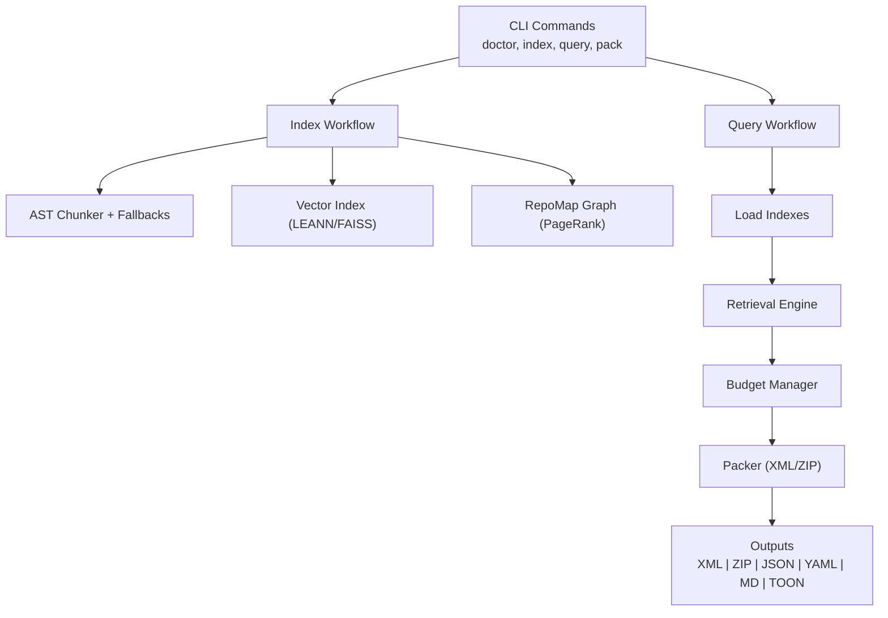
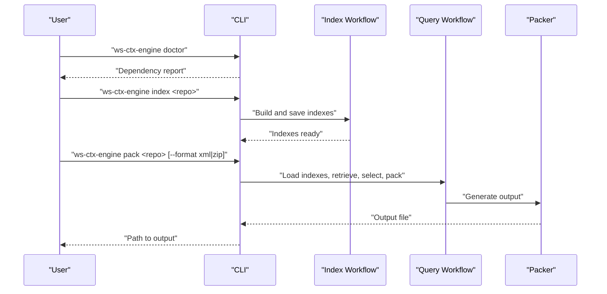
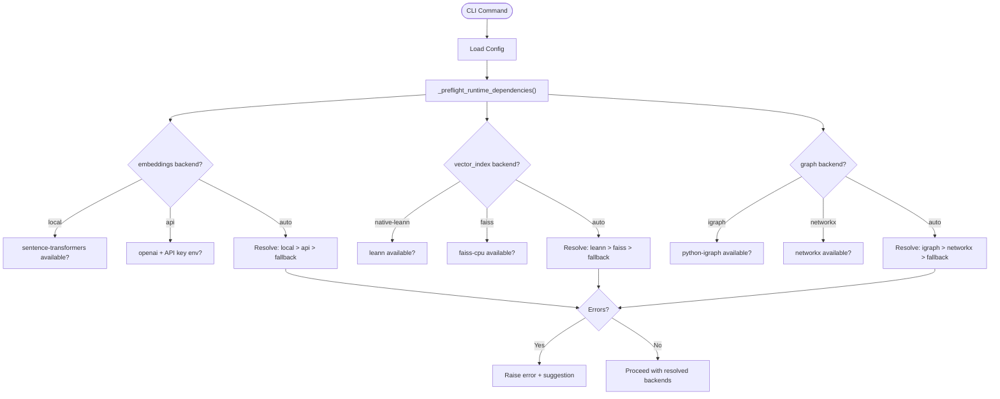

# Getting Started

<cite>
**Referenced Files in This Document**
- [INSTALL.md](file://INSTALL.md)
- [README.md](file://README.md)
- [pyproject.toml](file://pyproject.toml)
- [.ws-ctx-engine.yaml.example](file://.ws-ctx-engine.yaml.example)
- [src/ws_ctx_engine/cli/cli.py](file://src/ws_ctx_engine/cli/cli.py)
- [src/ws_ctx_engine/workflow/indexer.py](file://src/ws_ctx_engine/workflow/indexer.py)
- [src/ws_ctx_engine/workflow/query.py](file://src/ws_ctx_engine/workflow/query.py)
- [src/ws_ctx_engine/packer/xml_packer.py](file://src/ws_ctx_engine/packer/xml_packer.py)
- [src/ws_ctx_engine/packer/zip_packer.py](file://src/ws_ctx_engine/packer/zip_packer.py)
- [src/ws_ctx_engine/config/config.py](file://src/ws_ctx_engine/config/config.py)
- [docs/guides/output-formats.md](file://docs/guides/output-formats.md)
- [docs/reference/output-formatters.md](file://docs/reference/output-formatters.md)
- [docs/reference/packer.md](file://docs/reference/packer.md)
</cite>

## Table of Contents
1. [Introduction](#introduction)
2. [Project Structure](#project-structure)
3. [Core Components](#core-components)
4. [Architecture Overview](#architecture-overview)
5. [Detailed Component Analysis](#detailed-component-analysis)
6. [Dependency Analysis](#dependency-analysis)
7. [Performance Considerations](#performance-considerations)
8. [Troubleshooting Guide](#troubleshooting-guide)
9. [Conclusion](#conclusion)
10. [Appendices](#appendices)

## Introduction
This guide helps you quickly install, configure, and use ws-ctx-engine to intelligently package codebases into optimized context for Large Language Models (LLMs). You will learn:
- How to choose among the three dependency tiers (core, all, fast)
- How to verify your environment with the dependency doctor
- How to index a repository and generate context packs in XML or ZIP formats
- Practical workflows for code review, bug investigation, and documentation generation
- When to use XML versus ZIP outputs
- How to configure ws-ctx-engine via the YAML configuration file

## Project Structure
At a high level, ws-ctx-engine provides:
- A CLI with commands for dependency verification, indexing, querying, and packaging
- A workflow orchestrator that parses code, builds indexes, retrieves relevant files, selects within a token budget, and packages outputs
- Two primary output packers (XML and ZIP) plus additional formats (JSON, YAML, Markdown, TOON)
- A configuration system to tailor behavior (weights, filters, backends, performance)

**Diagram sources**
- [src/ws_ctx_engine/cli/cli.py](file://src/ws_ctx_engine/cli/cli.py)
- [src/ws_ctx_engine/workflow/indexer.py](file://src/ws_ctx_engine/workflow/indexer.py)
- [src/ws_ctx_engine/workflow/query.py](file://src/ws_ctx_engine/workflow/query.py)
- [src/ws_ctx_engine/packer/xml_packer.py](file://src/ws_ctx_engine/packer/xml_packer.py)
- [src/ws_ctx_engine/packer/zip_packer.py](file://src/ws_ctx_engine/packer/zip_packer.py)

**Section sources**
- [README.md:16-118](file://README.md#L16-L118)

## Core Components
- CLI: Provides commands for dependency verification, indexing, searching, and packaging. It validates runtime dependencies and logs progress.
- Index Workflow: Parses code, builds vector and graph indexes, and persists metadata for staleness detection.
- Query Workflow: Loads indexes, retrieves candidates with hybrid ranking, selects within a token budget, and packages outputs.
- Packer: Generates XML (Repomix-compatible) or ZIP outputs; supports smart compression and secret redaction.
- Config: Loads and validates .ws-ctx-engine.yaml with defaults and strict validation.

**Section sources**
- [src/ws_ctx_engine/cli/cli.py:329-800](file://src/ws_ctx_engine/cli/cli.py#L329-L800)
- [src/ws_ctx_engine/workflow/indexer.py:72-371](file://src/ws_ctx_engine/workflow/indexer.py#L72-L371)
- [src/ws_ctx_engine/workflow/query.py:230-617](file://src/ws_ctx_engine/workflow/query.py#L230-L617)
- [src/ws_ctx_engine/packer/xml_packer.py:51-239](file://src/ws_ctx_engine/packer/xml_packer.py#L51-L239)
- [src/ws_ctx_engine/packer/zip_packer.py:17-254](file://src/ws_ctx_engine/packer/zip_packer.py#L17-L254)
- [src/ws_ctx_engine/config/config.py:16-399](file://src/ws_ctx_engine/config/config.py#L16-L399)

## Architecture Overview
The system separates concerns into distinct stages:
- Indexing: Build semantic and structural indexes once, reuse for fast queries
- Querying: Hybrid ranking (semantic + PageRank), budget selection, and packaging
- Packaging: XML for paste workflows, ZIP for upload workflows, plus JSON/YAML/MD/TOON

**Diagram sources**
- [src/ws_ctx_engine/cli/cli.py:329-800](file://src/ws_ctx_engine/cli/cli.py#L329-L800)
- [src/ws_ctx_engine/workflow/indexer.py:72-371](file://src/ws_ctx_engine/workflow/indexer.py#L72-L371)
- [src/ws_ctx_engine/workflow/query.py:230-617](file://src/ws_ctx_engine/workflow/query.py#L230-L617)
- [src/ws_ctx_engine/packer/xml_packer.py:51-239](file://src/ws_ctx_engine/packer/xml_packer.py#L51-L239)
- [src/ws_ctx_engine/packer/zip_packer.py:17-254](file://src/ws_ctx_engine/packer/zip_packer.py#L17-L254)

## Detailed Component Analysis

### Installation Methods and Dependency Tiers
Choose the tier that matches your environment and needs:
- Core (minimal): Essential dependencies only (tiktoken, PyYAML, lxml). Best for minimal setups.
- All (recommended): Primary backends for optimal performance (python-igraph, sentence-transformers, tree-sitter, LEANN).
- Fast (fallback-focused): Core plus fallbacks (faiss-cpu, networkx, scikit-learn).

Installation commands:
- Core: pip install ws-ctx-engine
- All: pip install "ws-ctx-engine[all]"
- Fast: pip install "ws-ctx-engine[fast]"

Verification:
- After installation, run the dependency doctor to check availability of recommended components.
- If doctor reports missing optional dependencies, install the recommended profile.

**Section sources**
- [INSTALL.md:3-48](file://INSTALL.md#L3-L48)
- [INSTALL.md:66-87](file://INSTALL.md#L66-L87)
- [README.md:16-49](file://README.md#L16-L49)
- [src/ws_ctx_engine/cli/cli.py:329-364](file://src/ws_ctx_engine/cli/cli.py#L329-L364)

### Dependency Requirements and Choosing a Tier
- Core includes tiktoken, PyYAML, lxml, typer, rich, psutil, numpy, pathspec.
- All adds python-igraph, sentence-transformers, torch, tree-sitter family, and LEANN.
- Fast adds faiss-cpu, networkx, scikit-learn.

Guidance:
- Choose Core for minimal environments or when you only need basic functionality.
- Choose All for maximum compatibility and performance.
- Choose Fast when you want fewer dependencies or to avoid C++ compilation issues.

**Section sources**
- [pyproject.toml:55-111](file://pyproject.toml#L55-L111)
- [INSTALL.md:88-120](file://INSTALL.md#L88-L120)

### Quick Start Guide
Step-by-step:
1. Check dependencies
   - Run ws-ctx-engine doctor to verify your environment.
   - If recommended components are missing, install the recommended profile.

2. Index your repository
   - Build and persist indexes for later queries.
   - Indexes include vector index, graph, metadata, and logs.

3. Generate a context pack
   - Use pack to generate ZIP output by default, or XML for paste workflows.
   - Alternatively, use query to search indexed content and generate output.

4. Use the output
   - XML: Copy the generated XML file and paste into supported chat interfaces.
   - ZIP: Upload the archive to agents/tools that accept multi-file uploads; it includes a manifest and preserved directory structure.

Common flags and options:
- --format xml|zip|json|yaml|md|toon
- --budget INT
- --config PATH
- --output PATH
- --compress
- --shuffle/--no-shuffle
- --mode discovery|edit|test
- --session-id STR
- --no-dedup
- --stdout
- --copy

**Section sources**
- [README.md:64-118](file://README.md#L64-L118)
- [src/ws_ctx_engine/cli/cli.py:406-501](file://src/ws_ctx_engine/cli/cli.py#L406-L501)
- [src/ws_ctx_engine/cli/cli.py:698-800](file://src/ws_ctx_engine/cli/cli.py#L698-L800)
- [src/ws_ctx_engine/workflow/indexer.py:72-120](file://src/ws_ctx_engine/workflow/indexer.py#L72-L120)

### Practical Workflows

#### Code Review
- Index once, then query with a focus on changed files.
- Use ZIP output for multi-file upload to agents/tools that support it.

Example steps:
- Index the repository
- Query with a natural language description of the changes and specify changed files
- Generate ZIP output with a reduced token budget for focused review

**Section sources**
- [README.md:310-324](file://README.md#L310-L324)

#### Bug Investigation
- Use pack with a natural language query to locate relevant files.
- Prefer XML output for paste-based workflows.

Example steps:
- Pack with a query describing the issue and a lower token budget
- Paste the XML output into the target interface

**Section sources**
- [README.md:325-335](file://README.md#L325-L335)

#### Documentation Generation
- Focus on core API and public interfaces.
- Use pack with a query targeting APIs and models.

Example steps:
- Pack with a query for public APIs and models
- Use ZIP output to include files with preserved structure

**Section sources**
- [README.md:337-345](file://README.md#L337-L345)

### XML vs ZIP Output Formats
- XML (Repomix-compatible)
  - Single file with structured metadata and CDATA-wrapped file contents
  - Best for paste workflows (e.g., pasting into chat interfaces)
  - Supports context shuffling to improve recall at start/end positions

- ZIP
  - Archive with preserved directory structure and a human-readable manifest
  - Best for upload workflows (e.g., Cursor, Claude Code)
  - Includes a manifest with repository metadata, included files, reasons, and suggested reading order

Additional formats:
- JSON, YAML, Markdown, TOON are supported for programmatic consumption, readability, or experimental use.

**Section sources**
- [docs/reference/packer.md:107-294](file://docs/reference/packer.md#L107-L294)
- [docs/guides/output-formats.md:3-131](file://docs/guides/output-formats.md#L3-L131)
- [docs/reference/output-formatters.md:1-231](file://docs/reference/output-formatters.md#L1-L231)

### Basic Configuration File
Create .ws-ctx-engine.yaml in your repository root to customize behavior:
- Output settings: format, token_budget, output_path
- Scoring weights: semantic_weight, pagerank_weight (must sum to 1.0)
- File filtering: include_tests, include_patterns, exclude_patterns, respect_gitignore
- Backend selection: vector_index, graph, embeddings
- Embeddings configuration: model, device, batch_size, api_provider, api_key_env
- Performance tuning: cache_embeddings, incremental_index

Examples and guidance are provided in the example configuration file.

**Section sources**
- [.ws-ctx-engine.yaml.example:1-254](file://.ws-ctx-engine.yaml.example#L1-L254)
- [src/ws_ctx_engine/config/config.py:16-399](file://src/ws_ctx_engine/config/config.py#L16-L399)

## Dependency Analysis
The CLI performs a runtime dependency preflight to resolve backends and validate requirements. It checks for availability of optional modules and suggests the recommended install profile when needed.

**Diagram sources**
- [src/ws_ctx_engine/cli/cli.py:239-327](file://src/ws_ctx_engine/cli/cli.py#L239-L327)

**Section sources**
- [src/ws_ctx_engine/cli/cli.py:239-327](file://src/ws_ctx_engine/cli/cli.py#L239-L327)

## Performance Considerations
- Primary backends deliver sub-second PageRank and indexing for large repositories.
- Fallback backends maintain functionality within 2x of primary performance.
- Incremental indexing reduces rebuild time by updating only changed/deleted files.
- Smart compression and deduplication reduce token usage and improve recall.

[No sources needed since this section provides general guidance]

## Troubleshooting Guide
- Dependency Doctor shows missing optional dependencies; install the recommended profile if needed.
- If C++ compilation fails (common with All tier), install the Fast tier or build tools for your platform.
- If embeddings OOM, reduce batch size or switch to API embeddings.
- If index is stale, rebuild is automatic; you can force rebuild by removing the index directory.
- For permission errors, install with --user.

**Section sources**
- [INSTALL.md:93-120](file://INSTALL.md#L93-L120)
- [README.md:386-428](file://README.md#L386-L428)

## Conclusion
You now have everything needed to install ws-ctx-engine, verify dependencies, index a repository, and generate optimized context packs in XML or ZIP formats. Use the configuration file to tailor behavior, and leverage the provided workflows for code review, bug investigation, and documentation generation.

[No sources needed since this section summarizes without analyzing specific files]

## Appendices

### Appendix A: CLI Commands Overview
- ws-ctx-engine doctor: Check optional dependencies and show recommended setup
- ws-ctx-engine index: Build and save indexes for later queries
- ws-ctx-engine query: Search indexed repository and generate output
- ws-ctx-engine pack: Full workflow: index + query + pack

**Section sources**
- [README.md:120-185](file://README.md#L120-L185)
- [src/ws_ctx_engine/cli/cli.py:329-800](file://src/ws_ctx_engine/cli/cli.py#L329-L800)

### Appendix B: Indexing Internals
- Parses code with AST chunker and fallbacks
- Builds vector index and graph with automatic backend selection
- Saves metadata for staleness detection and domain keyword map

**Section sources**
- [src/ws_ctx_engine/workflow/indexer.py:72-371](file://src/ws_ctx_engine/workflow/indexer.py#L72-L371)

### Appendix C: Query and Packaging Internals
- Loads indexes with auto-detection and staleness handling
- Retrieves candidates with hybrid ranking and selects within token budget
- Packs outputs with XMLPacker or ZIPPacker, supports compression and secret redaction

**Section sources**
- [src/ws_ctx_engine/workflow/query.py:230-617](file://src/ws_ctx_engine/workflow/query.py#L230-L617)
- [src/ws_ctx_engine/packer/xml_packer.py:51-239](file://src/ws_ctx_engine/packer/xml_packer.py#L51-L239)
- [src/ws_ctx_engine/packer/zip_packer.py:17-254](file://src/ws_ctx_engine/packer/zip_packer.py#L17-L254)