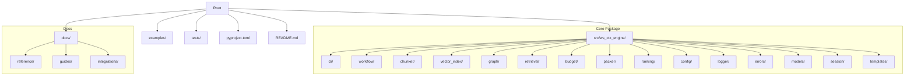
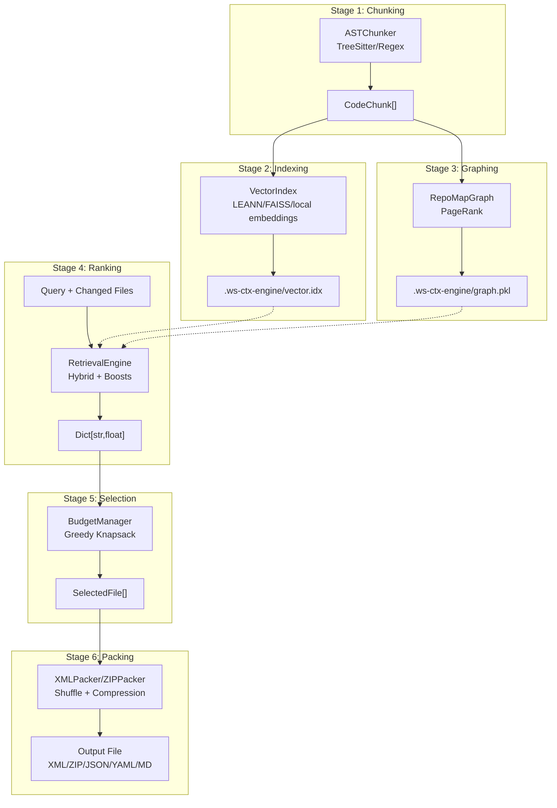
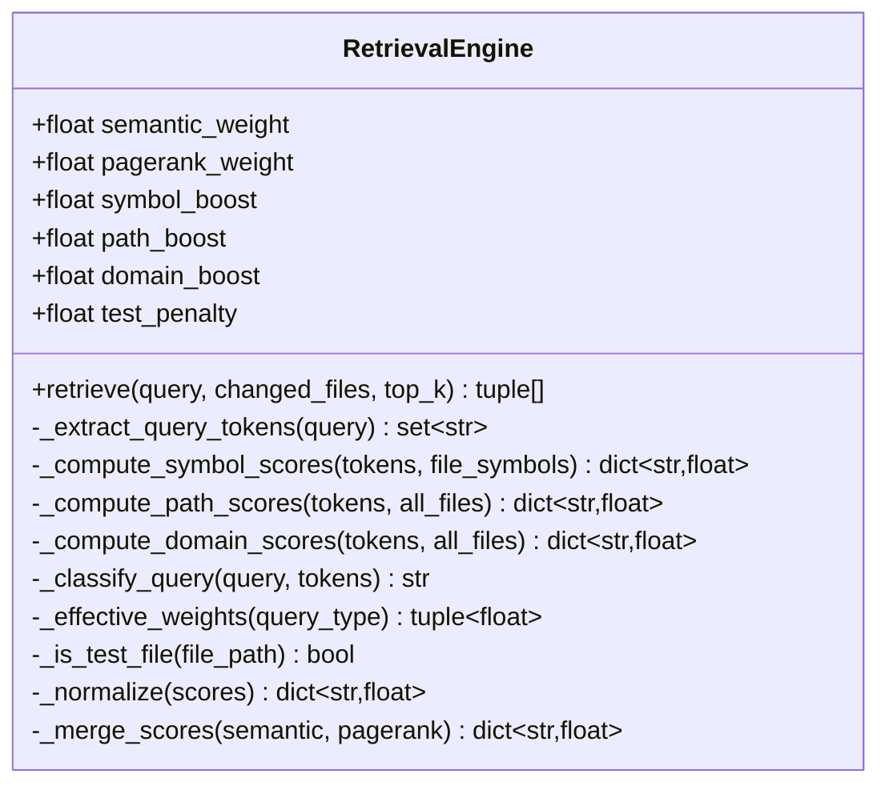
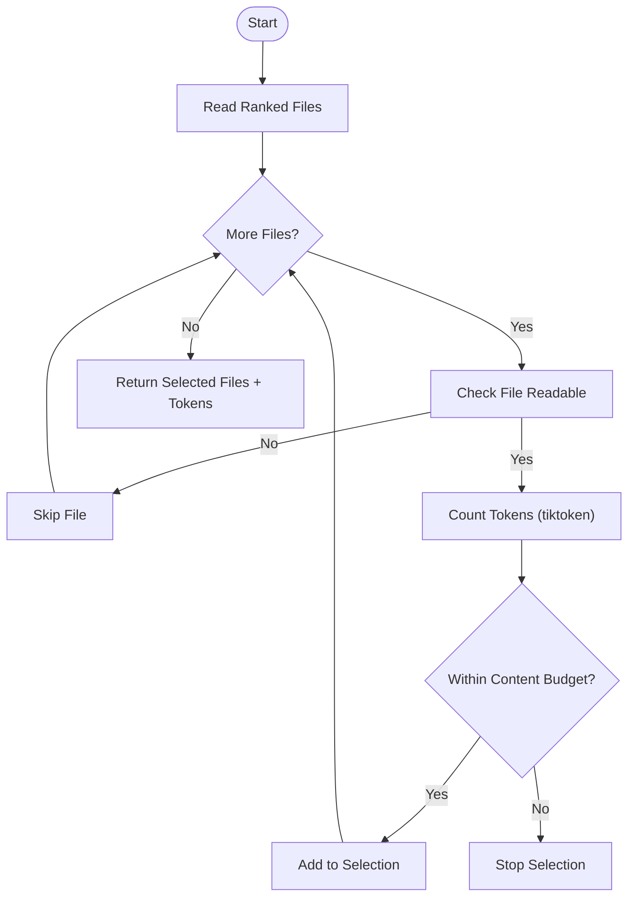
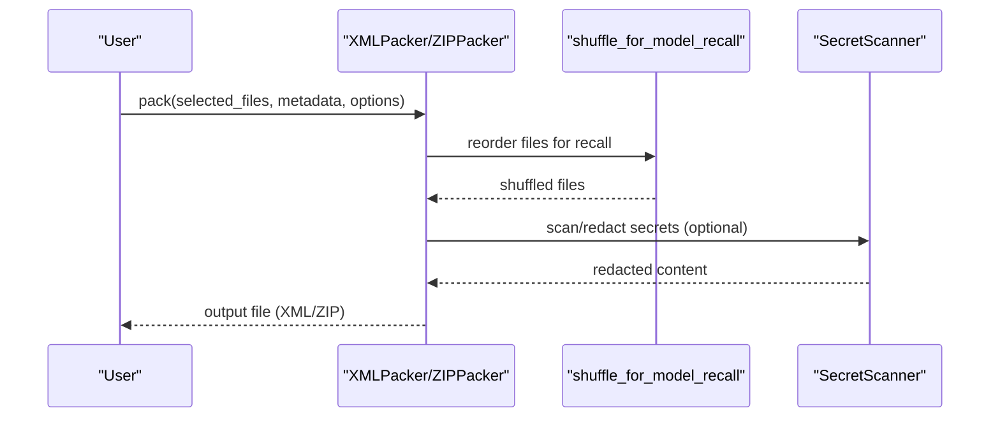
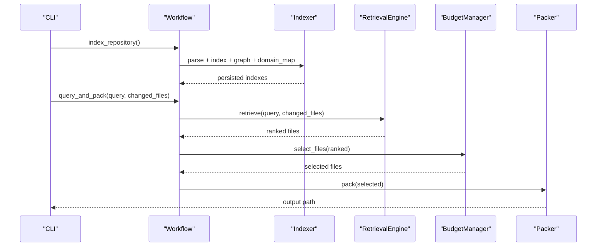
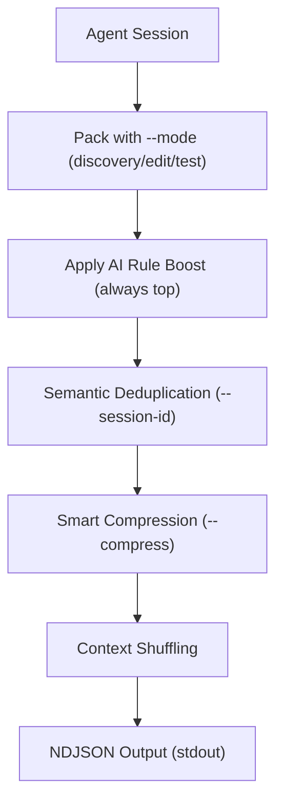
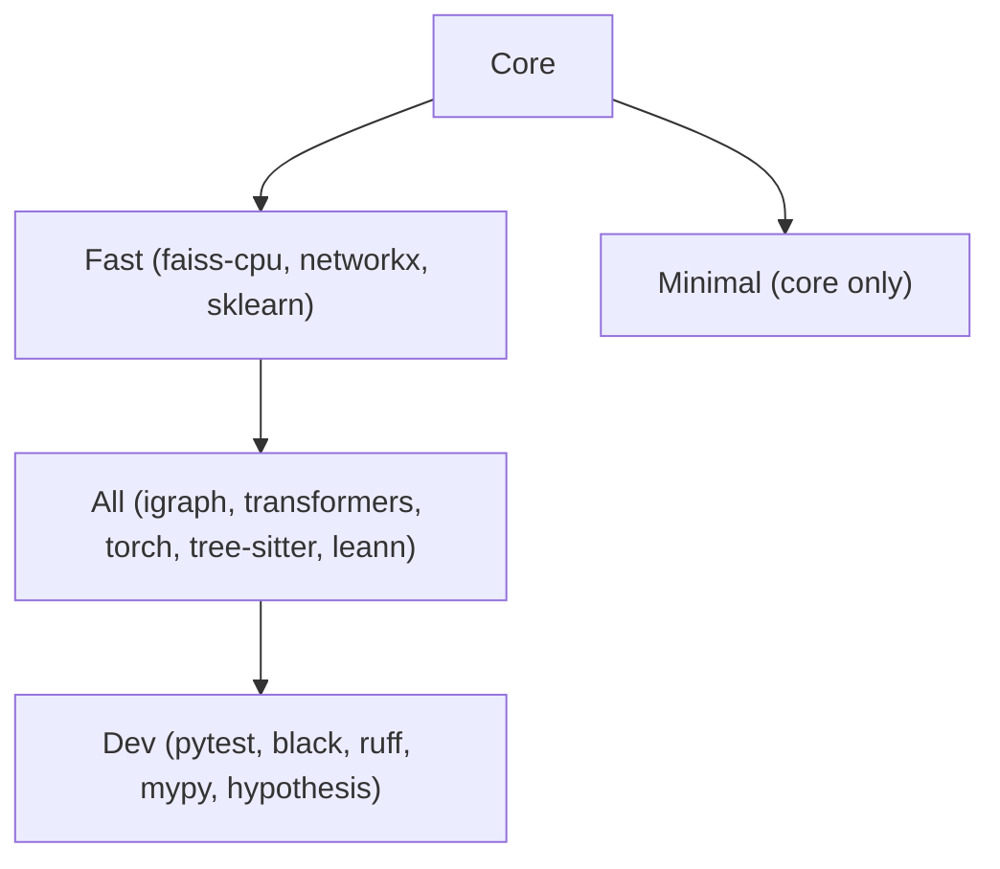

# Project Overview

<cite>
**Referenced Files in This Document**
- [README.md](file://README.md)
- [docs/README.md](file://docs/README.md)
- [docs/reference/architecture.md](file://docs/reference/architecture.md)
- [docs/reference/design-ideas.md](file://docs/reference/design-ideas.md)
- [docs/reference/workflow.md](file://docs/reference/workflow.md)
- [docs/reference/ranking.md](file://docs/reference/ranking.md)
- [docs/reference/budget.md](file://docs/reference/budget.md)
- [docs/reference/packer.md](file://docs/reference/packer.md)
- [docs/guides/output-formats.md](file://docs/guides/output-formats.md)
- [docs/integrations/agent-workflows.md](file://docs/integrations/agent-workflows.md)
- [pyproject.toml](file://pyproject.toml)
- [src/ws_ctx_engine/__init__.py](file://src/ws_ctx_engine/__init__.py)
- [src/ws_ctx_engine/retrieval/retrieval.py](file://src/ws_ctx_engine/retrieval/retrieval.py)
</cite>

## Table of Contents
1. [Introduction](#introduction)
2. [Project Structure](#project-structure)
3. [Core Components](#core-components)
4. [Architecture Overview](#architecture-overview)
5. [Detailed Component Analysis](#detailed-component-analysis)
6. [Dependency Analysis](#dependency-analysis)
7. [Performance Considerations](#performance-considerations)
8. [Troubleshooting Guide](#troubleshooting-guide)
9. [Conclusion](#conclusion)
10. [Appendices](#appendices)

## Introduction
ws-ctx-engine is an intelligent codebase packaging tool designed to optimize context delivery for Large Language Models (LLMs). Its core value proposition is hybrid ranking that combines semantic search with structural analysis (PageRank) to select the most relevant files within a token budget. This approach ensures that LLMs receive focused, high-value context tailored to the user’s query or task, while maintaining production-grade reliability through comprehensive fallback strategies.

Key benefits for AI-assisted development workflows:
- Hybrid ranking improves precision over pure semantic or structural methods alone.
- Token budget management prevents oversized context windows and wasted tokens.
- Dual output formats (XML and ZIP) serve paste-based and upload-based workflows.
- Production-ready fallbacks ensure robust operation across diverse environments.
- Incremental indexing accelerates repeated operations on large repositories.
- Agent-friendly features (phase-aware modes, semantic deduplication, AI rule persistence) streamline automated workflows.

Practical use cases:
- Code review: Focus on changed files and their dependencies with PageRank-driven coverage.
- Bug investigation: Rapidly surface relevant logic and supporting files around a problem area.
- Documentation generation: Curate representative API and module files for accurate documentation.
- Onboarding: Provide curated entry points and reading order for new team members.

## Project Structure
The repository is organized into:
- Core Python package under src/ws_ctx_engine/, exposing APIs and CLI entry points.
- Comprehensive documentation under docs/ covering architecture, guides, integrations, and reference materials.
- Examples and scripts for demos and CI tasks.
- Tests validating correctness, performance, and resilience.

**Diagram sources**
- [docs/README.md:1-104](file://docs/README.md#L1-L104)
- [pyproject.toml:138-149](file://pyproject.toml#L138-L149)

**Section sources**
- [docs/README.md:1-104](file://docs/README.md#L1-L104)
- [pyproject.toml:138-149](file://pyproject.toml#L138-L149)

## Core Components
- Hybrid ranking engine: Merges semantic similarity and PageRank scores, then applies query-aware boosts and penalties.
- Token budget manager: Greedy knapsack selection respecting content and metadata budgets.
- Dual output packers: XML (paste) and ZIP (upload) with smart compression and context shuffling.
- Workflow orchestrator: Coordinates indexing and querying, with staleness detection and incremental updates.
- Fallback architecture: Automatic fallback across backends for vector indexing, graph analysis, and embeddings.

Implementation highlights:
- Hybrid ranking formula and adaptive boosting per query type.
- Token budget allocation (80% content, 20% metadata) with tiktoken-based counting.
- Smart compression and context shuffling to improve model recall.
- Session-based semantic deduplication and AI rule file persistence for agents.

**Section sources**
- [docs/reference/architecture.md:182-222](file://docs/reference/architecture.md#L182-L222)
- [docs/reference/budget.md:83-104](file://docs/reference/budget.md#L83-L104)
- [docs/reference/packer.md:38-106](file://docs/reference/packer.md#L38-L106)
- [docs/reference/workflow.md:138-191](file://docs/reference/workflow.md#L138-L191)
- [src/ws_ctx_engine/retrieval/retrieval.py:140-369](file://src/ws_ctx_engine/retrieval/retrieval.py#L140-L369)

## Architecture Overview
The system implements a six-stage pipeline: chunking → indexing → graphing → ranking → selection → packing. Each stage integrates specialized backends with automatic fallbacks, ensuring reliable operation across environments.

**Diagram sources**
- [docs/reference/architecture.md:76-296](file://docs/reference/architecture.md#L76-L296)
- [docs/reference/workflow.md:17-37](file://docs/reference/workflow.md#L17-L37)

**Section sources**
- [docs/reference/architecture.md:76-296](file://docs/reference/architecture.md#L76-L296)
- [docs/reference/workflow.md:17-37](file://docs/reference/workflow.md#L17-L37)

## Detailed Component Analysis

### Hybrid Ranking Engine
The retrieval engine computes base importance scores by merging normalized semantic and PageRank scores, then applies query-aware boosts and penalties. It classifies queries to adapt boost weights dynamically and ensures AI rule files are always prioritized.

**Diagram sources**
- [src/ws_ctx_engine/retrieval/retrieval.py:140-369](file://src/ws_ctx_engine/retrieval/retrieval.py#L140-L369)

**Section sources**
- [src/ws_ctx_engine/retrieval/retrieval.py:140-369](file://src/ws_ctx_engine/retrieval/retrieval.py#L140-L369)
- [docs/reference/ranking.md:46-85](file://docs/reference/ranking.md#L46-L85)

### Token Budget Manager
The budget manager performs greedy knapsack selection to maximize importance within the token budget, allocating 80% for content and reserving 20% for metadata/manifest. It tolerates I/O errors gracefully and provides utilization insights.

**Diagram sources**
- [docs/reference/budget.md:83-104](file://docs/reference/budget.md#L83-L104)

**Section sources**
- [docs/reference/budget.md:32-104](file://docs/reference/budget.md#L32-L104)

### Output Packer (XML/ZIP)
The packer generates XML (paste) or ZIP (upload) outputs, with context shuffling to combat “Lost in the Middle” and smart compression for low-relevance files. It also supports secret redaction and session-based deduplication.

**Diagram sources**
- [docs/reference/packer.md:38-106](file://docs/reference/packer.md#L38-L106)
- [docs/reference/packer.md:196-294](file://docs/reference/packer.md#L196-L294)

**Section sources**
- [docs/reference/packer.md:107-294](file://docs/reference/packer.md#L107-L294)

### Workflow Orchestration
The workflow module coordinates indexing and querying, with staleness detection and incremental updates. It supports programmatic search and integrates with CLI commands.

**Diagram sources**
- [docs/reference/workflow.md:269-300](file://docs/reference/workflow.md#L269-L300)

**Section sources**
- [docs/reference/workflow.md:48-191](file://docs/reference/workflow.md#L48-L191)

### Agent Workflows and AI Rule Persistence
Agent workflows leverage phase-aware ranking, semantic deduplication, and persistent AI rule files to ensure consistent, high-quality context delivery across multi-turn interactions.

**Diagram sources**
- [docs/integrations/agent-workflows.md:8-103](file://docs/integrations/agent-workflows.md#L8-L103)

**Section sources**
- [docs/integrations/agent-workflows.md:8-103](file://docs/integrations/agent-workflows.md#L8-L103)

## Dependency Analysis
Installation tiers and optional dependencies:
- Core: tiktoken, PyYAML, lxml, typer, rich.
- Fast: adds faiss-cpu, networkx, scikit-learn.
- All: adds python-igraph, sentence-transformers, torch, tree-sitter, leann.
- Dev: testing and linting tools.

**Diagram sources**
- [pyproject.toml:67-122](file://pyproject.toml#L67-L122)

**Section sources**
- [pyproject.toml:55-122](file://pyproject.toml#L55-L122)

## Performance Considerations
- Primary stack targets: indexing under 5 minutes, query under 10 seconds for 10k files, with minimal memory footprint and compact index storage.
- Fallback backends maintain functionality within 2x of primary performance.
- Incremental indexing detects SHA256 changes and updates only affected files.
- Token counting uses tiktoken cl100k_base with ±2% accuracy versus actual LLM tokenization.

[No sources needed since this section provides general guidance]

## Troubleshooting Guide
Common scenarios and actionable steps:
- Missing optional dependencies: Install the recommended tier (e.g., ws-ctx-engine[all]) or configure backends explicitly.
- Stale indexes: Rebuild automatically or remove .ws-ctx-engine/ to force regeneration.
- Out-of-memory during embeddings: Switch to API embeddings or reduce batch size.
- Slow PageRank: Prefer python-igraph when available; fallback to NetworkX is still fast.
- Emergency mode: File size ranking only when all else fails; install recommended tier for optimal performance.

**Section sources**
- [README.md:386-427](file://README.md#L386-L427)
- [docs/reference/architecture.md:299-371](file://docs/reference/architecture.md#L299-L371)

## Conclusion
ws-ctx-engine delivers a production-ready, agent-friendly solution for packaging codebases into optimized LLM context. Its hybrid ranking, precise token budgeting, dual output formats, and robust fallbacks make it suitable for both human developers and AI agents. The modular architecture, incremental indexing, and comprehensive documentation support rapid adoption and reliable operation across diverse environments.

[No sources needed since this section summarizes without analyzing specific files]

## Appendices

### Practical Use Cases
- Code review: Use pack with changed files to highlight recent modifications and their dependencies.
- Bug investigation: Query for symptoms or error-related logic; adjust token budget for depth.
- Documentation generation: Focus on public APIs and core modules; export ZIP for structured review.
- Onboarding: Provide curated entry points and reading order for new contributors.

**Section sources**
- [README.md:308-346](file://README.md#L308-L346)

### Output Formats Reference
- XML: Repomix-compatible single-file output for paste workflows.
- ZIP: Archive with preserved directory structure and a human-readable manifest.
- JSON/YAML/MD: Structured outputs for programmatic consumption and validation.

**Section sources**
- [docs/guides/output-formats.md:1-131](file://docs/guides/output-formats.md#L1-L131)
- [docs/reference/packer.md:107-294](file://docs/reference/packer.md#L107-L294)