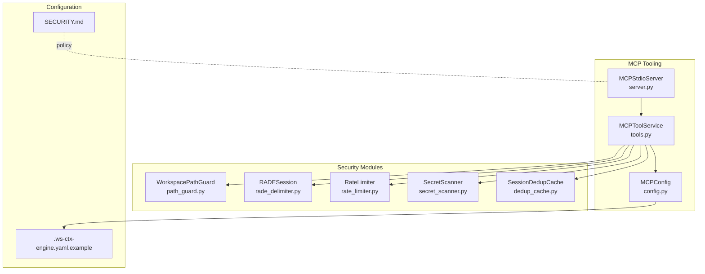
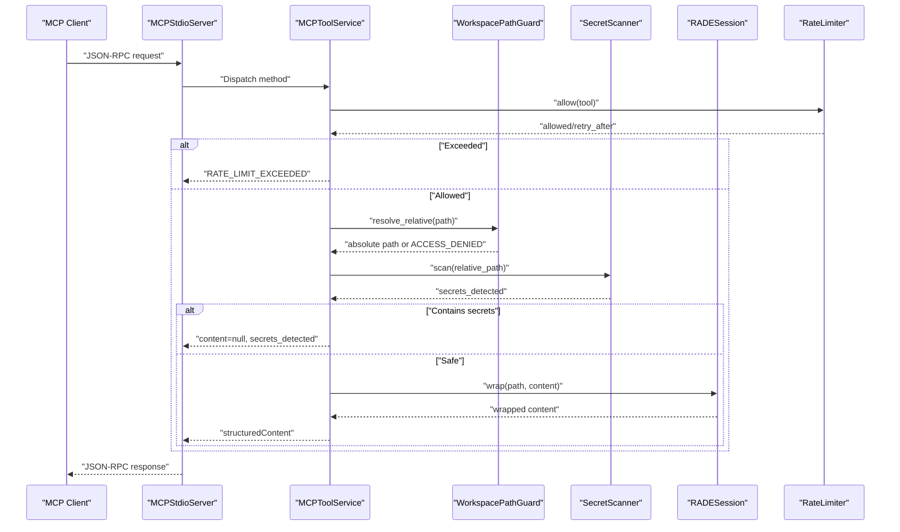
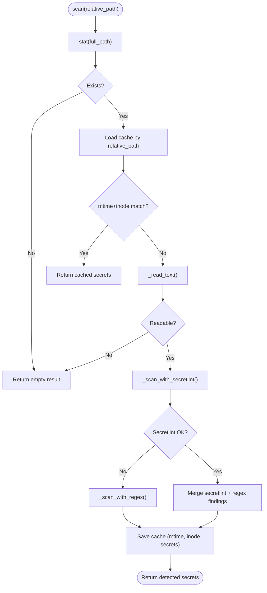
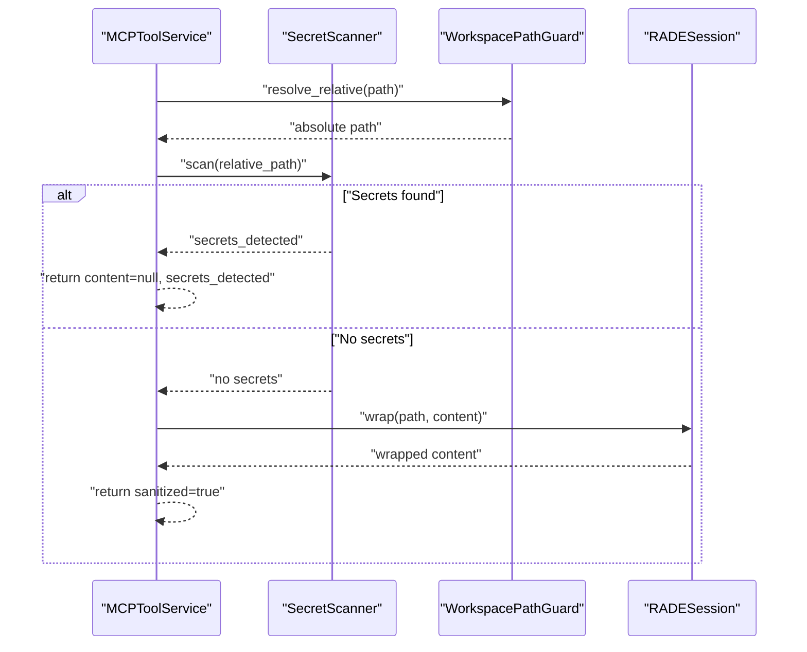
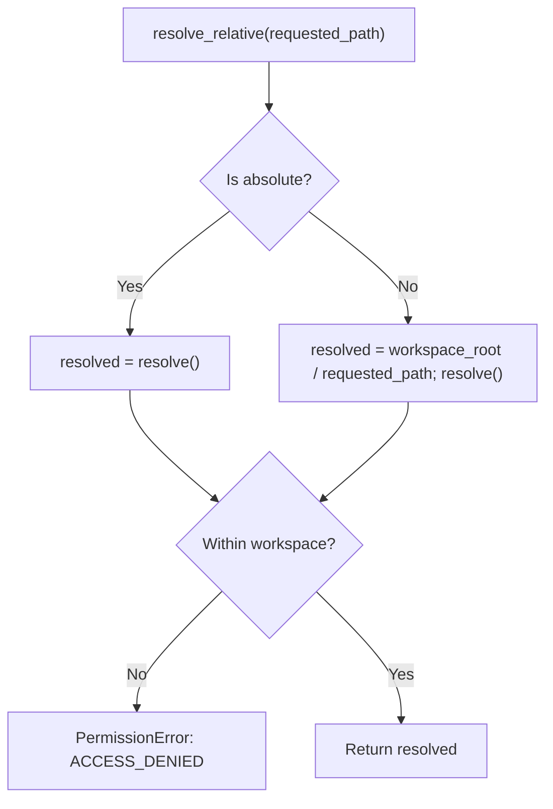
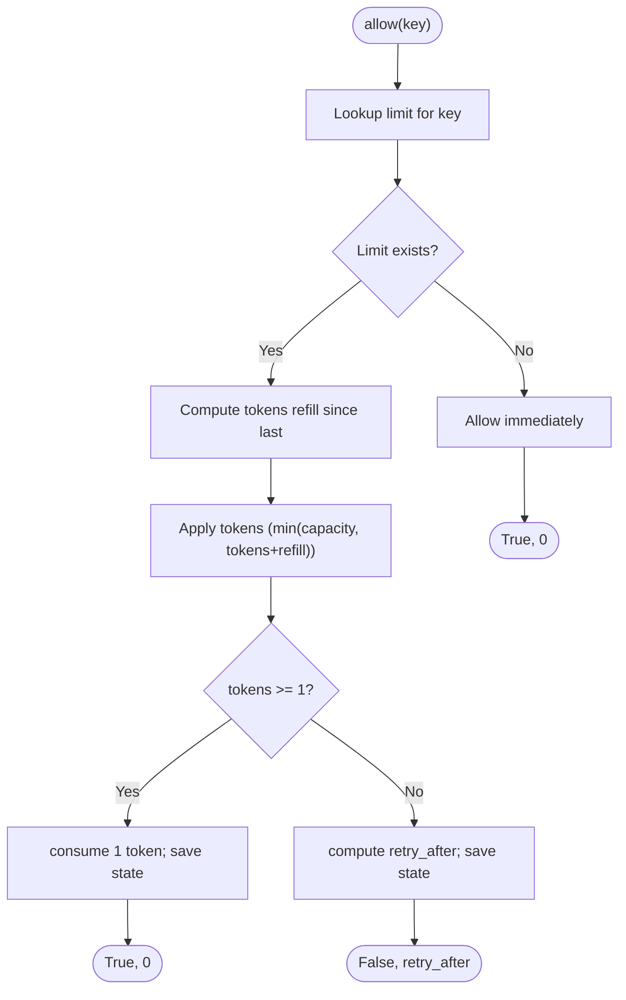
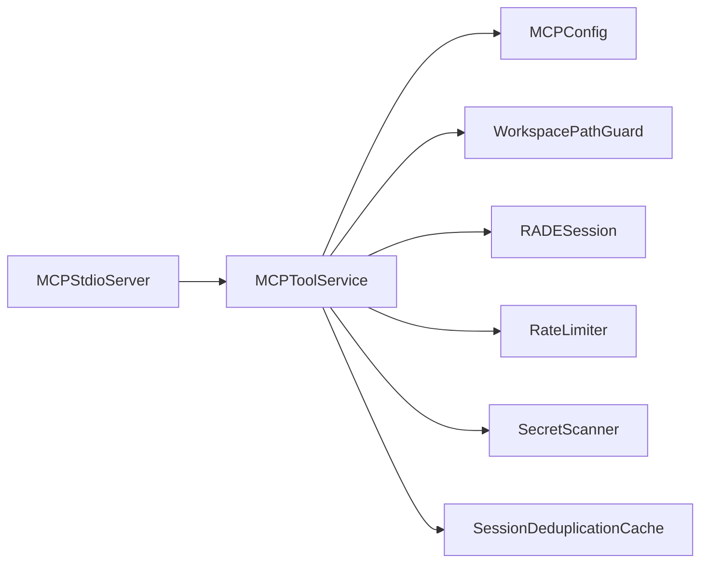

# Security & Compliance

<cite>
**Referenced Files in This Document**
- [SECURITY.md](file://SECURITY.md)
- [secret_scanner.py](file://src/ws_ctx_engine/secret_scanner.py)
- [path_guard.py](file://src/ws_ctx_engine/mcp/security/path_guard.py)
- [rade_delimiter.py](file://src/ws_ctx_engine/mcp/security/rade_delimiter.py)
- [rate_limiter.py](file://src/ws_ctx_engine/mcp/security/rate_limiter.py)
- [mcp_config.py](file://src/ws_ctx_engine/mcp/config.py)
- [mcp_server.py](file://src/ws_ctx_engine/mcp/server.py)
- [mcp_tools.py](file://src/ws_ctx_engine/mcp/tools.py)
- [.ws-ctx-engine.yaml.example](file://.ws-ctx-engine.yaml.example)
- [mcp-security.md](file://docs/development/audits/mcp-security.md)
- [test_mcp_security_units.py](file://tests/unit/test_mcp_security_units.py)
- [test_mcp_integration.py](file://tests/integration/test_mcp_integration.py)
- [dedup_cache.py](file://src/ws_ctx_engine/session/dedup_cache.py)
</cite>

## Table of Contents
1. [Introduction](#introduction)
2. [Project Structure](#project-structure)
3. [Core Components](#core-components)
4. [Architecture Overview](#architecture-overview)
5. [Detailed Component Analysis](#detailed-component-analysis)
6. [Dependency Analysis](#dependency-analysis)
7. [Performance Considerations](#performance-considerations)
8. [Troubleshooting Guide](#troubleshooting-guide)
9. [Conclusion](#conclusion)
10. [Appendices](#appendices)

## Introduction
This document provides comprehensive security and compliance guidance for ws-ctx-engine with a focus on secret scanning, content sanitization, path traversal protection, rate limiting, and MCP security features. It also covers compliance considerations for code context sharing, data privacy implications, secure handling of proprietary code, best practices for agent integration, configuration management, and output generation. Threat modeling, vulnerability assessment procedures, incident response guidelines, and legal/ethical considerations for AI-assisted code analysis and context sharing are included.

## Project Structure
The security-relevant implementation resides primarily in the MCP tooling layer and supporting modules:
- Secret scanning and caching for CLI and MCP outputs
- Workspace path guard for read-only, boundary-enforced file access
- RADE session-based delimiter wrapping for safe content transport
- Token-bucket rate limiter per MCP tool
- MCP configuration and server orchestration
- Session-level deduplication cache with path traversal protections
- Example configuration for output formats, filtering, and privacy-sensitive defaults

**Diagram sources**
- [mcp_server.py:13-136](file://src/ws_ctx_engine/mcp/server.py#L13-L136)
- [mcp_tools.py:29-42](file://src/ws_ctx_engine/mcp/tools.py#L29-L42)
- [mcp_config.py:22-129](file://src/ws_ctx_engine/mcp/config.py#L22-L129)
- [path_guard.py:6-31](file://src/ws_ctx_engine/mcp/security/path_guard.py#L6-L31)
- [rade_delimiter.py:6-23](file://src/ws_ctx_engine/mcp/security/rade_delimiter.py#L6-L23)
- [rate_limiter.py:14-45](file://src/ws_ctx_engine/mcp/security/rate_limiter.py#L14-L45)
- [secret_scanner.py:35-205](file://src/ws_ctx_engine/secret_scanner.py#L35-L205)
- [dedup_cache.py:35-154](file://src/ws_ctx_engine/session/dedup_cache.py#L35-L154)
- [.ws-ctx-engine.yaml.example:1-254](file://.ws-ctx-engine.yaml.example#L1-L254)
- [SECURITY.md:1-137](file://SECURITY.md#L1-L137)

**Section sources**
- [mcp_server.py:13-136](file://src/ws_ctx_engine/mcp/server.py#L13-L136)
- [mcp_tools.py:29-42](file://src/ws_ctx_engine/mcp/tools.py#L29-L42)
- [mcp_config.py:22-129](file://src/ws_ctx_engine/mcp/config.py#L22-L129)
- [path_guard.py:6-31](file://src/ws_ctx_engine/mcp/security/path_guard.py#L6-L31)
- [rade_delimiter.py:6-23](file://src/ws_ctx_engine/mcp/security/rade_delimiter.py#L6-L23)
- [rate_limiter.py:14-45](file://src/ws_ctx_engine/mcp/security/rate_limiter.py#L14-L45)
- [secret_scanner.py:35-205](file://src/ws_ctx_engine/secret_scanner.py#L35-L205)
- [dedup_cache.py:35-154](file://src/ws_ctx_engine/session/dedup_cache.py#L35-L154)
- [.ws-ctx-engine.yaml.example:1-254](file://.ws-ctx-engine.yaml.example#L1-L254)
- [SECURITY.md:1-137](file://SECURITY.md#L1-L137)

## Core Components
- Secret Scanner: Detects secrets across files using regex patterns and optional external secretlint integration, with mtime+inode cache persistence to avoid repeated scans.
- Workspace Path Guard: Enforces read-only, boundary-constrained file access by resolving relative paths against a configured workspace root and rejecting out-of-bounds accesses.
- RADE Delimiter: Wraps file content with session-scoped start/end markers to delineate content boundaries for safe transport.
- Rate Limiter: Implements a per-tool token-bucket limiter with configurable limits and retry-after guidance.
- MCP Configuration: Loads and validates MCP configuration including rate limits, cache TTL, and workspace resolution with precedence rules.
- MCP Server: Orchestrates MCP tool execution, validates requests, and enforces method and parameter checks.
- Session Deduplication Cache: Prevents redundant content transmission within an agent session using content hashing and atomic persistence.

**Section sources**
- [secret_scanner.py:35-205](file://src/ws_ctx_engine/secret_scanner.py#L35-L205)
- [path_guard.py:6-31](file://src/ws_ctx_engine/mcp/security/path_guard.py#L6-L31)
- [rade_delimiter.py:6-23](file://src/ws_ctx_engine/mcp/security/rade_delimiter.py#L6-L23)
- [rate_limiter.py:14-45](file://src/ws_ctx_engine/mcp/security/rate_limiter.py#L14-L45)
- [mcp_config.py:22-129](file://src/ws_ctx_engine/mcp/config.py#L22-L129)
- [mcp_server.py:13-136](file://src/ws_ctx_engine/mcp/server.py#L13-L136)
- [mcp_tools.py:29-42](file://src/ws_ctx_engine/mcp/tools.py#L29-L42)
- [dedup_cache.py:35-154](file://src/ws_ctx_engine/session/dedup_cache.py#L35-L154)

## Architecture Overview
The MCP tooling layer integrates security controls at each step of request processing:
- Request validation and routing
- Workspace scoping and path normalization
- Secret detection and exclusion decisions
- Content wrapping and delivery
- Rate limiting and caching
- Output path safety checks

**Diagram sources**
- [mcp_server.py:57-111](file://src/ws_ctx_engine/mcp/server.py#L57-L111)
- [mcp_tools.py:133-184](file://src/ws_ctx_engine/mcp/tools.py#L133-L184)
- [path_guard.py:10-20](file://src/ws_ctx_engine/mcp/security/path_guard.py#L10-L20)
- [secret_scanner.py:49-89](file://src/ws_ctx_engine/secret_scanner.py#L49-L89)
- [rade_delimiter.py:15-22](file://src/ws_ctx_engine/mcp/security/rade_delimiter.py#L15-L22)
- [rate_limiter.py:19-44](file://src/ws_ctx_engine/mcp/security/rate_limiter.py#L19-L44)

## Detailed Component Analysis

### Secret Scanning Implementation
- Detection strategies:
  - Regex-based patterns for AWS keys, private keys, database URLs with passwords, API key assignments, and environment variables.
  - Optional external secretlint integration with robust command variants and JSON parsing resilient to various output formats.
- Caching:
  - Persisted cache keyed by relative path with mtime+inode to detect file changes and avoid redundant scans.
  - Cache file location under the repository’s index directory.
- Error handling:
  - Graceful degradation when secretlint is unavailable or returns unexpected output.
  - Robust JSON parsing with fallback to regex-only detection.

**Diagram sources**
- [secret_scanner.py:49-89](file://src/ws_ctx_engine/secret_scanner.py#L49-L89)
- [secret_scanner.py:94-122](file://src/ws_ctx_engine/secret_scanner.py#L94-L122)
- [secret_scanner.py:180-181](file://src/ws_ctx_engine/secret_scanner.py#L180-L181)
- [secret_scanner.py:183-196](file://src/ws_ctx_engine/secret_scanner.py#L183-L196)

**Section sources**
- [secret_scanner.py:14-26](file://src/ws_ctx_engine/secret_scanner.py#L14-L26)
- [secret_scanner.py:91-122](file://src/ws_ctx_engine/secret_scanner.py#L91-L122)
- [secret_scanner.py:124-178](file://src/ws_ctx_engine/secret_scanner.py#L124-L178)
- [secret_scanner.py:183-196](file://src/ws_ctx_engine/secret_scanner.py#L183-L196)

### Content Sanitization and Delivery
- Secret-bearing files are excluded from content delivery with explicit detection results.
- Safe files are wrapped with session-scoped delimiters to define content boundaries for transport.
- The wrapper emits start and end markers and the wrapped content, while the session token remains internal.

**Diagram sources**
- [mcp_tools.py:249-312](file://src/ws_ctx_engine/mcp/tools.py#L249-L312)
- [secret_scanner.py:49-89](file://src/ws_ctx_engine/secret_scanner.py#L49-L89)
- [rade_delimiter.py:15-22](file://src/ws_ctx_engine/mcp/security/rade_delimiter.py#L15-L22)

**Section sources**
- [mcp_tools.py:274-287](file://src/ws_ctx_engine/mcp/tools.py#L274-L287)
- [mcp_tools.py:301-312](file://src/ws_ctx_engine/mcp/tools.py#L301-L312)
- [rade_delimiter.py:10-22](file://src/ws_ctx_engine/mcp/security/rade_delimiter.py#L10-L22)

### Path Traversal Protection
- WorkspacePathGuard:
  - Anchors all path resolutions to a configured workspace root.
  - Rejects absolute or out-of-bounds paths with ACCESS_DENIED.
  - Provides a safe relative POSIX representation for transport.
- SessionDeduplicationCache:
  - Guards against path traversal via session_id by resolving and validating cache file paths within the intended directory.

**Diagram sources**
- [path_guard.py:10-20](file://src/ws_ctx_engine/mcp/security/path_guard.py#L10-L20)
- [path_guard.py:25-30](file://src/ws_ctx_engine/mcp/security/path_guard.py#L25-L30)

**Section sources**
- [path_guard.py:6-31](file://src/ws_ctx_engine/mcp/security/path_guard.py#L6-L31)
- [dedup_cache.py:45-57](file://src/ws_ctx_engine/session/dedup_cache.py#L45-L57)
- [test_mcp_security_units.py:26-33](file://tests/unit/test_mcp_security_units.py#L26-L33)

### Rate Limiting Strategy
- Per-tool configuration with defaults for search_codebase, get_file_context, get_domain_map, get_index_status, pack_context, and session_clear.
- Token-bucket limiter with refill rate derived from per-minute limits.
- Returns RATE_LIMIT_EXCEEDED with retry_after_seconds when exceeded.

**Diagram sources**
- [rate_limiter.py:19-44](file://src/ws_ctx_engine/mcp/security/rate_limiter.py#L19-L44)
- [mcp_config.py:8-15](file://src/ws_ctx_engine/mcp/config.py#L8-L15)

**Section sources**
- [mcp_config.py:8-15](file://src/ws_ctx_engine/mcp/config.py#L8-L15)
- [mcp_config.py:68-90](file://src/ws_ctx_engine/mcp/config.py#L68-L90)
- [rate_limiter.py:14-45](file://src/ws_ctx_engine/mcp/security/rate_limiter.py#L14-L45)
- [mcp_tools.py:158-165](file://src/ws_ctx_engine/mcp/tools.py#L158-L165)

### MCP Security Features
- Workspace scope isolation and traversal protection are enforced during path resolution and relative path derivation.
- Secret handling ensures secret-bearing files are not returned as content.
- RADE delimiter wrapping provides session-scoped boundaries for content transport.
- Rate limiting is enforced per tool with standardized error responses.

**Section sources**
- [mcp_tools.py:249-312](file://src/ws_ctx_engine/mcp/tools.py#L249-L312)
- [mcp_tools.py:158-165](file://src/ws_ctx_engine/mcp/tools.py#L158-L165)
- [mcp-security.md:14-36](file://docs/development/audits/mcp-security.md#L14-L36)

### Compliance Considerations
- Data privacy:
  - Indexed code is stored locally; when using API fallback, code snippets may be transmitted to third-party providers. Review provider policies and minimize exposure.
- Proprietary code handling:
  - Use include/exclude patterns to limit sensitive files. Avoid committing secrets and rely on secret scanning and exclusion.
- Configuration management:
  - Review and lock down .ws-ctx-engine.yaml and MCP config to enforce safe defaults and workspace scoping.
- Output generation:
  - Prefer secure output formats and guard output paths to the workspace to prevent unintended external writes.

**Section sources**
- [SECURITY.md:89-98](file://SECURITY.md#L89-L98)
- [.ws-ctx-engine.yaml.example:74-98](file://.ws-ctx-engine.yaml.example#L74-L98)
- [mcp_tools.py:620-627](file://src/ws_ctx_engine/mcp/tools.py#L620-L627)

### Agent Integration Best Practices
- Bind the MCP server to a strict workspace root and validate configuration precedence.
- Configure rate limits appropriate for agent workloads.
- Use secret scanning and RADE wrapping to ensure safe context delivery.
- Monitor index health and refresh indices when repositories change.

**Section sources**
- [mcp_server.py:20-37](file://src/ws_ctx_engine/mcp/server.py#L20-L37)
- [mcp_config.py:117-129](file://src/ws_ctx_engine/mcp/config.py#L117-L129)
- [mcp_tools.py:380-399](file://src/ws_ctx_engine/mcp/tools.py#L380-L399)

## Dependency Analysis
The MCP tooling layer composes several security modules with clear responsibilities and minimal coupling.

**Diagram sources**
- [mcp_server.py:13-38](file://src/ws_ctx_engine/mcp/server.py#L13-L38)
- [mcp_tools.py:29-42](file://src/ws_ctx_engine/mcp/tools.py#L29-L42)
- [mcp_config.py:22-129](file://src/ws_ctx_engine/mcp/config.py#L22-L129)
- [path_guard.py:6-31](file://src/ws_ctx_engine/mcp/security/path_guard.py#L6-L31)
- [rade_delimiter.py:6-23](file://src/ws_ctx_engine/mcp/security/rade_delimiter.py#L6-L23)
- [rate_limiter.py:14-45](file://src/ws_ctx_engine/mcp/security/rate_limiter.py#L14-L45)
- [secret_scanner.py:35-205](file://src/ws_ctx_engine/secret_scanner.py#L35-L205)
- [dedup_cache.py:35-154](file://src/ws_ctx_engine/session/dedup_cache.py#L35-L154)

**Section sources**
- [mcp_tools.py:29-42](file://src/ws_ctx_engine/mcp/tools.py#L29-L42)

## Performance Considerations
- Secret scanning cache reduces repeated I/O and CPU usage by leveraging mtime+inode checks.
- Token-bucket rate limiting prevents bursty loads while maintaining fairness across tools.
- Session deduplication reduces redundant content transmission and token usage.
- Workspace scoping avoids unnecessary filesystem traversal outside the intended scope.

[No sources needed since this section provides general guidance]

## Troubleshooting Guide
- Secret scanning failures:
  - Verify secretlint availability and command variants; fallback to regex-only detection is automatic.
  - Check cache file permissions and path correctness.
- Path access denials:
  - Confirm workspace root configuration and that requested paths are within the workspace.
  - Validate symlink safety and absolute path handling.
- Rate limit exceeded:
  - Adjust per-tool limits in MCP configuration or back off according to retry_after_seconds.
- Session deduplication issues:
  - Ensure session_id matches allowed pattern and cache directory is writable.
  - Clear session caches when necessary.

**Section sources**
- [secret_scanner.py:91-122](file://src/ws_ctx_engine/secret_scanner.py#L91-L122)
- [secret_scanner.py:183-196](file://src/ws_ctx_engine/secret_scanner.py#L183-L196)
- [path_guard.py:17-18](file://src/ws_ctx_engine/mcp/security/path_guard.py#L17-L18)
- [mcp_config.py:68-90](file://src/ws_ctx_engine/mcp/config.py#L68-L90)
- [rate_limiter.py:41-44](file://src/ws_ctx_engine/mcp/security/rate_limiter.py#L41-L44)
- [dedup_cache.py:64-89](file://src/ws_ctx_engine/session/dedup_cache.py#L64-L89)
- [test_mcp_integration.py:122-126](file://tests/integration/test_mcp_integration.py#L122-L126)

## Conclusion
ws-ctx-engine’s MCP layer implements robust security controls: workspace-bound file access, secret-aware content delivery, RADE-delimited transport, and per-tool rate limiting. Complementary configuration and operational practices further strengthen privacy and compliance posture. Adhering to the best practices and incident response procedures outlined here will help maintain a secure and compliant deployment.

[No sources needed since this section summarizes without analyzing specific files]

## Appendices

### Threat Modeling
- Path traversal: Mitigated by WorkspacePathGuard and session cache path confinement.
- Secret exposure: Mitigated by pre-check scanning and exclusion of secret-bearing files.
- Overuse/abuse: Mitigated by rate limiting and standardized error responses.
- Misconfiguration: Mitigated by strict configuration loading and validation.

**Section sources**
- [path_guard.py:17-18](file://src/ws_ctx_engine/mcp/security/path_guard.py#L17-L18)
- [secret_scanner.py:49-89](file://src/ws_ctx_engine/secret_scanner.py#L49-L89)
- [rate_limiter.py:19-44](file://src/ws_ctx_engine/mcp/security/rate_limiter.py#L19-L44)
- [mcp_config.py:46-66](file://src/ws_ctx_engine/mcp/config.py#L46-L66)

### Vulnerability Assessment Procedures
- Static analysis: Review secret scanning patterns and delimiter wrapping logic.
- Dynamic testing: Validate path guard behavior, rate limiter thresholds, and cache persistence.
- Integration tests: Confirm MCP server and tool workflows under realistic scenarios.

**Section sources**
- [test_mcp_security_units.py:12-47](file://tests/unit/test_mcp_security_units.py#L12-L47)
- [test_mcp_integration.py:93-127](file://tests/integration/test_mcp_integration.py#L93-L127)

### Incident Response Guidelines
- Private reporting: Follow the security policy for vulnerability disclosure.
- Acknowledgment and assessment: Expect acknowledgment within 48 hours and assessment within 5 business days.
- Coordination: Work with maintainers on fixes and coordinated release timelines.
- Communication: Public disclosure timing is coordinated; maintain confidentiality until advised.

**Section sources**
- [SECURITY.md:12-38](file://SECURITY.md#L12-L38)
- [SECURITY.md:108-116](file://SECURITY.md#L108-L116)

### Legal and Ethical Considerations
- Data privacy: Respect provider data usage policies; avoid transmitting sensitive code unnecessarily.
- Proprietary code: Apply strict include/exclude patterns and avoid committing secrets.
- AI-assisted analysis: Ensure transparency and consent for any code sharing; apply least-privilege and boundary controls.

**Section sources**
- [SECURITY.md:89-98](file://SECURITY.md#L89-L98)
- [.ws-ctx-engine.yaml.example:74-98](file://.ws-ctx-engine.yaml.example#L74-L98)