# Troubleshooting & FAQ

<cite>
**Referenced Files in This Document**
- [README.md](file://README.md)
- [INSTALL.md](file://INSTALL.md)
- [docs/guides/performance.md](file://docs/guides/performance.md)
- [docs/guides/logging.md](file://docs/guides/logging.md)
- [docs/reference/config.md](file://docs/reference/config.md)
- [src/ws_ctx_engine/errors/errors.py](file://src/ws_ctx_engine/errors/errors.py)
- [src/ws_ctx_engine/logger/logger.py](file://src/ws_ctx_engine/logger/logger.py)
- [src/ws_ctx_engine/monitoring/performance.py](file://src/ws_ctx_engine/monitoring/performance.py)
- [src/ws_ctx_engine/cli/cli.py](file://src/ws_ctx_engine/cli/cli.py)
- [src/ws_ctx_engine/backend_selector/backend_selector.py](file://src/ws_ctx_engine/backend_selector/backend_selector.py)
- [src/ws_ctx_engine/workflow/indexer.py](file://src/ws_ctx_engine/workflow/indexer.py)
- [src/ws_ctx_engine/workflow/query.py](file://src/ws_ctx_engine/workflow/query.py)
- [src/ws_ctx_engine/vector_index/vector_index.py](file://src/ws_ctx_engine/vector_index/vector_index.py)
- [src/ws_ctx_engine/graph/graph.py](file://src/ws_ctx_engine/graph/graph.py)
- [src/ws_ctx_engine/chunker/base.py](file://src/ws_ctx_engine/chunker/base.py)
</cite>

## Table of Contents
1. [Introduction](#introduction)
2. [Project Structure](#project-structure)
3. [Core Components](#core-components)
4. [Architecture Overview](#architecture-overview)
5. [Detailed Component Analysis](#detailed-component-analysis)
6. [Dependency Analysis](#dependency-analysis)
7. [Performance Considerations](#performance-considerations)
8. [Troubleshooting Guide](#troubleshooting-guide)
9. [Conclusion](#conclusion)
10. [Appendices](#appendices)

## Introduction
This document provides comprehensive troubleshooting and FAQ guidance for ws-ctx-engine. It covers dependency problems, performance bottlenecks, configuration errors, integration failures, and systematic debugging procedures for indexing failures, query errors, and output generation problems. It also includes diagnostic commands, log analysis techniques, error interpretation, resolution steps, preventive measures, performance optimization, memory tuning, scaling recommendations, escalation procedures, and migration/version upgrade guidance.

## Project Structure
The project is organized around a CLI-driven workflow that indexes repositories, retrieves relevant files, selects within a token budget, and packages outputs. Key subsystems include:
- CLI and doctor checks
- Configuration loading and validation
- Backend selection with graceful fallback
- Indexing pipeline (parsing, vector index, graph, metadata)
- Query pipeline (loading indexes, hybrid retrieval, budget selection, packing)
- Logging and performance tracking
- Vector index and graph backends
- Rust extension for hot-path acceleration

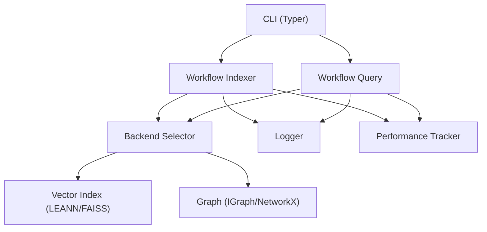

**Diagram sources**
- [src/ws_ctx_engine/cli/cli.py:27-800](file://src/ws_ctx_engine/cli/cli.py#L27-L800)
- [src/ws_ctx_engine/backend_selector/backend_selector.py:13-191](file://src/ws_ctx_engine/backend_selector/backend_selector.py#L13-L191)
- [src/ws_ctx_engine/workflow/indexer.py:72-493](file://src/ws_ctx_engine/workflow/indexer.py#L72-L493)
- [src/ws_ctx_engine/workflow/query.py:230-617](file://src/ws_ctx_engine/workflow/query.py#L230-L617)
- [src/ws_ctx_engine/logger/logger.py:13-145](file://src/ws_ctx_engine/logger/logger.py#L13-L145)
- [src/ws_ctx_engine/monitoring/performance.py:72-263](file://src/ws_ctx_engine/monitoring/performance.py#L72-L263)

**Section sources**
- [README.md:118-185](file://README.md#L118-L185)
- [docs/reference/config.md:1-453](file://docs/reference/config.md#L1-L453)

## Core Components
- CLI: Provides commands for doctor, index, search, query, and MCP server. Includes preflight dependency checks and agent-mode output.
- Configuration: Loads and validates YAML settings with defaults and validation rules.
- Backend Selector: Centralizes backend selection with graceful fallback across vector index, graph, and embeddings.
- Indexer: Builds and persists indexes, detects staleness, supports incremental updates, and tracks performance/memory.
- Query: Loads indexes, performs hybrid retrieval, budget selection, and output packaging.
- Logging: Dual-output logger with structured messages, fallback logging, phase metrics, and error context.
- Performance: Tracks timing, file counts, index size, tokens, and memory usage.
- Vector Index: LEANN and FAISS backends with embedding generation and caching.
- Graph: IGraph and NetworkX implementations with PageRank and persistence.
- Chunker: File discovery, ignore spec handling, and fallback warnings for unsupported extensions.

**Section sources**
- [src/ws_ctx_engine/cli/cli.py:27-800](file://src/ws_ctx_engine/cli/cli.py#L27-L800)
- [src/ws_ctx_engine/config/config.py:16-399](file://src/ws_ctx_engine/config/config.py#L16-L399)
- [src/ws_ctx_engine/backend_selector/backend_selector.py:13-191](file://src/ws_ctx_engine/backend_selector/backend_selector.py#L13-L191)
- [src/ws_ctx_engine/workflow/indexer.py:72-493](file://src/ws_ctx_engine/workflow/indexer.py#L72-L493)
- [src/ws_ctx_engine/workflow/query.py:230-617](file://src/ws_ctx_engine/workflow/query.py#L230-L617)
- [src/ws_ctx_engine/logger/logger.py:13-145](file://src/ws_ctx_engine/logger/logger.py#L13-L145)
- [src/ws_ctx_engine/monitoring/performance.py:72-263](file://src/ws_ctx_engine/monitoring/performance.py#L72-L263)
- [src/ws_ctx_engine/vector_index/vector_index.py:21-800](file://src/ws_ctx_engine/vector_index/vector_index.py#L21-L800)
- [src/ws_ctx_engine/graph/graph.py:19-667](file://src/ws_ctx_engine/graph/graph.py#L19-L667)
- [src/ws_ctx_engine/chunker/base.py:1-176](file://src/ws_ctx_engine/chunker/base.py#L1-L176)

## Architecture Overview
The system implements a layered architecture with automatic fallbacks and robust error handling:
- CLI orchestrates operations and validates runtime dependencies.
- Config drives behavior and validation.
- Backend Selector chooses optimal backends and logs fallback transitions.
- Indexer and Query pipelines track metrics and memory usage.
- Vector Index and Graph backends provide semantic and structural ranking.
- Logging and Performance modules provide observability.

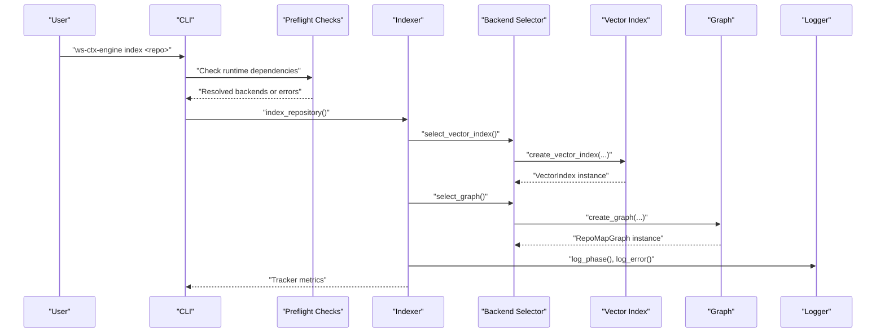

**Diagram sources**
- [src/ws_ctx_engine/cli/cli.py:406-501](file://src/ws_ctx_engine/cli/cli.py#L406-L501)
- [src/ws_ctx_engine/backend_selector/backend_selector.py:36-118](file://src/ws_ctx_engine/backend_selector/backend_selector.py#L36-L118)
- [src/ws_ctx_engine/workflow/indexer.py:178-282](file://src/ws_ctx_engine/workflow/indexer.py#L178-L282)
- [src/ws_ctx_engine/logger/logger.py:79-124](file://src/ws_ctx_engine/logger/logger.py#L79-L124)

**Section sources**
- [README.md:277-296](file://README.md#L277-L296)
- [docs/reference/config.md:143-176](file://docs/reference/config.md#L143-L176)

## Detailed Component Analysis

### CLI and Doctor Diagnostics
- Doctor command inspects optional dependencies and recommends installation tiers.
- Preflight validates runtime dependencies and resolves backend selections.
- Agent mode emits NDJSON for tooling integration.

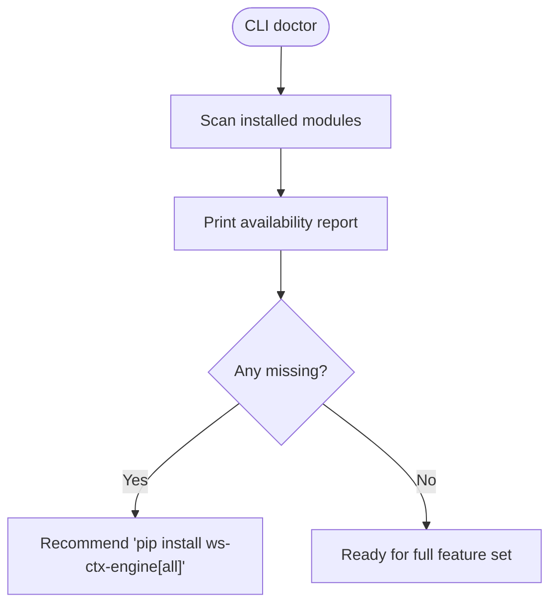

**Diagram sources**
- [src/ws_ctx_engine/cli/cli.py:329-364](file://src/ws_ctx_engine/cli/cli.py#L329-L364)

**Section sources**
- [src/ws_ctx_engine/cli/cli.py:239-327](file://src/ws_ctx_engine/cli/cli.py#L239-L327)
- [INSTALL.md:89-124](file://INSTALL.md#L89-L124)

### Configuration and Validation
- YAML loading with defaults and validation rules.
- Key validations include format, token budget, weights, patterns, backends, embeddings, and performance settings.
- Environment variables respected for API keys.

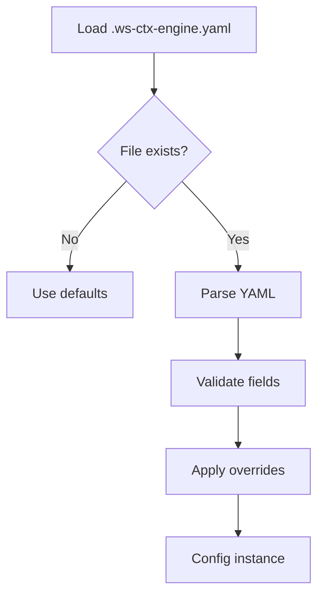

**Diagram sources**
- [src/ws_ctx_engine/config/config.py:112-215](file://src/ws_ctx_engine/config/config.py#L112-L215)

**Section sources**
- [docs/reference/config.md:340-356](file://docs/reference/config.md#L340-L356)
- [src/ws_ctx_engine/config/config.py:217-399](file://src/ws_ctx_engine/config/config.py#L217-L399)

### Backend Selection and Fallback
- Centralized selector with graceful degradation levels.
- Logs fallback transitions with component, primary, fallback, and reason.

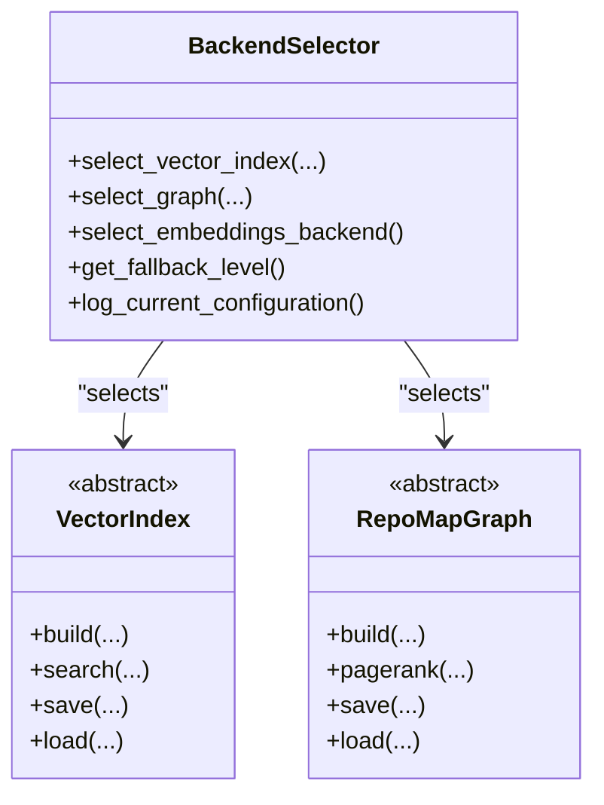

**Diagram sources**
- [src/ws_ctx_engine/backend_selector/backend_selector.py:13-191](file://src/ws_ctx_engine/backend_selector/backend_selector.py#L13-L191)
- [src/ws_ctx_engine/vector_index/vector_index.py:21-85](file://src/ws_ctx_engine/vector_index/vector_index.py#L21-L85)
- [src/ws_ctx_engine/graph/graph.py:19-95](file://src/ws_ctx_engine/graph/graph.py#L19-L95)

**Section sources**
- [src/ws_ctx_engine/backend_selector/backend_selector.py:120-178](file://src/ws_ctx_engine/backend_selector/backend_selector.py#L120-L178)
- [README.md:386-428](file://README.md#L386-L428)

### Indexing Pipeline
- Parses codebase, builds vector index and graph, persists metadata, and supports incremental updates.
- Detects staleness and rebuilds when needed.

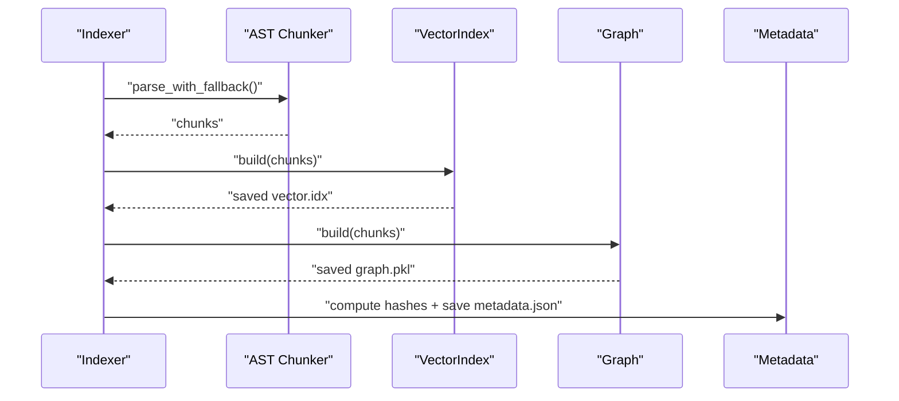

**Diagram sources**
- [src/ws_ctx_engine/workflow/indexer.py:72-371](file://src/ws_ctx_engine/workflow/indexer.py#L72-L371)

**Section sources**
- [src/ws_ctx_engine/workflow/indexer.py:27-69](file://src/ws_ctx_engine/workflow/indexer.py#L27-L69)
- [src/ws_ctx_engine/workflow/indexer.py:404-493](file://src/ws_ctx_engine/workflow/indexer.py#L404-L493)

### Query Pipeline
- Loads indexes, hybrid retrieval, budget selection, and output packing.
- Supports phase-aware ranking, deduplication, compression, and secret scanning.

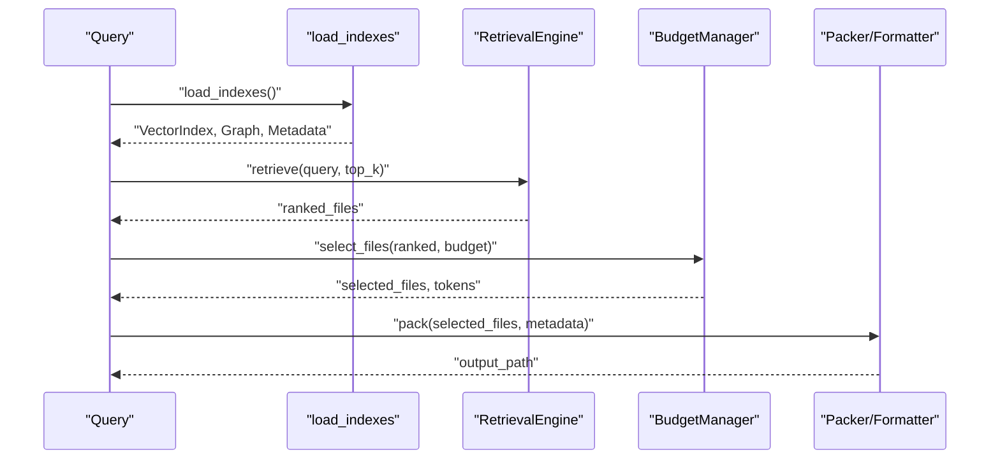

**Diagram sources**
- [src/ws_ctx_engine/workflow/query.py:230-617](file://src/ws_ctx_engine/workflow/query.py#L230-L617)

**Section sources**
- [src/ws_ctx_engine/workflow/query.py:158-228](file://src/ws_ctx_engine/workflow/query.py#L158-L228)
- [src/ws_ctx_engine/workflow/query.py:230-617](file://src/ws_ctx_engine/workflow/query.py#L230-L617)

### Logging and Error Handling
- Structured dual-output logging (console + file).
- Specialized methods: fallback, phase completion, error with context.
- Custom exceptions with actionable suggestions.

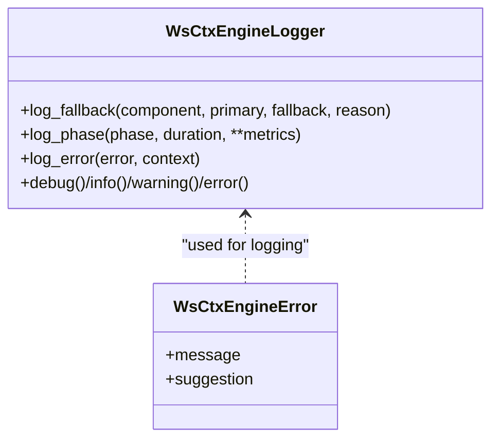

**Diagram sources**
- [src/ws_ctx_engine/logger/logger.py:13-145](file://src/ws_ctx_engine/logger/logger.py#L13-L145)
- [src/ws_ctx_engine/errors/errors.py:10-320](file://src/ws_ctx_engine/errors/errors.py#L10-L320)

**Section sources**
- [docs/guides/logging.md:1-100](file://docs/guides/logging.md#L1-L100)
- [src/ws_ctx_engine/logger/logger.py:64-124](file://src/ws_ctx_engine/logger/logger.py#L64-L124)
- [src/ws_ctx_engine/errors/errors.py:10-320](file://src/ws_ctx_engine/errors/errors.py#L10-L320)

### Performance Monitoring
- Tracks indexing and query timings, files processed/selected, total tokens, index size, and peak memory usage.
- Provides formatted metrics for diagnostics.

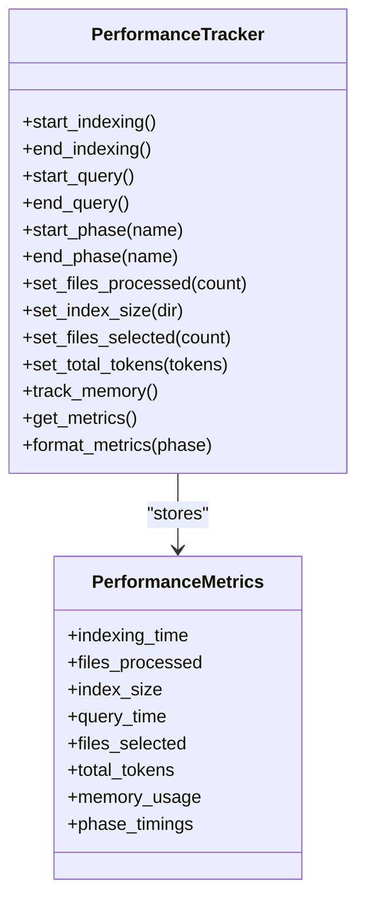

**Diagram sources**
- [src/ws_ctx_engine/monitoring/performance.py:72-263](file://src/ws_ctx_engine/monitoring/performance.py#L72-L263)

**Section sources**
- [src/ws_ctx_engine/monitoring/performance.py:13-263](file://src/ws_ctx_engine/monitoring/performance.py#L13-L263)

### Vector Index Backends
- LEANNIndex: Graph-based index with 97% storage savings.
- FAISSIndex: HNSW-like brute-force index with ID mapping for incremental updates.
- EmbeddingGenerator: Local (sentence-transformers) or API (OpenAI) with memory-aware fallback.

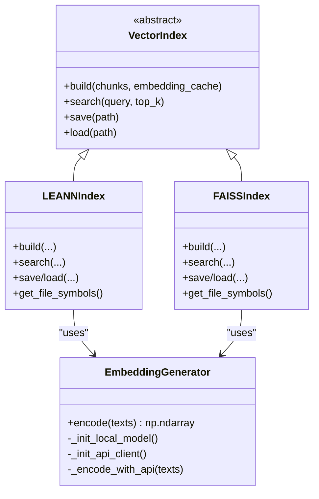

**Diagram sources**
- [src/ws_ctx_engine/vector_index/vector_index.py:21-800](file://src/ws_ctx_engine/vector_index/vector_index.py#L21-L800)

**Section sources**
- [src/ws_ctx_engine/vector_index/vector_index.py:96-280](file://src/ws_ctx_engine/vector_index/vector_index.py#L96-L280)
- [src/ws_ctx_engine/vector_index/vector_index.py:282-504](file://src/ws_ctx_engine/vector_index/vector_index.py#L282-L504)
- [src/ws_ctx_engine/vector_index/vector_index.py:506-800](file://src/ws_ctx_engine/vector_index/vector_index.py#L506-L800)

### Graph Backends
- IGraphRepoMap: Fast C++ backend using python-igraph.
- NetworkXRepoMap: Pure Python fallback with scipy or power iteration.
- Automatic backend selection and load-time detection.

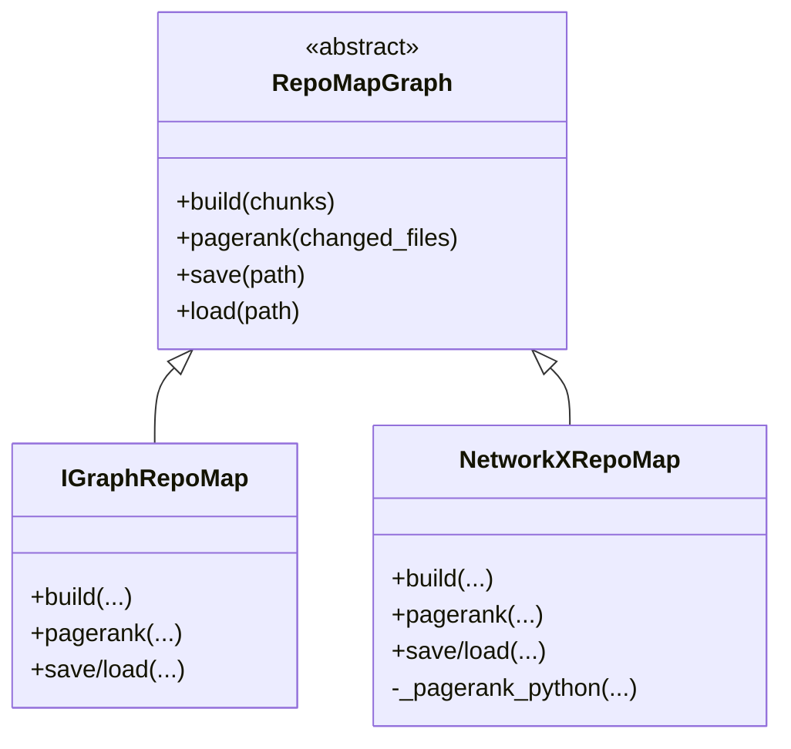

**Diagram sources**
- [src/ws_ctx_engine/graph/graph.py:19-667](file://src/ws_ctx_engine/graph/graph.py#L19-L667)

**Section sources**
- [src/ws_ctx_engine/graph/graph.py:97-315](file://src/ws_ctx_engine/graph/graph.py#L97-L315)
- [src/ws_ctx_engine/graph/graph.py:317-569](file://src/ws_ctx_engine/graph/graph.py#L317-L569)
- [src/ws_ctx_engine/graph/graph.py:572-667](file://src/ws_ctx_engine/graph/graph.py#L572-L667)

### Chunker and File Discovery
- Gitignore spec handling and pathspec-based matching.
- Fallback warnings for unsupported extensions.
- Optional Rust-accelerated file walker.

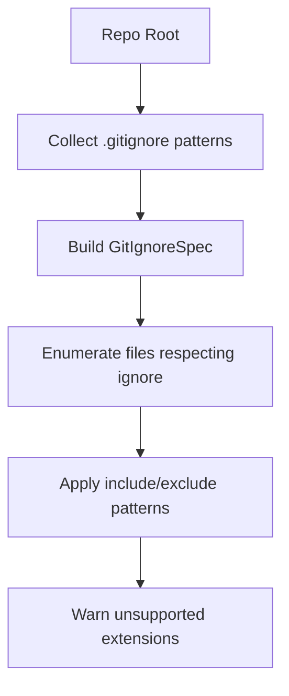

**Diagram sources**
- [src/ws_ctx_engine/chunker/base.py:47-176](file://src/ws_ctx_engine/chunker/base.py#L47-L176)

**Section sources**
- [src/ws_ctx_engine/chunker/base.py:1-176](file://src/ws_ctx_engine/chunker/base.py#L1-L176)

## Dependency Analysis
- Runtime dependency preflight resolves vector_index, graph, and embeddings backends and validates requirements.
- Doctor provides a quick health-check of optional dependencies.
- Backend Selector logs fallback transitions to aid diagnosis.

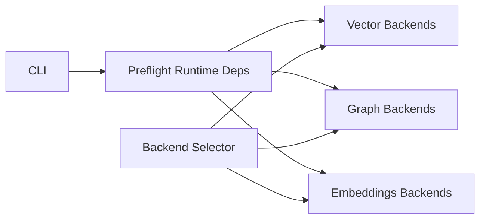

**Diagram sources**
- [src/ws_ctx_engine/cli/cli.py:256-327](file://src/ws_ctx_engine/cli/cli.py#L256-L327)
- [src/ws_ctx_engine/backend_selector/backend_selector.py:13-191](file://src/ws_ctx_engine/backend_selector/backend_selector.py#L13-L191)

**Section sources**
- [src/ws_ctx_engine/cli/cli.py:239-327](file://src/ws_ctx_engine/cli/cli.py#L239-L327)
- [src/ws_ctx_engine/backend_selector/backend_selector.py:120-178](file://src/ws_ctx_engine/backend_selector/backend_selector.py#L120-L178)

## Performance Considerations
- Optional Rust extension accelerates hot-path operations (file walk, hashing, token counting).
- Performance targets and benchmarking guidance are documented.
- Memory tracking via psutil is integrated; fallback when memory is low.
- Incremental indexing reduces rebuild costs.

**Section sources**
- [docs/guides/performance.md:1-81](file://docs/guides/performance.md#L1-L81)
- [src/ws_ctx_engine/monitoring/performance.py:185-206](file://src/ws_ctx_engine/monitoring/performance.py#L185-L206)
- [src/ws_ctx_engine/vector_index/vector_index.py:130-142](file://src/ws_ctx_engine/vector_index/vector_index.py#L130-L142)
- [src/ws_ctx_engine/workflow/indexer.py:139-155](file://src/ws_ctx_engine/workflow/indexer.py#L139-L155)

## Troubleshooting Guide

### Installation and Setup
- Verify Python version meets minimum requirement.
- Use doctor to check optional dependencies and install recommended profile.
- If C++ compilation fails, switch to the fast tier or install build tools per platform.

**Section sources**
- [INSTALL.md:89-124](file://INSTALL.md#L89-L124)
- [README.md:16-76](file://README.md#L16-L76)

### Dependency Problems
Common symptoms:
- Missing optional dependencies cause degraded performance or fallbacks.
- Explicit backend selection may fail if required packages are missing.

Resolution steps:
- Run doctor to identify missing packages.
- Install recommended profile or targeted extras.
- For explicit backends, ensure required packages are installed.

Diagnostic commands:
- ws-ctx-engine doctor
- ws-ctx-engine index/search/query with verbose logging

Log analysis:
- Look for fallback logs indicating component, primary, fallback, and reason.

**Section sources**
- [src/ws_ctx_engine/cli/cli.py:329-364](file://src/ws_ctx_engine/cli/cli.py#L329-L364)
- [src/ws_ctx_engine/backend_selector/backend_selector.py:68-80](file://src/ws_ctx_engine/backend_selector/backend_selector.py#L68-L80)
- [src/ws_ctx_engine/logger/logger.py:64-77](file://src/ws_ctx_engine/logger/logger.py#L64-L77)

### Configuration Errors
Common symptoms:
- Invalid format, token budget, weights, patterns, backends, or embeddings settings.
- YAML parse errors or missing configuration file.

Resolution steps:
- Validate .ws-ctx-engine.yaml against documented schema.
- Fix invalid values; the system logs warnings and resets to defaults when possible.
- Ensure weights sum to 1.0 within tolerance.

Diagnostic commands:
- Verify config load with CLI commands; check logs for validation messages.

**Section sources**
- [docs/reference/config.md:340-356](file://docs/reference/config.md#L340-L356)
- [src/ws_ctx_engine/config/config.py:217-399](file://src/ws_ctx_engine/config/config.py#L217-L399)

### Indexing Failures
Common symptoms:
- Parsing errors, vector index build failures, graph build failures, or metadata save errors.
- Stale or corrupted indexes.

Resolution steps:
- Rebuild indexes after fixing underlying issues.
- For corrupted indexes, delete and rebuild.
- Enable verbose logging to capture detailed error context.

Diagnostic commands:
- ws-ctx-engine index --verbose
- Inspect .ws-ctx-engine/logs/ for structured logs.

**Section sources**
- [src/ws_ctx_engine/workflow/indexer.py:174-177](file://src/ws_ctx_engine/workflow/indexer.py#L174-L177)
- [src/ws_ctx_engine/workflow/indexer.py:251-254](file://src/ws_ctx_engine/workflow/indexer.py#L251-L254)
- [src/ws_ctx_engine/workflow/indexer.py:279-282](file://src/ws_ctx_engine/workflow/indexer.py#L279-L282)
- [src/ws_ctx_engine/workflow/indexer.py:426-493](file://src/ws_ctx_engine/workflow/indexer.py#L426-L493)

### Query Errors
Common symptoms:
- Indexes not found, retrieval failures, budget exceeded, or packing errors.
- Empty results or insufficient files selected.

Resolution steps:
- Ensure indexes exist and are current; rebuild if stale.
- Adjust token budget or query to improve results.
- Check output format and packing logic.

Diagnostic commands:
- ws-ctx-engine query/search --verbose
- Review logs for retrieval and budget selection phases.

**Section sources**
- [src/ws_ctx_engine/workflow/query.py:316-323](file://src/ws_ctx_engine/workflow/query.py#L316-L323)
- [src/ws_ctx_engine/workflow/query.py:377-380](file://src/ws_ctx_engine/workflow/query.py#L377-L380)
- [src/ws_ctx_engine/workflow/query.py:409-412](file://src/ws_ctx_engine/workflow/query.py#L409-L412)
- [src/ws_ctx_engine/workflow/query.py:598-601](file://src/ws_ctx_engine/workflow/query.py#L598-L601)

### Output Generation Problems
Common symptoms:
- Unsupported format, packing failures, or empty output.
- Secrets scanning redactions affecting content.

Resolution steps:
- Verify format is supported and configured.
- Enable secrets scan if needed; note content redaction behavior.
- Check output directory permissions and disk space.

Diagnostic commands:
- ws-ctx-engine query/pack with verbose logging.
- Inspect generated output files and metadata.

**Section sources**
- [src/ws_ctx_engine/workflow/query.py:504-588](file://src/ws_ctx_engine/workflow/query.py#L504-L588)
- [src/ws_ctx_engine/workflow/query.py:589-601](file://src/ws_ctx_engine/workflow/query.py#L589-L601)

### Backend Selection and Fallback Issues
Common symptoms:
- Fallback transitions occur unexpectedly.
- Performance degrades due to fallbacks.

Resolution steps:
- Review backend configuration and install missing packages.
- Use doctor to confirm availability of preferred backends.
- Monitor fallback logs to understand reasons.

**Section sources**
- [src/ws_ctx_engine/backend_selector/backend_selector.py:120-178](file://src/ws_ctx_engine/backend_selector/backend_selector.py#L120-L178)
- [README.md:386-428](file://README.md#L386-L428)

### Memory Usage Concerns
Symptoms:
- Out-of-memory during embedding generation or graph operations.

Resolution steps:
- Reduce batch size or switch to API embeddings.
- Lower device memory threshold by ensuring adequate RAM.
- Use smaller token budgets or fewer files.

Diagnostic commands:
- Enable verbose logging and monitor memory usage metrics.

**Section sources**
- [src/ws_ctx_engine/vector_index/vector_index.py:130-142](file://src/ws_ctx_engine/vector_index/vector_index.py#L130-L142)
- [src/ws_ctx_engine/vector_index/vector_index.py:234-246](file://src/ws_ctx_engine/vector_index/vector_index.py#L234-L246)
- [src/ws_ctx_engine/monitoring/performance.py:185-206](file://src/ws_ctx_engine/monitoring/performance.py#L185-L206)

### Agent Integration Challenges
Symptoms:
- Tool availability or rate limiting issues.

Resolution steps:
- Use agent mode for NDJSON output.
- Configure rate limits for MCP tools.
- Ensure required packages are installed.

**Section sources**
- [src/ws_ctx_engine/cli/cli.py:55-86](file://src/ws_ctx_engine/cli/cli.py#L55-L86)
- [src/ws_ctx_engine/cli/cli.py:204-229](file://src/ws_ctx_engine/cli/cli.py#L204-L229)

### Migration and Version Upgrade
Guidance:
- Rebuild indexes after upgrading to ensure compatibility.
- Validate configuration against latest schema.
- Review breaking changes and feature flags in release notes.

**Section sources**
- [README.md:421-428](file://README.md#L421-L428)

## Conclusion
This guide consolidates practical troubleshooting and FAQ content for ws-ctx-engine. By leveraging doctor checks, structured logging, performance metrics, and backend fallbacks, most issues can be diagnosed and resolved efficiently. For persistent or complex problems, escalate with detailed logs, metrics, and reproduction steps.

## Appendices

### Diagnostic Commands Cheat Sheet
- Dependency health: ws-ctx-engine doctor
- Indexing: ws-ctx-engine index <repo> --verbose
- Searching: ws-ctx-engine search "<query>" --repo <repo> --verbose
- Querying: ws-ctx-engine query "<query>" --repo <repo> --verbose
- MCP server: ws-ctx-engine mcp --workspace <path> --rate-limit tool=limit

**Section sources**
- [src/ws_ctx_engine/cli/cli.py:406-694](file://src/ws_ctx_engine/cli/cli.py#L406-L694)

### Log Analysis Techniques
- Console logs: INFO and above for user-facing progress.
- File logs: DEBUG and above for detailed traces.
- Look for fallback logs, phase completions, and error contexts.
- Use structured format: timestamp | level | name | message.

**Section sources**
- [docs/guides/logging.md:1-100](file://docs/guides/logging.md#L1-L100)
- [src/ws_ctx_engine/logger/logger.py:13-145](file://src/ws_ctx_engine/logger/logger.py#L13-L145)

### Error Message Interpretation
- DependencyError: Missing backend or package; install recommended extras.
- ConfigurationError: Invalid field values; update YAML accordingly.
- ParsingError: Syntax errors or unsupported languages; fix or exclude files.
- IndexError: Corrupted or stale indexes; rebuild.
- BudgetError: Budget exceeded or no files fit; increase budget or adjust selection.

**Section sources**
- [src/ws_ctx_engine/errors/errors.py:10-320](file://src/ws_ctx_engine/errors/errors.py#L10-L320)

### Preventive Measures
- Keep dependencies updated and run doctor regularly.
- Use incremental indexing for large repositories.
- Tune token budget and weights for your use case.
- Monitor performance metrics and memory usage.

**Section sources**
- [docs/reference/config.md:161-176](file://docs/reference/config.md#L161-L176)
- [src/ws_ctx_engine/monitoring/performance.py:215-263](file://src/ws_ctx_engine/monitoring/performance.py#L215-L263)

### Escalation Procedures
- Gather: CLI version, OS, Python version, doctor report, logs, metrics.
- Reproduce: Provide minimal repo and exact commands.
- Attach: .ws-ctx-engine/logs/* and .ws-ctx-engine/ contents if available.

**Section sources**
- [src/ws_ctx_engine/cli/cli.py:366-374](file://src/ws_ctx_engine/cli/cli.py#L366-L374)