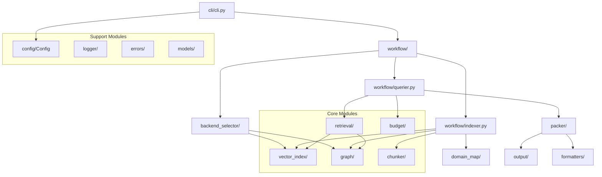

# ws-ctx-engine: System Architecture

## 1. System Overview

ws-ctx-engine implements a **6-stage pipeline** that transforms a codebase into optimized LLM context:

```
┌─────────────┐    ┌─────────────┐    ┌─────────────┐    ┌─────────────┐    ┌─────────────┐    ┌─────────────┐
│   Stage 1   │───▶│   Stage 2   │───▶│   Stage 3   │───▶│   Stage 4   │───▶│   Stage 5   │───▶│   Stage 6   │
│  Chunking   │    │  Indexing   │    │  Graphing   │    │   Ranking   │    │  Selection  │    │   Packing   │
│             │    │             │    │             │    │             │    │             │    │             │
│ AST Parse   │    │ Embeddings  │    │ PageRank    │    │ Hybrid      │    │ Greedy      │    │ XML/ZIP     │
│ → Chunks    │    │ → Vectors   │    │ → Scores    │    │ Merge       │    │ Knapsack    │    │ Generation  │
└─────────────┘    └─────────────┘    └─────────────┘    └─────────────┘    └─────────────┘    └─────────────┘
      │                  │                  │                  │                  │                  │
      ▼                  ▼                  ▼                  ▼                  ▼                  ▼
 CodeChunk[]        VectorIndex       RepoMapGraph       Dict[str,float]   SelectedFile[]      Output File
```

### Pipeline Phases

| Phase | Name      | Input                 | Output               | Persistence                 |
| ----- | --------- | --------------------- | -------------------- | --------------------------- |
| 1     | Chunking  | Source files          | `List[CodeChunk]`    | In-memory                   |
| 2     | Indexing  | CodeChunks            | `VectorIndex`        | `.ws-ctx-engine/vector.idx` |
| 3     | Graphing  | CodeChunks            | `RepoMapGraph`       | `.ws-ctx-engine/graph.pkl`  |
| 4     | Ranking   | Query + Indexes       | `Dict[str, float]`   | In-memory                   |
| 5     | Selection | Ranked files + Budget | `List[SelectedFile]` | In-memory                   |
| 6     | Packing   | Selected files        | XML/ZIP file         | Output directory            |

---

## 2. Technology Stack

### 2.1 Primary + Fallback Backends

| Component          | Primary                                 | Fallback 1     | Fallback 2 | Minimal           |
| ------------------ | --------------------------------------- | -------------- | ---------- | ----------------- |
| **AST Parsing**    | tree-sitter (C bindings, 40+ languages) | Regex patterns | —          | Regex             |
| **Embeddings**     | sentence-transformers (local)           | OpenAI API     | TF-IDF     | TF-IDF            |
| **Vector Index**   | NativeLEANN (97% storage savings)       | FAISS (HNSW)   | LEANNIndex | Cosine similarity |
| **Graph Analysis** | python-igraph (C++ backend)             | NetworkX       | —          | File size ranking |
| **Token Counting** | tiktoken (cl100k_base)                  | —              | —          | tiktoken          |

### 2.2 Core Dependencies

| Library    | Version | Purpose                                      |
| ---------- | ------- | -------------------------------------------- |
| `tiktoken` | ≥0.7.0  | OpenAI tokenizer for accurate token counting |
| `PyYAML`   | ≥6.0    | Configuration file parsing                   |
| `lxml`     | ≥5.0.0  | XML generation (C-based, fast)               |
| `typer`    | ≥0.12.0 | Type-safe CLI framework                      |
| `rich`     | ≥13.0.0 | Terminal formatting and progress bars        |

### 2.3 Optional Dependencies by Tier

```bash
# Minimal: Core functionality only
pip install ws-ctx-engine

# Fast: Adds fallback backends
pip install "ws-ctx-engine[fast]"
# Adds: faiss-cpu, networkx, scikit-learn

# All: Full feature set (recommended)
pip install "ws-ctx-engine[all]"
# Adds: leann, python-igraph, sentence-transformers, torch, tree-sitter

# Dev: Development tools
pip install "ws-ctx-engine[dev]"
# Adds: pytest, black, ruff, mypy, hypothesis
```

---

## 3. 6-Stage Pipeline Details

### Stage 1: Code Chunking

**Purpose**: Parse source files into structured `CodeChunk` objects with metadata.

```python
@dataclass
class CodeChunk:
    path: str                    # File path relative to repo root
    content: str                 # Source code content
    language: str                # Detected language
    symbols_defined: List[str]   # Classes, functions, variables defined
    symbols_referenced: List[str] # Identifiers referenced
    start_line: int              # Starting line number
    end_line: int                # Ending line number
    chunk_type: str              # 'file', 'class', 'function', etc.
```

**Backend Selection**:

```
tree-sitter available?
  ├── Yes → TreeSitterChunker (accurate AST, 40+ languages)
  └── No  → RegexChunker (Python, JS, TS only)
              └── MarkdownChunker (for .md files)
```

**Language Resolvers**:

- `PythonResolver`: Functions, classes, imports, decorators
- `JavaScriptResolver`: Functions, classes, exports, JSX
- `TypeScriptResolver`: Extends JS with type annotations
- `RustResolver`: Functions, structs, impls, traits
- `MarkdownResolver`: Headers, code blocks

### Stage 2: Semantic Indexing

**Purpose**: Generate vector embeddings for semantic search.

```python
class VectorIndex(ABC):
    def build(self, chunks: List[CodeChunk]) -> None: ...
    def search(self, query: str, top_k: int) -> Dict[str, float]: ...
    def save(self, path: str) -> None: ...
    def load(cls, path: str) -> "VectorIndex": ...
```

**Embedding Generation**:

```
Local Model (sentence-transformers)
  ├── Model: all-MiniLM-L6-v2 (384-dim, fast)
  ├── Alternative: all-mpnet-base-v2 (768-dim, better quality)
  └── Device: cpu/cuda/mps

API Fallback (OpenAI)
  ├── Model: text-embedding-3-small
  └── Triggered by: OOM, model load failure
```

**Index Backends**:

| Backend     | Storage        | Query Speed | Build Speed | When Used                         |
| ----------- | -------------- | ----------- | ----------- | --------------------------------- |
| NativeLEANN | ~3% of FAISS   | Fast        | Fast        | Primary (leann library available) |
| FAISSIndex  | ~100% baseline | Very Fast   | Fast        | Fallback (faiss-cpu available)    |
| LEANNIndex  | ~3%            | Medium      | Medium      | Fallback (neither available)      |

### Stage 3: Dependency Graphing

**Purpose**: Build dependency graph and compute PageRank scores.

```python
class RepoMapGraph(ABC):
    def build(self, chunks: List[CodeChunk]) -> None: ...
    def rank(self, seed_files: List[str]) -> Dict[str, float]: ...
    def save(self, path: str) -> None: ...
    def load(cls, path: str) -> "RepoMapGraph": ...
```

**Graph Construction**:

```
For each CodeChunk:
  Node: file path
  Edges: symbols_referenced → symbols_defined mappings

Example:
  login.py defines: login(), authenticate()
  session.py references: login()
  → Edge: session.py → login.py
```

**PageRank Computation**:

```python
# With seed files (changed files get boost)
pagerank_scores = graph.pagerank(
    personalization={changed_file: 1.0 for changed_file in changed_files}
)

# Without seed files (structural importance)
pagerank_scores = graph.pagerank()
```

### Stage 4: Hybrid Ranking

**Purpose**: Merge semantic and structural scores with query-specific boosts.

```python
class RetrievalEngine:
    def retrieve(
        self,
        query: str,
        changed_files: List[str] = None,
        top_k: int = 100
    ) -> List[Tuple[str, float]]:
        # Step 1: Semantic search
        semantic_scores = self.vector_index.search(query, top_k=top_k)

        # Step 2: PageRank computation
        pagerank_scores = self.graph.rank(seed_files=changed_files)

        # Step 3: Normalize both to [0, 1]
        semantic_norm = self._normalize(semantic_scores)
        pagerank_norm = self._normalize(pagerank_scores)

        # Step 4: Merge with weights
        merged = self._merge_scores(semantic_norm, pagerank_norm)

        # Step 5: Apply boosts and penalties
        boosted = self._apply_boosts(merged, query)
        penalized = self._apply_test_penalty(boosted)

        # Step 6: Final normalization and sort
        return sorted(penalized.items(), key=lambda x: x[1], reverse=True)
```

**Score Formula**:

```
base_score = semantic_weight × semantic_score + pagerank_weight × pagerank_score

final_score = (base_score + symbol_boost + path_boost + domain_boost) × (1 - test_penalty)
```

### Stage 5: Budget Selection

**Purpose**: Select files that maximize importance within token budget.

```python
class BudgetManager:
    def select(
        self,
        ranked_files: List[Tuple[str, float]],
        token_budget: int
    ) -> List[SelectedFile]:
        content_budget = int(token_budget * 0.8)  # 80% for content
        metadata_reserve = int(token_budget * 0.2)  # 20% for metadata

        selected = []
        used_tokens = 0

        for file_path, score in ranked_files:
            file_tokens = self.count_tokens(file_path)
            if used_tokens + file_tokens <= content_budget:
                selected.append(SelectedFile(
                    path=file_path,
                    score=score,
                    tokens=file_tokens
                ))
                used_tokens += file_tokens

        return selected
```

**Token Counting**:

```python
import tiktoken

encoder = tiktoken.get_encoding("cl100k_base")

def count_tokens(content: str) -> int:
    return len(encoder.encode(content))
```

### Stage 6: Output Generation

**Purpose**: Package selected files into final output format.

**XML Packer**:

```xml
<?xml version="1.0" encoding="UTF-8"?>
<repository name="project" files="25" tokens="48000">
  <metadata>
    <generated>2024-03-25T10:30:00Z</generated>
    <query>authentication logic</query>
  </metadata>
  <file path="src/auth/login.py" tokens="2500" importance="0.95">
    <![CDATA[
def login(username: str, password: str) -> User:
    ...
    ]]>
  </file>
</repository>
```

**ZIP Packer**:

```
ws-ctx-engine.zip
├── files/           # Preserved directory structure
│   └── src/
│       └── auth/
│           └── login.py
└── REVIEW_CONTEXT.md  # Manifest with scores and reading order
```

---

## 4. Fallback Strategy

### 4.1 Complete Fallback Hierarchy

```
Level 1: igraph + NativeLEANN + local embeddings
         (Optimal: C++ performance, 97% storage savings)

    ↓ igraph install fails (C++ compilation)

Level 2: NetworkX + NativeLEANN + local embeddings
         (Slower PageRank, same vector performance)

    ↓ LEANN library unavailable

Level 3: NetworkX + LEANNIndex + local embeddings
         (Pure Python LEANN fallback)

    ↓ LEANNIndex fails (memory, compatibility)

Level 4: NetworkX + FAISS + local embeddings
         (HNSW index, more storage)

    ↓ Local embeddings OOM

Level 5: NetworkX + FAISS + API embeddings
         (OpenAI API for embeddings)

    ↓ API fails (network, rate limits)

Level 6: File size ranking only
         (No semantic, no structural - emergency mode)
```

### 4.2 Backend Detection Logic

```python
def select_vector_index(backend: str = "auto") -> VectorIndex:
    if backend == "native-leann":
        return NativeLEANNIndex()
    elif backend == "faiss":
        return FAISSIndex()
    elif backend == "leann":
        return LEANNIndex()
    elif backend == "auto":
        # Try in priority order
        try:
            from leann import LEANNIndex as NativeIndex
            return NativeLEANNIndex()
        except ImportError:
            pass

        try:
            import faiss
            return FAISSIndex()
        except ImportError:
            pass

        return LEANNIndex()  # Pure Python fallback
```

### 4.3 Fallback Logging

All transitions are logged with actionable suggestions:

```
WARNING: NativeLEANN not available, falling back to FAISS
Suggestion: Install with: pip install "ws-ctx-engine[all]"

WARNING: Local embeddings OOM, falling back to API
Suggestion: Reduce batch_size in config or set OPENAI_API_KEY
```

---

## 5. Design Patterns

### 5.1 Strategy Pattern: Language Resolvers

```python
class LanguageResolver(ABC):
    @abstractmethod
    def parse(self, content: str, path: str) -> List[CodeChunk]: ...

class PythonResolver(LanguageResolver):
    def parse(self, content: str, path: str) -> List[CodeChunk]:
        # Python-specific AST parsing
        ...

class JavaScriptResolver(LanguageResolver):
    def parse(self, content: str, path: str) -> List[CodeChunk]:
        # JavaScript-specific parsing
        ...

# Usage
resolvers = {
    ".py": PythonResolver(),
    ".js": JavaScriptResolver(),
    ".ts": TypeScriptResolver(),
}
```

### 5.2 Factory Pattern: Backend Creation

```python
def create_vector_index(backend: str = "auto", **kwargs) -> VectorIndex:
    """Factory function with automatic fallback."""
    ...

def create_graph(backend: str = "auto", **kwargs) -> RepoMapGraph:
    """Factory function with automatic fallback."""
    ...

def create_backend_selector(config: Config = None) -> BackendSelector:
    """Factory for creating BackendSelector instance."""
    ...
```

### 5.3 Template Method: ASTChunker Pipeline

```python
class ASTChunker:
    def chunk(self, repo_path: str) -> List[CodeChunk]:
        # Template method defining the algorithm skeleton
        files = self._discover_files(repo_path)
        chunks = []
        for file in files:
            content = self._read_file(file)
            language = self._detect_language(file)
            resolver = self._get_resolver(language)
            chunks.extend(resolver.parse(content, file))
        return chunks

    # Hooks for customization
    def _discover_files(self, path: str) -> List[str]: ...
    def _detect_language(self, path: str) -> str: ...
    def _get_resolver(self, language: str) -> LanguageResolver: ...
```

### 5.4 Adapter Pattern: Embedding Generator

```python
class EmbeddingGenerator:
    """Adapter for local vs API embeddings."""

    def encode(self, texts: List[str]) -> np.ndarray:
        if self._use_local():
            return self._encode_local(texts)
        else:
            return self._encode_api(texts)

    def _encode_local(self, texts: List[str]) -> np.ndarray:
        from sentence_transformers import SentenceTransformer
        model = SentenceTransformer(self.model_name)
        return model.encode(texts)

    def _encode_api(self, texts: List[str]) -> np.ndarray:
        # OpenAI API call
        ...
```

### 5.5 Decorator Pattern: Shuffle for Model Recall

```python
def shuffle_for_model_recall(selected_files: List[SelectedFile]) -> List[SelectedFile]:
    """
    Reorder files to combat "Lost in the Middle" phenomenon.
    Places high-importance files at beginning and end.
    """
    if len(selected_files) <= 2:
        return selected_files

    sorted_files = sorted(selected_files, key=lambda f: f.score, reverse=True)

    # Interleave: high, low, high, low...
    result = []
    left, right = 0, len(sorted_files) - 1
    toggle = True
    while left <= right:
        if toggle:
            result.append(sorted_files[left])
            left += 1
        else:
            result.append(sorted_files[right])
            right -= 1
        toggle = not toggle

    return result
```

---

## 6. Inter-Module Dependency Graph



---

## 7. Data Flow Diagram

```
┌─────────────────────────────────────────────────────────────────────────────┐
│                              USER INPUT                                      │
│  • Repository path: /path/to/repo                                           │
│  • Query: "authentication logic"                                            │
│  • Budget: 100,000 tokens                                                   │
│  • Format: zip                                                              │
└─────────────────────────────────┬───────────────────────────────────────────┘
                                  │
                                  ▼
┌─────────────────────────────────────────────────────────────────────────────┐
│                           STAGE 1: CHUNKING                                  │
│  ┌─────────────┐    ┌─────────────────┐    ┌─────────────────────────────┐ │
│  │ File Walker │───▶│ Language Detect │───▶│ AST Parser (tree-sitter)    │ │
│  └─────────────┘    └─────────────────┘    │ or Regex Parser (fallback)  │ │
│                                             └──────────────┬──────────────┘ │
└────────────────────────────────────────────────────────────┼────────────────┘
                                                             │
                                  ┌──────────────────────────┘
                                  ▼
                    ┌─────────────────────────────┐
                    │    List[CodeChunk]          │
                    │    • path: str              │
                    │    • content: str           │
                    │    • symbols_defined: []    │
                    │    • symbols_referenced: [] │
                    └─────────────┬───────────────┘
                                  │
          ┌───────────────────────┼───────────────────────┐
          ▼                       ▼                       ▼
┌─────────────────┐    ┌─────────────────┐    ┌─────────────────┐
│  STAGE 2:       │    │  STAGE 3:       │    │  Domain Map     │
│  INDEXING       │    │  GRAPHING       │    │  Building       │
│                 │    │                 │    │                 │
│ Embeddings      │    │ Symbol → File   │    │ Keywords →      │
│ → Vector Index  │    │ → Dep Graph     │    │ Directories     │
│                 │    │ → PageRank      │    │                 │
└────────┬────────┘    └────────┬────────┘    └────────┬────────┘
         │                      │                      │
         ▼                      ▼                      ▼
   .ws-ctx-engine/        .ws-ctx-engine/        .ws-ctx-engine/
   vector.idx             graph.pkl              domain_map.db
         │                      │                      │
         └──────────────────────┼──────────────────────┘
                                │
                    ┌───────────┴───────────┐
                    │    QUERY ARRIVES      │
                    │ "authentication logic"│
                    └───────────┬───────────┘
                                │
                                ▼
┌─────────────────────────────────────────────────────────────────────────────┐
│                           STAGE 4: RANKING                                   │
│                                                                              │
│  ┌─────────────────┐         ┌─────────────────┐         ┌───────────────┐ │
│  │ Vector Search   │         │ PageRank Calc   │         │ Query Signals │ │
│  │ (top-k=100)     │         │ (seed: changed) │         │ • Symbol      │ │
│  │                 │         │                 │         │ • Path        │ │
│  │ semantic_scores │         │ pagerank_scores │         │ • Domain      │ │
│  └────────┬────────┘         └────────┬────────┘         └───────┬───────┘ │
│           │                           │                          │         │
│           └───────────────┬───────────┘                          │         │
│                           ▼                                      │         │
│           ┌─────────────────────────────┐                        │         │
│           │ _merge_scores()             │                        │         │
│           │ 0.6 × semantic + 0.4 × rank │◀───────────────────────┘         │
│           └─────────────┬───────────────┘                                  │
│                         │                                                  │
│                         ▼                                                  │
│           ┌─────────────────────────────┐                                  │
│           │ _apply_boosts()             │                                  │
│           │ + symbol_boost (0.3)        │                                  │
│           │ + path_boost (0.2)          │                                  │
│           │ + domain_boost (0.25)       │                                  │
│           │ × (1 - test_penalty)        │                                  │
│           └─────────────┬───────────────┘                                  │
└─────────────────────────┼───────────────────────────────────────────────────┘
                          │
                          ▼
            ┌─────────────────────────────┐
            │    Dict[str, float]         │
            │    {                        │
            │      "src/auth/login.py":   │
            │        0.95,                │
            │      "src/auth/session.py": │
            │        0.87,                │
            │      ...                    │
            │    }                        │
            └─────────────┬───────────────┘
                          │
                          ▼
┌─────────────────────────────────────────────────────────────────────────────┐
│                        STAGE 5: BUDGET SELECTION                             │
│                                                                              │
│  Budget: 100,000 tokens                                                     │
│  ├── Content: 80,000 (80%)                                                  │
│  └── Metadata: 20,000 (20%)                                                 │
│                                                                              │
│  Greedy Knapsack:                                                           │
│  ┌──────────────────────┬─────────┬────────────┬────────────┐              │
│  │ File                 │ Score   │ Tokens     │ Cumulative │              │
│  ├──────────────────────┼─────────┼────────────┼────────────┤              │
│  │ src/auth/login.py    │ 0.95    │ 2,500      │ 2,500      │ ✓            │
│  │ src/auth/session.py  │ 0.87    │ 1,800      │ 4,300      │ ✓            │
│  │ src/models/user.py   │ 0.82    │ 3,200      │ 7,500      │ ✓            │
│  │ ...                  │ ...     │ ...        │ ...        │              │
│  │ tests/test_auth.py   │ 0.45    │ 4,500      │ 79,800     │ ✓            │
│  │ docs/README.md       │ 0.30    │ 1,500      │ 81,300     │ ✗ (exceeds)  │
│  └──────────────────────┴─────────┴────────────┴────────────┘              │
└─────────────────────────┬───────────────────────────────────────────────────┘
                          │
                          ▼
            ┌─────────────────────────────┐
            │    List[SelectedFile]       │
            │    25 files, 79,800 tokens  │
            └─────────────┬───────────────┘
                          │
                          ▼
┌─────────────────────────────────────────────────────────────────────────────┐
│                        STAGE 6: PACKING                                      │
│                                                                              │
│  Format: ZIP                                                                │
│                                                                              │
│  ws-ctx-engine.zip                                                          │
│  ├── files/                                                                 │
│  │   ├── src/                                                               │
│  │   │   ├── auth/                                                          │
│  │   │   │   ├── login.py                                                   │
│  │   │   │   └── session.py                                                 │
│  │   │   └── models/                                                        │
│  │   │       └── user.py                                                    │
│  │   └── tests/                                                             │
│  │       └── test_auth.py                                                   │
│  └── REVIEW_CONTEXT.md                                                      │
│      ├── Query: "authentication logic"                                      │
│      ├── Files: 25 (79,800 tokens)                                          │
│      ├── Reading Order                                                      │
│      └── Dependency Hints                                                   │
└─────────────────────────────────────────────────────────────────────────────┘
```

---

## 8. Error Handling Philosophy

### "Fail Gracefully, Log Actionably"

### 8.1 Exception Hierarchy

```python
class WsCtxEngineError(Exception):
    """Base exception with message and suggestion."""
    def __init__(self, message: str, suggestion: str):
        self.message = message
        self.suggestion = suggestion
        super().__init__(f"{message}\n\nSuggestion: {suggestion}")

class DependencyError(WsCtxEngineError):
    """Missing required dependency."""
    @classmethod
    def missing_backend(cls, backend: str, install_cmd: str): ...

class ConfigurationError(WsCtxEngineError):
    """Invalid configuration."""
    @classmethod
    def invalid_value(cls, field: str, value: any, expected: str): ...

class ParsingError(WsCtxEngineError):
    """Source code parsing failure."""
    @classmethod
    def syntax_error(cls, file_path: str, line: int, error: str): ...

class IndexError(WsCtxEngineError):
    """Index operation failure."""
    @classmethod
    def corrupted_index(cls, index_path: str): ...

class BudgetError(WsCtxEngineError):
    """Token budget issues."""
    @classmethod
    def budget_exceeded(cls, required: int, available: int): ...
```

### 8.2 Error Messages Format

Every error includes:

1. **What failed**: Clear description of the failure
2. **Why it failed**: Context about the cause
3. **How to fix**: Actionable suggestion

```
DependencyError: Backend 'igraph' is not available

Suggestion: Install with: pip install python-igraph
```

---

## 9. Performance Targets

### 9.1 Primary Stack Performance

| Metric          | Target   | Actual (10k files)   |
| --------------- | -------- | -------------------- |
| Index time      | < 5 min  | ~3-4 min             |
| Query time      | < 10 sec | ~5-7 sec             |
| Memory usage    | < 2 GB   | ~1.5 GB              |
| Storage (index) | < 100 MB | ~50 MB (NativeLEANN) |
| Token accuracy  | ±2%      | ±1%                  |

### 9.2 Fallback Stack Performance

| Metric          | Target   | Actual (10k files) |
| --------------- | -------- | ------------------ |
| Index time      | < 10 min | ~8-10 min          |
| Query time      | < 15 sec | ~12-15 sec         |
| Memory usage    | < 3 GB   | ~2.5 GB            |
| Storage (index) | < 2 GB   | ~1.5 GB (FAISS)    |
| Token accuracy  | ±2%      | ±1%                |

### 9.3 Phase Breakdown

| Phase            | Primary   | Fallback         | Notes             |
| ---------------- | --------- | ---------------- | ----------------- |
| AST parsing      | ~2-3 min  | ~2-3 min         | Same (C bindings) |
| Build embeddings | ~5-10 min | ~30-60 min (API) | One-time cost     |
| Build graph      | ~2-3 sec  | ~20-30 sec       | Offline phase     |
| PageRank         | ~0.5 sec  | ~3-5 sec         | Still fast        |
| Query search     | ~1-2 sec  | ~3-5 sec         | Under 10s target  |
| Pack output      | ~1-2 sec  | ~1-2 sec         | Same              |

---

## 10. Installation Tiers

### Tier Comparison

| Tier        | Command                             | Components                                                 | Size    | Use Case                       |
| ----------- | ----------------------------------- | ---------------------------------------------------------- | ------- | ------------------------------ |
| **minimal** | `pip install ws-ctx-engine`         | tiktoken, PyYAML, lxml, typer, rich                        | ~50 MB  | Basic usage, CI/CD             |
| **fast**    | `pip install "ws-ctx-engine[fast]"` | + faiss-cpu, networkx, scikit-learn                        | ~200 MB | Good performance, easy install |
| **all**     | `pip install "ws-ctx-engine[all]"`  | + leann, igraph, sentence-transformers, torch, tree-sitter | ~2 GB   | Optimal performance            |
| **dev**     | `pip install "ws-ctx-engine[dev]"`  | + pytest, black, ruff, mypy, hypothesis                    | ~2.5 GB | Development                    |

### Recommended Installation

```bash
# For most users
pip install "ws-ctx-engine[all]"

# Verify installation
ws-ctx-engine doctor
```

---

## 11. Security Features

### 11.1 PathGuard (Workspace Isolation)

```python
class WorkspacePathGuard:
    """Prevents path traversal attacks."""

    def __init__(self, workspace_root: str):
        self.root = Path(workspace_root).resolve()

    def resolve_relative(self, path: str) -> Path:
        resolved = (self.root / path).resolve()

        # Check for traversal
        if not str(resolved).startswith(str(self.root)):
            raise PermissionError("ACCESS_DENIED: Path escapes workspace")

        # Check for symlink escape
        if resolved.is_symlink():
            target = resolved.resolve()
            if not str(target).startswith(str(self.root)):
                raise PermissionError("ACCESS_DENIED: Symlink escapes workspace")

        return resolved
```

### 11.2 RateLimiter (API Protection)

```python
class RateLimiter:
    """Prevents CPU abuse from tight loops."""

    limits = {
        "search_codebase": 60,    # requests/minute
        "get_file_context": 120,  # requests/minute
        "get_domain_map": 10,     # requests/minute
        "get_index_status": 10,   # requests/minute
    }
```

### 11.3 RADE Delimiter (Prompt Injection Defense)

```python
class RADESession:
    """Randomized delimiter for prompt injection mitigation."""

    def __init__(self):
        self.session_token = secrets.token_hex(8)  # e.g., "7f3a9b2e4c1d5e6f"

    def wrap(self, path: str, content: str) -> dict:
        start = f"CTX_{self.session_token}:content_start:{path}"
        end = f"CTX_{self.session_token}:content_end"

        return {
            "content_start_marker": start,
            "content": f"{start}\n{content}\n{end}",
            "content_end_marker": end,
        }
```

### 11.4 Secret Scanner (Leak Prevention)

```python
class SecretScanner:
    """Scans files for secrets before returning to agents."""

    patterns = [
        r"(?i)api[_-]?key\s*[=:]\s*['\"][a-zA-Z0-9]{20,}",
        r"(?i)password\s*[=:]\s*['\"][^'\"]+",
        r"(?i)secret\s*[=:]\s*['\"][^'\"]+",
        # ... more patterns
    ]

    def scan(self, content: str) -> List[str]:
        """Returns list of detected secret types."""
        ...
```

### 11.5 Security Layer Stack

```
Layer 5: RADE Delimiter     ← Randomized session token
Layer 4: Secret Scanner     ← mtime-keyed scan cache
Layer 3: Path Traversal     ← Symlink resolution + boundary check
Layer 2: Scope Isolation    ← Workspace-bound at startup
Layer 1: Read-Only          ← No write tools exposed
```

---

## 12. Configuration Reference

```yaml
# .ws-ctx-engine.yaml

# Output settings
format: zip # xml | zip | json | yaml | md
token_budget: 100000
output_path: ./output

# Scoring weights (semantic + pagerank should sum to ~1.0)
semantic_weight: 0.6
pagerank_weight: 0.4

# Additional boosts
symbol_boost: 0.3 # Exact symbol match bonus
path_boost: 0.2 # Path keyword match bonus
domain_boost: 0.25 # Domain keyword match bonus
test_penalty: 0.5 # Test file score reduction

# File filtering
include_tests: false
include_patterns:
  - "**/*.py"
  - "**/*.js"
  - "**/*.ts"
exclude_patterns:
  - "*.min.js"
  - "node_modules/**"
  - "__pycache__/**"
  - ".git/**"

# Backend selection
backends:
  vector_index: auto # auto | native-leann | leann | faiss
  graph: auto # auto | igraph | networkx
  embeddings: auto # auto | local | api

# Embeddings configuration
embeddings:
  model: all-MiniLM-L6-v2 # Fast, 384-dim
  device: cpu # cpu | cuda | mps
  batch_size: 32
  api_provider: openai
  api_key_env: OPENAI_API_KEY

# Performance tuning
performance:
  max_workers: 4
  cache_embeddings: true
  incremental_index: true
```
