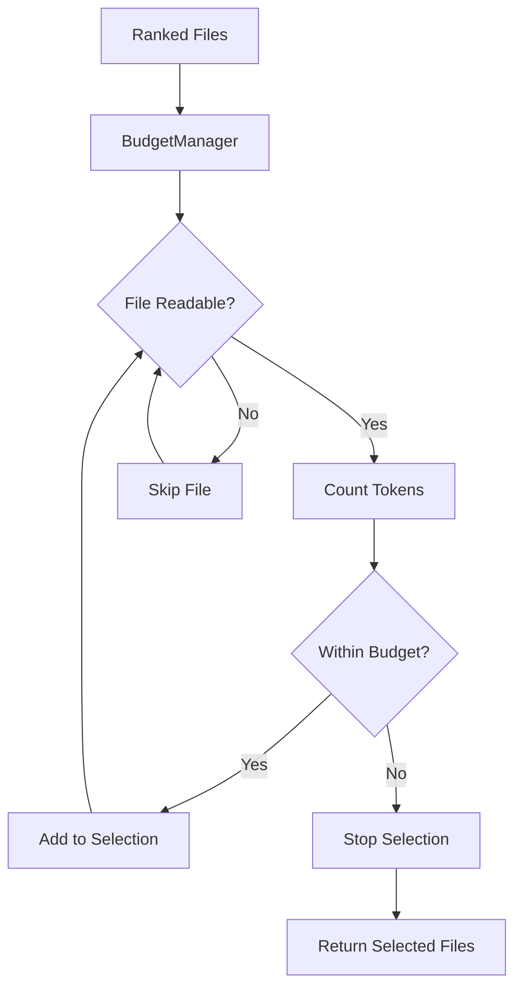

# Budget Module

> **Module Path**: `src/ws_ctx_engine/budget/`

The Budget module provides token-aware file selection using a greedy knapsack algorithm to maximize context relevance within LLM token limits.

## Purpose

The Budget module serves as the gatekeeper between the retrieval phase and the packing phase. Its primary responsibilities are:

1. **Token Counting**: Accurately count tokens using tiktoken with the `cl100k_base` encoding (GPT-4 compatible)
2. **Budget Allocation**: Reserve 80% for file content, 20% for metadata/manifest
3. **Greedy Selection**: Select files in importance order until budget is exhausted
4. **Error Resilience**: Skip unreadable files without failing the entire operation

## Architecture



## Key Class: BudgetManager

The `BudgetManager` class implements token-aware file selection with the greedy knapsack algorithm.

### Constructor

```python
def __init__(self, token_budget: int, encoding: str = "cl100k_base"):
    """
    Initialize BudgetManager with token budget and encoding.

    Args:
        token_budget: Total token budget for the context
        encoding: tiktoken encoding name (default: cl100k_base for GPT-4)

    Raises:
        ValueError: If token_budget is not positive
    """
```

**Attributes:**

| Attribute        | Type                | Description                                    |
| ---------------- | ------------------- | ---------------------------------------------- |
| `token_budget`   | `int`               | Total token budget (user-specified)            |
| `encoding`       | `tiktoken.Encoding` | Tiktoken encoding instance                     |
| `content_budget` | `int`               | 80% of token_budget, reserved for file content |

### Core Method: select_files()

```python
def select_files(
    self,
    ranked_files: List[Tuple[str, float]],
    repo_path: str
) -> Tuple[List[str], int]:
    """
    Select files within budget using greedy knapsack algorithm.

    Args:
        ranked_files: List of (file_path, importance_score) tuples,
                     should be sorted by importance_score descending
        repo_path: Path to repository root for reading file contents

    Returns:
        Tuple of (selected_files, total_tokens) where:
            - selected_files: List of file paths that fit within budget
            - total_tokens: Total token count of selected files
    """
```

## Algorithm

### Greedy Knapsack Strategy

The Budget module uses a **greedy knapsack** approach rather than dynamic programming because:

1. **Real-time constraints**: File selection must be fast
2. **Pre-sorted input**: Files are already ranked by importance
3. **Near-optimal results**: For context packing, greedy typically achieves >95% of optimal

**Algorithm Steps:**

1. Process files in descending order of importance score
2. For each file:
   - Skip if file doesn't exist
   - Read file content (skip on I/O error)
   - Count tokens using tiktoken
   - If `total_tokens + file_tokens <= content_budget`:
     - Add file to selection
     - Update total_tokens
   - Else: Stop (budget exceeded)
3. Return selected files and total tokens used

### Budget Allocation

```
Total Budget = 100,000 tokens (example)
├── Content Budget (80%) = 80,000 tokens
│   └── Selected file contents
└── Metadata Budget (20%) = 20,000 tokens
    ├── XML/ZIP manifest
    ├── File metadata (paths, scores, reasons)
    └── Repository information
```

## Token Counting

### Encoding: cl100k_base

The module uses the `cl100k_base` encoding, which is the tokenizer for:

- GPT-4
- GPT-3.5-turbo
- text-embedding-ada-002

**Accuracy**: ±2% compared to actual API token counts

### Token Count Examples

| Content Type                  | Example            | Approximate Tokens |
| ----------------------------- | ------------------ | ------------------ |
| Python function (10 lines)    | `def hello(): ...` | 50-100             |
| JavaScript module (100 lines) | ES6 class          | 500-800            |
| Markdown README               | 500 words          | 600-750            |
| JSON config                   | 50 keys            | 200-300            |

## Error Handling

The BudgetManager is designed to be resilient:

| Error Condition    | Behavior                                   |
| ------------------ | ------------------------------------------ |
| File doesn't exist | Skip, continue to next file                |
| Permission denied  | Skip, continue to next file                |
| Encoding error     | Try `errors='ignore'`, fallback to latin-1 |
| Zero budget        | Raise `ValueError`                         |
| Budget exceeded    | Stop selection, return current set         |

## Code Examples

### Basic Usage

```python
from ws_ctx_engine.budget import BudgetManager

# Initialize with 100k token budget
manager = BudgetManager(token_budget=100000)

# Ranked files from retrieval phase
ranked_files = [
    ("src/main.py", 0.95),
    ("src/utils.py", 0.82),
    ("src/config.py", 0.75),
    ("tests/test_main.py", 0.60),
    ("README.md", 0.40),
]

# Select files within budget
selected, total_tokens = manager.select_files(
    ranked_files=ranked_files,
    repo_path="/path/to/repo"
)

print(f"Selected {len(selected)} files using {total_tokens:,} tokens")
# Output: Selected 4 files using 78,234 tokens
```

### With Custom Encoding

```python
# For older GPT-3 models
manager = BudgetManager(
    token_budget=4096,
    encoding="p50k_base"
)
```

### Checking Budget Usage

```python
manager = BudgetManager(token_budget=100000)
selected, total_tokens = manager.select_files(ranked_files, repo_path)

# Calculate utilization
utilization = (total_tokens / manager.content_budget) * 100
print(f"Budget utilization: {utilization:.1f}%")
# Output: Budget utilization: 97.8%
```

## Dependencies

```python
# External
import tiktoken  # Token counting

# Standard library
import os
from typing import List, Tuple
```

## Configuration

The BudgetManager respects the `token_budget` setting from `.ws-ctx-engine.yaml`:

```yaml
# .ws-ctx-engine.yaml
token_budget: 100000 # Total tokens (default: 100,000)
```

The 80/20 split (content/metadata) is hardcoded based on empirical analysis of typical LLM context consumption patterns.

## Performance Characteristics

| Operation                 | Complexity    | Typical Duration |
| ------------------------- | ------------- | ---------------- |
| Token counting (per file) | O(n)          | 1-10ms           |
| File selection (m files)  | O(m)          | 10-100ms         |
| Memory usage              | O(1) per file | ~1MB peak        |

## Related Modules

- **[Retrieval](retrieval.md)**: Provides ranked files as input
- **[Packer](packer.md)**: Consumes selected files for output generation
- **[Config](config.md)**: Provides `token_budget` setting
- **[Workflow](workflow.md)**: Orchestrates budget selection in query phase
