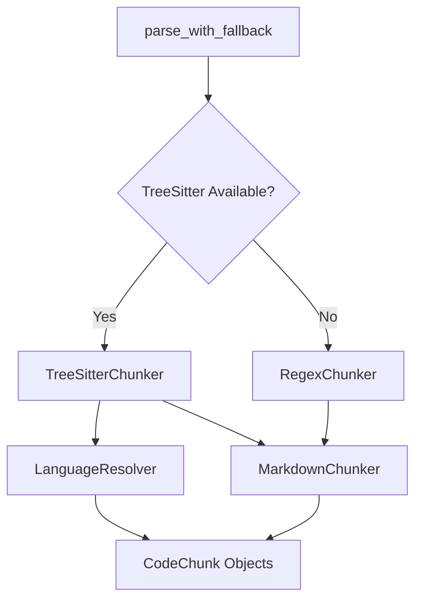
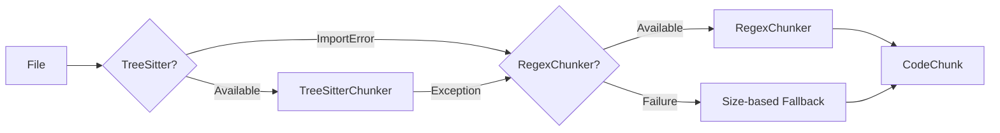

# Chunker Module

> **Module Path**: `src/ws_ctx_engine/chunker/`

## Purpose

The Chunker module parses source code files into structured `CodeChunk` objects with rich symbol metadata. It extracts function and class definitions, tracks symbol dependencies (imports, references), and provides the foundational data structures used by downstream indexing and retrieval components.

## Architecture

```
chunker/
├── __init__.py          # Public API, parse_with_fallback() entry point
├── base.py              # ASTChunker ABC, file filtering, gitignore handling
├── tree_sitter.py       # Primary parser using py-tree-sitter
├── regex.py             # Fallback parser using language-specific regex
├── markdown.py          # Heading-based parser for .md files
└── resolvers/           # Language-specific extraction strategies
    ├── __init__.py      # ALL_RESOLVERS registry
    ├── base.py          # LanguageResolver abstract base class
    ├── python.py        # Python resolver
    ├── javascript.py    # JavaScript resolver
    ├── typescript.py    # TypeScript resolver
    └── rust.py          # Rust resolver
```



## Key Classes

### CodeChunk Dataclass

The fundamental data structure representing a parsed code segment:

```python
@dataclass
class CodeChunk:
    """Represents a parsed code segment with metadata."""

    path: str                    # Relative path from repository root
    start_line: int              # Starting line number (1-indexed)
    end_line: int                # Ending line number (inclusive)
    content: str                 # Raw source code content
    symbols_defined: List[str]   # Functions/classes defined in this chunk
    symbols_referenced: List[str] # Imports and function calls
    language: str                # Programming language identifier
```

**Example:**

```python
chunk = CodeChunk(
    path="src/auth/login.py",
    start_line=15,
    end_line=42,
    content="def authenticate(user, password):\n    ...",
    symbols_defined=["authenticate"],
    symbols_referenced=["hashlib", "User", "Session"],
    language="python"
)
```

### ASTChunker Abstract Base

The abstract base class defining the parser interface:

```python
class ASTChunker(ABC):
    @abstractmethod
    def parse(self, repo_path: str, config=None) -> List[CodeChunk]:
        """Parse a repository and return code chunks."""
        pass
```

### TreeSitterChunker

The primary parser implementation using tree-sitter for accurate AST parsing:

```python
class TreeSitterChunker(ASTChunker):
    """AST parser using py-tree-sitter with language-specific resolvers."""

    # Supported import statement types per language
    IMPORT_TYPES = {
        'python': {'import_statement', 'import_from_statement'},
        'javascript': {'import_statement'},
        'typescript': {'import_statement'},
        'rust': {'use_declaration'},
    }

    # Extension to language mapping
    ext_to_lang = {
        '.py': 'python',
        '.js': 'javascript',
        '.jsx': 'javascript',
        '.ts': 'typescript',
        '.tsx': 'typescript',
        '.rs': 'rust',
    }
```

**Key Methods:**

| Method                                                     | Description                                     |
| ---------------------------------------------------------- | ----------------------------------------------- |
| `parse(repo_path, config)`                                 | Main entry point - parses entire repository     |
| `_parse_file(file_path, repo_root)`                        | Parse single file into chunks                   |
| `_extract_definitions(node, content, file_path, language)` | Recursively extract definitions using resolvers |
| `_extract_file_imports(root_node, language)`               | Extract all import statements from file         |

### RegexChunker

Fallback parser using regex patterns when tree-sitter is unavailable:

```python
class RegexChunker(ASTChunker):
    """Fallback parser using regex patterns with block detection."""

    _PATTERNS = {
        'python': {
            'function': re.compile(r'^def\s+(\w+)\s*\(', re.MULTILINE),
            'class': re.compile(r'^class\s+(\w+)\s*[\(:]', re.MULTILINE),
        },
        'javascript': {
            'function': re.compile(r'function\s+(\w+)\s*\(', re.MULTILINE),
            'class': re.compile(r'class\s+(\w+)\s*[{]', re.MULTILINE),
            'arrow': re.compile(r'const\s+(\w+)\s*=\s*\([^)]*\)\s*=>', re.MULTILINE),
        },
        # ... typescript, rust patterns
    }
```

**Block End Detection:**

- **Python**: Indentation-based (`_python_indent_end`)
- **Brace languages (JS/TS/Rust)**: Brace matching with string/comment awareness (`_brace_matching_end`)

### MarkdownChunker

Parses markdown files into chunks based on heading boundaries:

```python
class MarkdownChunker(ASTChunker):
    """Splits Markdown files into chunks based on heading boundaries."""

    EXTENSIONS = {'.md', '.markdown', '.mdx'}
    _HEADING_RE = re.compile(r'^(#{1,6})\s+(.+)', re.MULTILINE)
```

Each ATX heading (`#`, `##`, etc.) starts a new chunk. Files without headings are returned as a single chunk.

## LanguageResolver Pattern

The resolver pattern implements the Strategy design pattern, allowing language-specific extraction logic to be encapsulated and easily extended.

### Base Interface

```python
class LanguageResolver(ABC):
    """Abstract base for language-specific code resolution."""

    @property
    @abstractmethod
    def language(self) -> str:
        """Return the language identifier."""
        pass

    @property
    @abstractmethod
    def target_types(self) -> Set[str]:
        """Return set of AST node types to extract."""
        pass

    @abstractmethod
    def extract_symbol_name(self, node) -> Optional[str]:
        """Extract symbol name from AST node."""
        pass

    @abstractmethod
    def extract_references(self, node) -> List[str]:
        """Extract referenced symbols from AST node."""
        pass

    def node_to_chunk(self, node, content: str, file_path: str) -> Optional[CodeChunk]:
        """Convert AST node to CodeChunk."""
        # Default implementation provided
```

### Available Resolvers

| Resolver             | Language   | Target Node Types                                                                         |
| -------------------- | ---------- | ----------------------------------------------------------------------------------------- |
| `PythonResolver`     | python     | `function_definition`, `class_definition`, `decorated_definition`, `type_alias_statement` |
| `JavaScriptResolver` | javascript | `function_declaration`, `class_declaration`, `arrow_function`, `method_definition`        |
| `TypeScriptResolver` | typescript | Same as JS + `interface_declaration`, `type_alias_declaration`                            |
| `RustResolver`       | rust       | `function_item`, `struct_item`, `impl_item`, `trait_item`, `enum_item`                    |

### Resolver Registry

```python
# In resolvers/__init__.py
ALL_RESOLVERS = {
    'python': PythonResolver,
    'javascript': JavaScriptResolver,
    'typescript': TypeScriptResolver,
    'rust': RustResolver,
}
```

## Supported Languages

| Language   | Extensions                 | Parser             | Features                                     |
| ---------- | -------------------------- | ------------------ | -------------------------------------------- |
| Python     | `.py`                      | TreeSitter + Regex | Functions, classes, decorators, type aliases |
| JavaScript | `.js`, `.jsx`              | TreeSitter + Regex | Functions, classes, arrow functions          |
| TypeScript | `.ts`, `.tsx`              | TreeSitter + Regex | Functions, classes, interfaces, type aliases |
| Rust       | `.rs`                      | TreeSitter + Regex | Functions, structs, traits, impls, enums     |
| Markdown   | `.md`, `.markdown`, `.mdx` | Heading-based      | Section splitting by headers                 |

## File Filtering

### GitIgnore Integration

The module respects `.gitignore` rules using `pathspec.GitIgnoreSpec`:

```python
def collect_gitignore_patterns(root: Path) -> List[str]:
    """
    Recursively discover all .gitignore files under root and collect patterns,
    prefixing sub-directory patterns with their relative directory path.
    """
```

**Features:**

- Recursive `.gitignore` discovery
- Sub-directory pattern scoping
- Re-include (`!pattern`) support
- Last-pattern-wins semantics

### Include/Exclude Patterns

```python
def _should_include_file(
    file_path: Path,
    repo_root: Path,
    include_patterns: List[str],
    exclude_patterns: List[str],
    gitignore_spec: Optional[object] = None,
) -> bool:
    """
    Priority:
    1. If gitignore_spec is provided, honour it
    2. Check explicit exclude_patterns (user config)
    3. Check include_patterns
    """
```

## Fallback Chain



**Fallback Triggers:**

1. `ImportError` - tree-sitter dependencies not installed
2. Parse exception - syntax errors or unsupported constructs
3. Graceful degradation - never crashes on malformed files

## Entry Point

The main entry point for parsing with automatic fallback:

```python
def parse_with_fallback(repo_path: str, config=None) -> List[CodeChunk]:
    """Parse repository with automatic fallback from TreeSitter to Regex."""
    try:
        chunker = TreeSitterChunker()
        logger.info("Using TreeSitterChunker for AST parsing")
        return chunker.parse(repo_path, config=config)
    except ImportError as e:
        logger.warning(f"TreeSitter not available ({e}), falling back to RegexChunker")
        return RegexChunker().parse(repo_path, config=config)
    except Exception as e:
        logger.warning(f"TreeSitterChunker failed ({e}), falling back to RegexChunker")
        return RegexChunker().parse(repo_path, config=config)
```

**Usage:**

```python
from ws_ctx_engine.chunker import parse_with_fallback
from ws_ctx_engine.config import Config

config = Config()
config.include_patterns = ["**/*.py", "**/*.js"]
config.exclude_patterns = ["**/node_modules/**", "**/__pycache__/**"]

chunks = parse_with_fallback("/path/to/repo", config=config)

for chunk in chunks:
    print(f"{chunk.path}:{chunk.start_line} - {chunk.symbols_defined}")
```

## Error Handling

The module is designed for graceful degradation:

| Error Type          | Handling                              |
| ------------------- | ------------------------------------- |
| Missing tree-sitter | Falls back to RegexChunker            |
| Parse errors        | Logs warning, skips file              |
| Encoding errors     | Uses `errors="ignore"`                |
| File read errors    | Logs warning, returns empty list      |
| Syntax errors       | Does not crash, falls back gracefully |

```python
try:
    chunks.extend(self._parse_file(file_path, repo_path_obj))
except Exception as e:
    logger.warning(f"Failed to parse {file_path}: {e}")
    # Continues with next file
```

## Configuration

Relevant YAML configuration options:

```yaml
# .ws-ctx-engine.yaml
indexing:
  # File patterns to include (glob syntax)
  include_patterns:
    - "**/*.py"
    - "**/*.js"
    - "**/*.ts"
    - "**/*.rs"
    - "**/*.md"

  # File patterns to exclude
  exclude_patterns:
    - "**/node_modules/**"
    - "**/__pycache__/**"
    - "**/venv/**"
    - "**/.git/**"

  # Whether to respect .gitignore files
  respect_gitignore: true
```

## Dependencies

### Internal Dependencies

- `ws_ctx_engine.models.CodeChunk` - Data structure for parsed chunks
- `ws_ctx_engine.config.Config` - Configuration management
- `ws_ctx_engine.logger` - Logging utilities

### External Dependencies

| Package                  | Purpose            | Required               |
| ------------------------ | ------------------ | ---------------------- |
| `py-tree-sitter`         | AST parsing        | Optional (recommended) |
| `tree-sitter-python`     | Python grammar     | Optional               |
| `tree-sitter-javascript` | JS grammar         | Optional               |
| `tree-sitter-typescript` | TS grammar         | Optional               |
| `tree-sitter-rust`       | Rust grammar       | Optional               |
| `pathspec`               | GitIgnore matching | Required               |

### Optional Rust Acceleration

The module supports optional Rust-accelerated hot paths via PyO3:

```python
try:
    from ws_ctx_engine._rust import walk_files as _rust_walk_files
    from ws_ctx_engine._rust import hash_content as _rust_hash_content
    from ws_ctx_engine._rust import count_tokens as _rust_count_tokens
    RUST_AVAILABLE = True
except ImportError:
    RUST_AVAILABLE = False
```

## Related Modules

- [Vector Index](./vector-index.md) - Uses CodeChunks to build semantic search index
- [Graph](./graph.md) - Uses symbol metadata to build dependency graph
- [Retrieval](./retrieval.md) - Combines semantic and structural signals for ranking
