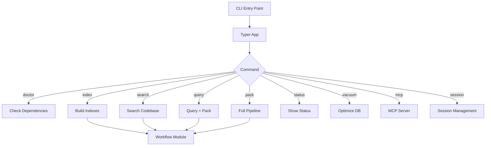

# CLI Module

> **Module Path**: `src/ws_ctx_engine/cli/`

The CLI module provides the user-facing command-line interface for ws-ctx-engine, built with Typer and Rich for an excellent developer experience.

## Purpose

The CLI module serves as the primary user interface for ws-ctx-engine:

1. **Repository Indexing**: Build and maintain semantic indexes
2. **Codebase Search**: Query indexed repositories
3. **Context Packing**: Generate LLM-ready output
4. **Index Management**: Status, cleanup, and maintenance

## Entry Points

The package provides multiple entry points for convenience:

| Entry Point          | Description           |
| -------------------- | --------------------- |
| `ws-ctx-engine`      | Primary CLI command   |
| `wsctx`              | Short alias           |
| `ws-ctx-engine-init` | Config initialization |
| `wsctx-init`         | Short alias for init  |

## Architecture



## Commands Reference

### doctor

Check optional dependencies and recommend installation tier.

```bash
ws-ctx-engine doctor
```

**Output Example:**

```
Dependency Doctor
- faiss-cpu                 OK
- igraph                    OK
- leann                     MISSING
- networkx                  OK
- scikit-learn              OK
- sentence-transformers     OK
- tree-sitter               OK
- tree-sitter-javascript    OK
- tree-sitter-python        OK
- tree-sitter-rust          MISSING
- tree-sitter-typescript    OK

Some recommended dependencies are missing for full feature set.
Recommended install: pip install "ws-ctx-engine[all]"
Missing: leann, tree-sitter-rust
```

---

### index

Build and save indexes for a repository.

```bash
ws-ctx-engine index <repo_path> [OPTIONS]
```

**Arguments:**

| Argument    | Description                           |
| ----------- | ------------------------------------- |
| `repo_path` | Path to the repository root directory |

**Options:**

| Option          | Short | Default | Description                       |
| --------------- | ----- | ------- | --------------------------------- |
| `--config`      | `-c`  | None    | Path to custom configuration file |
| `--verbose`     | `-v`  | False   | Enable verbose logging            |
| `--incremental` |       | False   | Only re-index changed files (M6)  |

**Example:**

```bash
# Basic indexing
ws-ctx-engine index /path/to/repo

# Incremental indexing
ws-ctx-engine index /path/to/repo --incremental

# With custom config
ws-ctx-engine index /path/to/repo -c custom-config.yaml
```

---

### search

Search the indexed codebase and return ranked file paths.

```bash
ws-ctx-engine search <query> [OPTIONS]
```

**Arguments:**

| Argument | Description                                |
| -------- | ------------------------------------------ |
| `query`  | Natural language query for semantic search |

**Options:**

| Option            | Short | Default | Description             |
| ----------------- | ----- | ------- | ----------------------- |
| `--repo`          | `-r`  | `.`     | Path to repository root |
| `--limit`         | `-l`  | 10      | Maximum results (1-50)  |
| `--domain-filter` |       | None    | Filter by domain        |
| `--config`        | `-c`  | None    | Path to custom config   |
| `--verbose`       | `-v`  | False   | Enable verbose logging  |
| `--agent-mode`    |       | False   | Emit NDJSON output      |

**Example:**

```bash
# Basic search
ws-ctx-engine search "authentication logic"

# With options
ws-ctx-engine search "database queries" --repo /path/to/repo --limit 20

# Agent mode (NDJSON output)
ws-ctx-engine search "error handling" --agent-mode
```

---

### query

Search indexes and generate output.

```bash
ws-ctx-engine query <query> [OPTIONS]
```

**Arguments:**

| Argument | Description                                |
| -------- | ------------------------------------------ |
| `query`  | Natural language query for semantic search |

**Options:**

| Option                   | Short | Default | Description                                   |
| ------------------------ | ----- | ------- | --------------------------------------------- |
| `--repo`                 | `-r`  | `.`     | Path to repository root                       |
| `--format`               | `-f`  | config  | Output format: xml, zip, json, yaml, md, toon |
| `--budget`               | `-b`  | config  | Token budget for context                      |
| `--config`               | `-c`  | None    | Path to custom config                         |
| `--verbose`              | `-v`  | False   | Enable verbose logging                        |
| `--secrets-scan`         |       | False   | Enable secret scanning and redaction          |
| `--agent-mode`           |       | False   | Emit NDJSON output                            |
| `--stdout`               |       | False   | Write output to stdout                        |
| `--copy`                 |       | False   | Copy output to clipboard                      |
| `--compress`             |       | False   | Apply smart compression                       |
| `--shuffle/--no-shuffle` |       | True    | Reorder for model recall                      |
| `--mode`                 |       | None    | Agent phase: discovery, edit, test            |
| `--session-id`           |       | default | Session ID for deduplication                  |
| `--no-dedup`             |       | False   | Disable deduplication                         |

**Example:**

```bash
# Basic query
ws-ctx-engine query "user authentication flow"

# With format and budget
ws-ctx-engine query "API endpoints" --format xml --budget 50000

# With compression and clipboard
ws-ctx-engine query "error handling" --compress --copy

# Agent mode with session
ws-ctx-engine query "database schema" --agent-mode --session-id agent-123
```

---

### pack

Execute full workflow: index, query, and pack.

```bash
ws-ctx-engine pack [repo_path] [OPTIONS]
```

**Arguments:**

| Argument    | Default | Description             |
| ----------- | ------- | ----------------------- |
| `repo_path` | `.`     | Path to repository root |

**Options:**

| Option                   | Short | Default | Description                        |
| ------------------------ | ----- | ------- | ---------------------------------- |
| `--query`                | `-q`  | None    | Natural language query             |
| `--changed-files`        |       | None    | Path to file listing changed files |
| `--format`               | `-f`  | config  | Output format                      |
| `--budget`               | `-b`  | config  | Token budget                       |
| `--config`               | `-c`  | None    | Custom config path                 |
| `--verbose`              | `-v`  | False   | Verbose logging                    |
| `--secrets-scan`         |       | False   | Enable secret scanning             |
| `--agent-mode`           |       | False   | NDJSON output                      |
| `--stdout`               |       | False   | Output to stdout                   |
| `--copy`                 |       | False   | Copy to clipboard                  |
| `--compress`             |       | False   | Smart compression                  |
| `--shuffle/--no-shuffle` |       | True    | Model recall optimization          |
| `--mode`                 |       | None    | Agent phase mode                   |
| `--session-id`           |       | default | Session for dedup                  |
| `--no-dedup`             |       | False   | Disable deduplication              |

**Example:**

```bash
# Full pipeline with query
ws-ctx-engine pack /path/to/repo -q "authentication system"

# With changed files for PageRank boost
echo "src/auth.py" > changed.txt
ws-ctx-engine pack . -q "auth changes" --changed-files changed.txt

# Production workflow
ws-ctx-engine pack . -q "API layer" --format xml --compress --shuffle
```

---

### status

Show index status and statistics.

```bash
ws-ctx-engine status <repo_path> [OPTIONS]
```

**Arguments:**

| Argument    | Description             |
| ----------- | ----------------------- |
| `repo_path` | Path to repository root |

**Options:**

| Option         | Short | Description        |
| -------------- | ----- | ------------------ |
| `--config`     | `-c`  | Custom config path |
| `--agent-mode` |       | NDJSON output      |

**Output Example:**

```
Index Status for: /path/to/repo
Index directory: /path/to/repo/.ws-ctx-engine
Total size: 2.5 MB

Indexed Files: 150
Backend: FAISSIndex+NetworkXRepoMap
Vector index size: 1.8 MB
Graph index size: 0.5 MB
Domain map DB size: 0.2 MB
Domain keywords: 45
Domain directories: 23

Last indexed: 2024-01-15T10:30:00
```

---

### vacuum

Optimize SQLite database by running VACUUM.

```bash
ws-ctx-engine vacuum <repo_path> [OPTIONS]
```

**Arguments:**

| Argument    | Description             |
| ----------- | ----------------------- |
| `repo_path` | Path to repository root |

**Options:**

| Option     | Short | Description        |
| ---------- | ----- | ------------------ |
| `--config` | `-c`  | Custom config path |

**Example:**

```bash
ws-ctx-engine vacuum /path/to/repo
# Output: VACUUM complete! Database size after optimization: 180.5 KB
```

---

### reindex-domain

Rebuild only the domain map database (SQLite).

```bash
ws-ctx-engine reindex-domain <repo_path> [OPTIONS]
```

**Arguments:**

| Argument    | Description             |
| ----------- | ----------------------- |
| `repo_path` | Path to repository root |

**Options:**

| Option     | Short | Description        |
| ---------- | ----- | ------------------ |
| `--config` | `-c`  | Custom config path |

**Use Case:** When only domain mapping needs updating without rebuilding vector index or graph.

---

### init-config

Generate a smart `.ws-ctx-engine.yaml` for the target repository.

```bash
ws-ctx-engine init-config [repo_path] [OPTIONS]
```

**Arguments:**

| Argument    | Default | Description       |
| ----------- | ------- | ----------------- |
| `repo_path` | `.`     | Target repository |

**Options:**

| Option                                       | Default | Description                                      |
| -------------------------------------------- | ------- | ------------------------------------------------ |
| `--force`                                    | False   | Overwrite existing config                        |
| `--include-gitignore/--no-include-gitignore` | True    | Include .gitignore patterns                      |
| `--vector-index`                             | auto    | Vector backend: auto, native-leann, leann, faiss |
| `--graph`                                    | auto    | Graph backend: auto, igraph, networkx            |
| `--embeddings`                               | auto    | Embeddings: auto, local, api                     |

**Example:**

```bash
# Generate with defaults
ws-ctx-engine init-config

# Force overwrite with specific backends
ws-ctx-engine init-config --force --vector-index faiss --graph networkx
```

---

### mcp

Run ws-ctx-engine as an MCP stdio server.

```bash
ws-ctx-engine mcp [OPTIONS]
```

**Options:**

| Option         | Short | Description                       |
| -------------- | ----- | --------------------------------- |
| `--workspace`  | `-w`  | Workspace root path               |
| `--mcp-config` |       | Path to MCP config JSON           |
| `--rate-limit` |       | Override rate limit as TOOL=LIMIT |

**Example:**

```bash
# Start MCP server
ws-ctx-engine mcp --workspace /path/to/repo

# With rate limits
ws-ctx-engine mcp -w . --rate-limit search_codebase=60
```

---

### session clear

Delete session deduplication cache files.

```bash
ws-ctx-engine session clear [repo_path] [OPTIONS]
```

**Arguments:**

| Argument    | Default | Description     |
| ----------- | ------- | --------------- |
| `repo_path` | `.`     | Repository root |

**Options:**

| Option         | Description                     |
| -------------- | ------------------------------- |
| `--session-id` | Clear only this session's cache |

**Example:**

```bash
# Clear all sessions
ws-ctx-engine session clear

# Clear specific session
ws-ctx-engine session clear --session-id agent-123
```

## Global Options

Options available for all commands via the main callback:

| Option               | Short | Default | Description           |
| -------------------- | ----- | ------- | --------------------- |
| `--version`          | `-V`  |         | Show version and exit |
| `--agent-mode`       |       | False   | NDJSON output mode    |
| `--quiet/--no-quiet` |       | True    | Suppress info logs    |

## CLI Output Modes

### Human Mode (Default)

Rich-formatted output with colors and panels:

```
╭─────────────────────────────────────────────────────────────────╮
│ Packing repository: /path/to/repo                               │
│ Query: authentication logic                                      │
│ Format: XML                                                      │
│ Budget: 100,000 tokens                                          │
╰─────────────────────────────────────────────────────────────────╯

Step 1: Checking indexes...
  → Indexes found (will auto-rebuild if stale)

Step 2: Querying and packing...

✓ Packing complete!
Context packed (78,234 / 100,000 tokens)
Output saved to: ./output/repomix-output.xml
```

### Agent Mode (--agent-mode)

NDJSON output for programmatic consumption:

```json
{ "type": "status", "command": "pack", "status": "success", "output_path": "./output/repomix-output.xml", "total_tokens": 78234, "generated_at": "2024-01-15T10:30:00Z" }
```

## Framework

The CLI is built with:

- **[Typer](https://typer.tiangolo.com/)**: Modern CLI framework with type hints
- **[Rich](https://rich.readthedocs.io/)**: Beautiful terminal formatting

## Dependencies

```python
# External
import typer           # CLI framework
from rich.console import Console
from rich.panel import Panel
import yaml            # Config generation

# Internal
from ..config import Config
from ..workflow import index_repository, query_and_pack, search_codebase
from ..logger import get_logger
from ..mcp_server import run_mcp_server
```

## Configuration

The CLI loads configuration from multiple sources:

1. **Explicit `--config` flag**: Highest priority
2. **Repository `.ws-ctx-engine.yaml`**: If exists in repo_path
3. **Default configuration**: Built-in defaults

```python
def _load_config(config_path: Optional[str], repo_path: Optional[str] = None) -> Config:
    """
    Load configuration from file or use defaults.

    Priority:
    1. Explicit config_path
    2. {repo_path}/.ws-ctx-engine.yaml
    3. Defaults
    """
```

## Common Workflows

### Initial Setup

```bash
# 1. Initialize configuration
ws-ctx-engine init-config /path/to/repo

# 2. Check dependencies
ws-ctx-engine doctor

# 3. Build initial index
ws-ctx-engine index /path/to/repo
```

### Development Workflow

```bash
# After code changes, use incremental indexing
ws-ctx-engine index . --incremental

# Quick search
ws-ctx-engine search "my feature"

# Generate context for LLM
ws-ctx-engine query "implement new feature" --copy
```

### CI/CD Integration

```bash
# Full pipeline with changed files from git
git diff --name-only HEAD~1 > changed.txt
ws-ctx-engine pack . -q "review changes" --changed-files changed.txt --format xml
```

### Agent Integration

```bash
# Start MCP server for agent consumption
ws-ctx-engine mcp --workspace /path/to/repo

# Or use agent mode directly
ws-ctx-engine query "fix bug" --agent-mode --session-id agent-session-1
```

## Error Handling

The CLI provides helpful error messages and suggestions:

```bash
$ ws-ctx-engine query "test" --repo /nonexistent
Error: Repository path does not exist: /nonexistent

$ ws-ctx-engine query "test" --repo /path/to/repo
Error: Indexes not found

Suggestion: Run 'ws-ctx-engine index' first to build indexes
```

## Related Modules

- **[Workflow](workflow.md)**: Core functions called by CLI commands
- **[Config](config.md)**: Configuration management
- **[Output Formatters](output-formatters.md)**: Format options for `--format` flag; compression for `--compress`
- **[Secret Scanner](secret-scanner.md)**: Backend for `--secrets-scan` flag
- **[Ranking](ranking.md)**: AI rule boosting applied during pack
- **[MCP](supporting-modules.md#mcp)**: Model Context Protocol server
- **[Session](supporting-modules.md#session)**: Deduplication cache (`--session-id`, `--no-dedup`)
