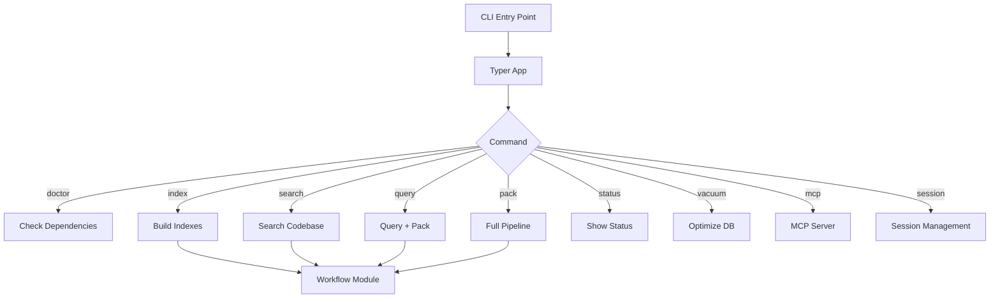

# CLI Architecture

This document describes the architecture of the ws-ctx-engine CLI module.

## System Architecture



## Component Overview

### Entry Point Layer
- **Typer Application**: Main CLI application framework
- **Rich Console**: Terminal formatting and output
- **Command Router**: Dispatches commands to appropriate handlers

### Command Layer
Commands are organized into logical groups:

1. **Core Commands** - Primary functionality
   - `index` - Build semantic indexes
   - `search` - Query codebase
   - `query` - Generate context
   - `pack` - Full pipeline

2. **Maintenance Commands** - Index management
   - `status` - View index statistics
   - `vacuum` - Optimize database
   - `reindex-domain` - Rebuild domain map

3. **Configuration Commands** - Setup and config
   - `init-config` - Generate configuration

4. **Server Commands** - Integration
   - `mcp` - MCP server mode

5. **Session Commands** - Cache management
   - `session clear` - Clear session caches

### Integration Layer

All commands integrate with the [Workflow Module](../workflow.md) which provides:
- Indexing operations
- Search and retrieval
- Context packing
- Output formatting

## Design Principles

### Separation of Concerns
- CLI handles user interface and argument parsing
- Workflow module handles business logic
- Clear separation between presentation and processing

### Command Hierarchy
- Global options apply to all commands
- Command-specific options override globals
- Subcommands group related functionality

### Output Modes
- **Human Mode** (default): Rich-formatted terminal output
- **Agent Mode** (--agent-mode): NDJSON for programmatic consumption

## Configuration Loading

The CLI loads configuration with the following priority:

1. Explicit `--config` flag (highest priority)
2. Repository `.ws-ctx-engine.yaml`
3. Default configuration (lowest priority)

See [Configuration](../implementation/configuration.md) for implementation details.

## Error Handling

Errors are caught and presented with helpful messages and suggestions:

```bash
$ ws-ctx-engine query "test" --repo /nonexistent
Error: Repository path does not exist: /nonexistent

$ ws-ctx-engine query "test" --repo /path/to/repo
Error: Indexes not found
Suggestion: Run 'ws-ctx-engine index' first to build indexes
```

See [Error Handling](../implementation/error-handling.md) for patterns.

## Related Documentation

- [Global Options](global-options.md) - CLI-wide options
- [Commands Overview](commands/README.md) - Complete command reference
- [Framework](../implementation/framework.md) - Typer and Rich implementation
