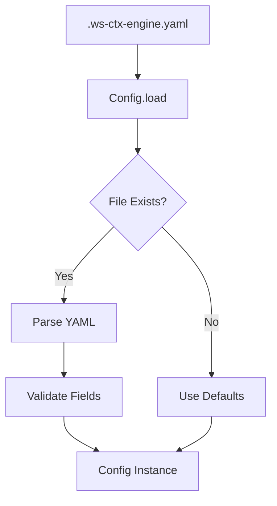

# Config Module

> **Module Path**: `src/ws_ctx_engine/config/`

The Config module provides configuration management with YAML loading, validation, and sensible defaults.

## Purpose

The Config module centralizes all configuration for ws-ctx-engine:

1. **YAML Loading**: Parse `.ws-ctx-engine.yaml` configuration files
2. **Validation**: Ensure configuration values are valid and consistent
3. **Defaults**: Provide sensible defaults for all settings
4. **Type Safety**: Dataclass-based configuration with type hints

## Architecture



## Key Class: Config

The `Config` dataclass holds all system configuration.

### Definition

```python
@dataclass
class Config:
    """
    System configuration loaded from .ws-ctx-engine.yaml.

    Fields are grouped by subsystem. Fields marked PLANNED are parsed
    but not yet acted upon - reserved for future milestones.
    """

    # Output settings
    format: str = "zip"
    token_budget: int = 100000
    output_path: str = "./output"

    # Scoring weights
    semantic_weight: float = 0.6
    pagerank_weight: float = 0.4

    # File filtering
    include_tests: bool = False
    respect_gitignore: bool = True
    include_patterns: List[str] = field(default_factory=list)
    exclude_patterns: List[str] = field(default_factory=list)

    # Backend selection
    backends: Dict[str, str] = field(default_factory=dict)

    # Embeddings config
    embeddings: Dict[str, Any] = field(default_factory=dict)

    # Performance tuning (PLANNED)
    performance: Dict[str, Any] = field(default_factory=dict)

    # AI rules
    ai_rules: Dict[str, Any] = field(default_factory=dict)
```

### Class Method: load()

```python
@classmethod
def load(cls, path: str = ".ws-ctx-engine.yaml") -> 'Config':
    """
    Load configuration from YAML file with validation.

    Args:
        path: Path to configuration file (default: .ws-ctx-engine.yaml)

    Returns:
        Config instance with validated settings

    Behavior:
        - If file doesn't exist: Returns default config
        - If file is empty: Returns default config
        - If YAML is invalid: Logs error, returns default config
        - Otherwise: Returns validated config with overrides
    """
```

## Configuration Fields

### Output Settings

| Field          | Type  | Default      | Description                                               |
| -------------- | ----- | ------------ | --------------------------------------------------------- |
| `format`       | `str` | `"zip"`      | Output format: `xml`, `zip`, `json`, `yaml`, `md`, `toon` |
| `token_budget` | `int` | `100000`     | Total token budget for context                            |
| `output_path`  | `str` | `"./output"` | Directory for output files                                |

### Scoring Weights

| Field             | Type    | Default | Description                              |
| ----------------- | ------- | ------- | ---------------------------------------- |
| `semantic_weight` | `float` | `0.6`   | Weight for semantic similarity (0.0-1.0) |
| `pagerank_weight` | `float` | `0.4`   | Weight for PageRank centrality (0.0-1.0) |

**Validation Rule:** `semantic_weight + pagerank_weight` must equal `1.0` (±0.01 for floating-point tolerance).

### File Filtering

| Field               | Type        | Default   | Description                        |
| ------------------- | ----------- | --------- | ---------------------------------- |
| `include_tests`     | `bool`      | `False`   | Include test files in context      |
| `respect_gitignore` | `bool`      | `True`    | Honor `.gitignore` patterns        |
| `include_patterns`  | `List[str]` | See below | Glob patterns for files to include |
| `exclude_patterns`  | `List[str]` | See below | Glob patterns for files to exclude |

**Default Include Patterns:**

```python
[
    "**/*.py", "**/*.js", "**/*.ts", "**/*.jsx", "**/*.tsx",
    "**/*.java", "**/*.go", "**/*.rs", "**/*.c", "**/*.cpp", "**/*.h"
]
```

**Default Exclude Patterns:**

```python
[
    "*.min.js", "*.min.css", "node_modules/**", "__pycache__/**",
    ".git/**", "dist/**", "build/**", "*.egg-info/**",
    ".venv/**", "venv/**", ".pytest_cache/**", "htmlcov/**",
    ".ws-ctx-engine/**", ".ws-ctx-engine.yaml"
]
```

### Backend Selection

| Field                   | Type  | Default  | Valid Values                             |
| ----------------------- | ----- | -------- | ---------------------------------------- |
| `backends.vector_index` | `str` | `"auto"` | `auto`, `native-leann`, `leann`, `faiss` |
| `backends.graph`        | `str` | `"auto"` | `auto`, `igraph`, `networkx`             |
| `backends.embeddings`   | `str` | `"auto"` | `auto`, `local`, `api`                   |

### Embeddings Configuration

| Field                     | Type  | Default              | Description                         |
| ------------------------- | ----- | -------------------- | ----------------------------------- |
| `embeddings.model`        | `str` | `"all-MiniLM-L6-v2"` | Sentence transformer model name     |
| `embeddings.device`       | `str` | `"cpu"`              | Device: `cpu` or `cuda`             |
| `embeddings.batch_size`   | `int` | `32`                 | Batch size for embedding generation |
| `embeddings.api_provider` | `str` | `"openai"`           | API provider for embeddings         |
| `embeddings.api_key_env`  | `str` | `"OPENAI_API_KEY"`   | Environment variable for API key    |

### Performance Tuning (PLANNED)

| Field                           | Type   | Default | Status           |
| ------------------------------- | ------ | ------- | ---------------- |
| `performance.max_workers`       | `int`  | `4`     | PLANNED          |
| `performance.cache_embeddings`  | `bool` | `True`  | PLANNED          |
| `performance.incremental_index` | `bool` | `True`  | PLANNED (see M6) |

### AI Rules

| Field                  | Type        | Default | Description                                 |
| ---------------------- | ----------- | ------- | ------------------------------------------- |
| `ai_rules.auto_detect` | `bool`      | `True`  | Auto-detect AI rule files (CLAUDE.md, etc.) |
| `ai_rules.extra_files` | `List[str]` | `[]`    | Additional rule files to include            |
| `ai_rules.boost`       | `float`     | `10.0`  | Score boost for AI rule files               |

## Full YAML Example

```yaml
# .ws-ctx-engine.yaml - Complete annotated configuration

# =============================================================================
# OUTPUT SETTINGS
# =============================================================================

# Output format for packed context
# Options: xml, zip, json, yaml, md, toon
format: xml

# Total token budget for the context window
# Recommended: Match your LLM's context limit minus prompt overhead
# GPT-4: 128000, Claude: 200000, GPT-3.5: 16000
token_budget: 100000

# Directory where output files are written
output_path: ./output

# =============================================================================
# SCORING WEIGHTS
# =============================================================================

# These weights control hybrid ranking. MUST sum to 1.0.

# Weight for semantic similarity from vector search
# Higher = more emphasis on query relevance
semantic_weight: 0.6

# Weight for PageRank centrality from dependency graph
# Higher = more emphasis on architectural importance
pagerank_weight: 0.4

# =============================================================================
# FILE FILTERING
# =============================================================================

# Include test files in context
# Set to true for test-related queries
include_tests: false

# Honor .gitignore patterns when scanning files
respect_gitignore: true

# Glob patterns for files to include
# Only files matching these patterns are considered
include_patterns:
  - "**/*.py"
  - "**/*.js"
  - "**/*.ts"
  - "**/*.tsx"
  - "**/*.jsx"
  - "**/*.java"
  - "**/*.go"
  - "**/*.rs"
  - "**/*.c"
  - "**/*.cpp"
  - "**/*.h"
  - "**/*.md" # Include documentation
  - "**/*.yaml"
  - "**/*.json"

# Glob patterns for files to exclude
# Takes precedence over include_patterns
exclude_patterns:
  - "*.min.js"
  - "*.min.css"
  - "node_modules/**"
  - "__pycache__/**"
  - ".git/**"
  - "dist/**"
  - "build/**"
  - "*.egg-info/**"
  - ".venv/**"
  - "venv/**"
  - ".pytest_cache/**"
  - "htmlcov/**"
  - ".ws-ctx-engine/**"
  - ".ws-ctx-engine.yaml"
  - "package-lock.json"
  - "yarn.lock"

# =============================================================================
# BACKEND SELECTION
# =============================================================================

backends:
  # Vector index backend
  # auto: Try native-leann → leann → faiss
  # native-leann: LEANN with 97% storage savings
  # leann: Pure Python LEANN fallback
  # faiss: FAISS HNSW index
  vector_index: auto

  # Dependency graph backend
  # auto: Try igraph → networkx
  # igraph: High-performance graph library
  # networkx: Pure Python fallback
  graph: auto

  # Embeddings backend
  # auto: Try local → api
  # local: sentence-transformers (requires GPU for best performance)
  # api: OpenAI API (requires API key)
  embeddings: auto

# =============================================================================
# EMBEDDINGS CONFIGURATION
# =============================================================================

embeddings:
  # Model for local embeddings (sentence-transformers)
  # Options: all-MiniLM-L6-v2 (fast), all-mpnet-base-v2 (accurate)
  model: all-MiniLM-L6-v2

  # Device for embedding generation
  # cpu: Works everywhere, slower
  # cuda: GPU acceleration, requires CUDA
  device: cpu

  # Batch size for processing files
  # Higher = faster but more memory
  batch_size: 32

  # API provider for remote embeddings
  api_provider: openai

  # Environment variable containing API key
  api_key_env: OPENAI_API_KEY

# =============================================================================
# PERFORMANCE TUNING (PLANNED - not yet active)
# =============================================================================

performance:
  # Maximum worker threads for parallel operations
  max_workers: 4

  # Cache embeddings between runs
  cache_embeddings: true

  # Enable incremental indexing (only re-index changed files)
  incremental_index: true

# =============================================================================
# AI RULES
# =============================================================================

ai_rules:
  # Auto-detect AI rule files (CLAUDE.md, .cursorrules, etc.)
  auto_detect: true

  # Additional rule files to always include
  extra_files:
    - CONTRIBUTING.md
    - CODE_STYLE.md

  # Score boost multiplier for AI rule files
  boost: 10.0
```

## Validation Rules

The Config class validates settings on load:

| Field                   | Rule                                                  | Error Action      |
| ----------------------- | ----------------------------------------------------- | ----------------- |
| `format`                | Must be `xml`, `zip`, `json`, `yaml`, `md`, or `toon` | Reset to `"zip"`  |
| `token_budget`          | Must be positive integer                              | Reset to `100000` |
| `semantic_weight`       | Must be 0.0-1.0                                       | Reset to `0.5`    |
| `pagerank_weight`       | Must be 0.0-1.0                                       | Reset to `0.5`    |
| Weight sum              | Must equal 1.0 (±0.01)                                | Log warning       |
| `include_patterns`      | Must be list of strings                               | Reset to `[]`     |
| `exclude_patterns`      | Must be list of strings                               | Reset to `[]`     |
| `backends.*`            | Must be valid option                                  | Reset to default  |
| `embeddings.device`     | Must be `cpu` or `cuda`                               | Reset to `"cpu"`  |
| `embeddings.batch_size` | Must be positive integer                              | Reset to `32`     |

## Code Examples

### Basic Loading

```python
from ws_ctx_engine.config import Config

# Load from default path (.ws-ctx-engine.yaml)
config = Config.load()

# Load from custom path
config = Config.load("/path/to/custom-config.yaml")
```

### Accessing Settings

```python
config = Config.load()

# Output settings
print(f"Format: {config.format}")
print(f"Budget: {config.token_budget:,} tokens")

# Scoring weights
print(f"Semantic: {config.semantic_weight}")
print(f"PageRank: {config.pagerank_weight}")

# Backend selection
print(f"Vector: {config.backends['vector_index']}")
print(f"Graph: {config.backends['graph']}")
```

### Programmatic Override

```python
from ws_ctx_engine.config import Config

config = Config.load()

# Override settings for this run
config.format = "xml"
config.token_budget = 50000
config.semantic_weight = 0.7
config.pagerank_weight = 0.3

# Use modified config
from ws_ctx_engine.workflow import query_and_pack
output_path, _ = query_and_pack(repo_path=".", config=config)
```

### Checking Defaults

```python
from ws_ctx_engine.config import Config

# Create config with all defaults (no file loading)
config = Config()

print(config.format)           # "zip"
print(config.token_budget)     # 100000
print(config.semantic_weight)  # 0.6
print(config.include_patterns) # ["**/*.py", "**/*.js", ...]
```

## Dependencies

```python
# Standard library
import os
from dataclasses import dataclass, field
from pathlib import Path
from typing import Any, Dict, List

# External
import yaml

# Internal
from ..logger import get_logger
```

## Environment Variables

The Config module respects these environment variables:

| Variable          | Usage                                                         |
| ----------------- | ------------------------------------------------------------- |
| `OPENAI_API_KEY`  | Default API key for embeddings (via `embeddings.api_key_env`) |
| Custom via config | Any env var specified in `embeddings.api_key_env`             |

## Related Modules

- **[CLI](cli.md)**: Loads config via `--config` flag
- **[Workflow](workflow.md)**: Uses config for all operations
- **[Backend Selector](supporting-modules.md#backend-selector)**: Reads backend settings
- **[Budget](budget.md)**: Uses `token_budget` setting
- **[Retrieval](retrieval.md)**: Uses scoring weights
