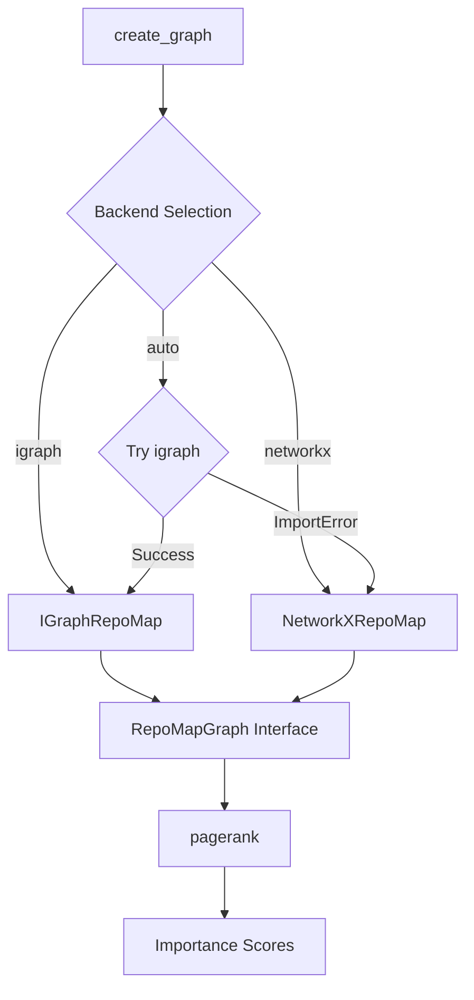
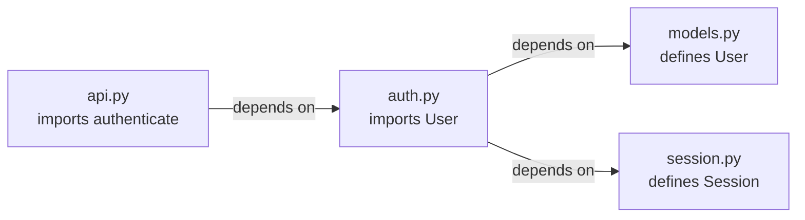
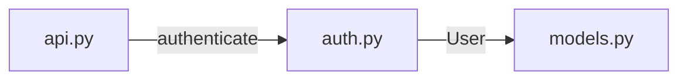

# Graph Module

> **Module Path**: `src/ws_ctx_engine/graph/`

## Purpose

The Graph module builds dependency graphs from symbol references and computes PageRank importance scores for structural ranking. It models the codebase as a directed graph where files are nodes and symbol dependencies form edges, enabling structural importance analysis that complements semantic search.

## Architecture

```
graph/
├── __init__.py    # Public exports
└── graph.py       # RepoMapGraph ABC, IGraphRepoMap, NetworkXRepoMap, factory functions
```



## Key Classes

### RepoMapGraph Abstract Base

The abstract base class defining the dependency graph interface:

```python
class RepoMapGraph(ABC):
    """
    Abstract base class for dependency graph and PageRank computation.

    Implementations must build directed dependency graphs from symbol references
    and compute PageRank scores for structural importance ranking.
    """

    @abstractmethod
    def build(self, chunks: List[CodeChunk]) -> None:
        """
        Build dependency graph from code chunks.

        Creates a directed graph where:
        - Nodes represent files
        - Edges represent symbol dependencies (file A imports/calls symbols from file B)
        """
        pass

    @abstractmethod
    def pagerank(self, changed_files: Optional[List[str]] = None) -> Dict[str, float]:
        """
        Compute PageRank scores for all files in the graph.

        If changed_files are provided, their scores are boosted by a configurable factor.

        Returns:
            Dictionary mapping file paths to PageRank scores (sum to 1.0)
        """
        pass

    @abstractmethod
    def save(self, path: str) -> None:
        """Persist graph to disk for incremental indexing."""
        pass

    @classmethod
    @abstractmethod
    def load(cls, path: str) -> 'RepoMapGraph':
        """Load graph from disk."""
        pass
```

### IGraphRepoMap

Primary implementation using python-igraph (C++ backend) for fast computation:

```python
class IGraphRepoMap(RepoMapGraph):
    """
    Primary RepoMap Graph implementation using python-igraph (C++ backend).

    Provides fast PageRank computation (<1 second for 10k nodes) using igraph's
    C++ backend. Falls back to NetworkX if igraph is unavailable.
    """

    def __init__(self, boost_factor: float = 2.0):
        """
        Args:
            boost_factor: Multiplier for changed file scores (default: 2.0)
        """
        self.boost_factor = boost_factor
        self.graph: Optional[ig.Graph] = None
        self.file_to_vertex: Dict[str, int] = {}  # file path → vertex index
        self.vertex_to_file: Dict[int, str] = {}  # vertex index → file path
```

**Performance Characteristics:**

| Metric          | Value                 |
| --------------- | --------------------- |
| 10k nodes       | < 1 second            |
| Memory overhead | Minimal (C++ backend) |
| Backend         | igraph (C++)          |

### NetworkXRepoMap

Fallback implementation using NetworkX (pure Python):

```python
class NetworkXRepoMap(RepoMapGraph):
    """
    Fallback RepoMap Graph implementation using NetworkX (pure Python).

    Provides PageRank computation using pure Python implementation.
    Slower than igraph (<10 seconds for 10k nodes) but more portable.
    """

    def __init__(self, boost_factor: float = 2.0):
        self.boost_factor = boost_factor
        self.graph: Optional[nx.DiGraph] = None
```

**Performance Characteristics:**

| Metric    | Value                                     |
| --------- | ----------------------------------------- |
| 10k nodes | < 10 seconds                              |
| Backend   | NetworkX (Python)                         |
| Fallback  | Pure Python PageRank if scipy unavailable |

## Symbol Dependency Logic

### Edge Creation Algorithm

The graph construction process:

1. **Build Symbol Definition Map**: Map each defined symbol to its file path
2. **Create Vertices**: One vertex per unique file
3. **Add Edges**: For each chunk, create edges from source file to files defining referenced symbols

```python
def build(self, chunks: List[CodeChunk]) -> None:
    # Step 1: Build symbol definition map
    symbol_to_file: Dict[str, str] = {}
    for chunk in chunks:
        for symbol in chunk.symbols_defined:
            symbol_to_file[symbol] = chunk.path

    # Step 2: Collect unique files and create vertex mapping
    unique_files = sorted(set(chunk.path for chunk in chunks))
    self.file_to_vertex = {file: idx for idx, file in enumerate(unique_files)}
    self.vertex_to_file = {idx: file for file, idx in self.file_to_vertex.items()}

    # Step 3: Create graph with vertices
    self.graph = ig.Graph(directed=True)
    self.graph.add_vertices(len(unique_files))

    # Step 4: Add edges based on symbol references
    edges = []
    for chunk in chunks:
        source_file = chunk.path
        source_vertex = self.file_to_vertex[source_file]

        for symbol in chunk.symbols_referenced:
            if symbol in symbol_to_file:
                target_file = symbol_to_file[symbol]
                target_vertex = self.file_to_vertex[target_file]

                # Edge: source → target (source depends on target)
                if source_vertex != target_vertex:  # No self-loops
                    edges.append((source_vertex, target_vertex))

    self.graph.add_edges(edges)
```

### Dependency Direction



**Edge Semantics:**

- Edge `A → B` means "file A depends on file B"
- A imports/references symbols defined in B
- In PageRank terms, A "votes" for B's importance

## PageRank Computation

### Algorithm Overview

PageRank assigns importance scores based on the principle that:

- Files that are depended upon by many other files are important
- Files that are depended upon by important files are even more important

```python
def pagerank(self, changed_files: Optional[List[str]] = None) -> Dict[str, float]:
    # Compute base PageRank using igraph
    scores = self.graph.pagerank(directed=True)

    # Map vertex indices to file paths
    pagerank_scores = {
        self.vertex_to_file[idx]: score
        for idx, score in enumerate(scores)
    }

    # Boost changed files if provided
    if changed_files:
        for file in changed_files:
            if file in pagerank_scores:
                pagerank_scores[file] *= self.boost_factor

        # Renormalize to sum to 1.0
        total = sum(pagerank_scores.values())
        if total > 0:
            pagerank_scores = {
                file: score / total
                for file, score in pagerank_scores.items()
            }

    return pagerank_scores
```

### Changed Files Boosting

When `changed_files` are provided:

1. **Multiply** each changed file's score by `boost_factor` (default: 2.0)
2. **Renormalize** all scores to sum to 1.0

This prioritizes recently changed files while maintaining proper probability distribution.

### Pure Python PageRank (NetworkX Fallback)

When scipy is unavailable, NetworkXRepoMap uses a pure Python power iteration:

```python
def _pagerank_python(
    self,
    graph: nx.DiGraph,
    alpha: float = 0.85,      # Damping factor
    max_iter: int = 100,      # Maximum iterations
    tol: float = 1e-6         # Convergence tolerance
) -> Dict[str, float]:
    """Pure Python implementation of PageRank using power iteration."""

    nodes = list(graph.nodes())
    n = len(nodes)

    # Initialize scores uniformly
    scores = {node: 1.0 / n for node in nodes}
    out_degree = {node: graph.out_degree(node) for node in nodes}

    # Power iteration
    for _ in range(max_iter):
        new_scores = {}

        for node in nodes:
            # Sum contributions from incoming edges
            rank_sum = 0.0
            for predecessor in graph.predecessors(node):
                if out_degree[predecessor] > 0:
                    rank_sum += scores[predecessor] / out_degree[predecessor]

            # Apply damping factor
            new_scores[node] = (1 - alpha) / n + alpha * rank_sum

        # Check convergence
        diff = sum(abs(new_scores[node] - scores[node]) for node in nodes)
        scores = new_scores

        if diff < tol:
            break

    # Normalize to sum to 1.0
    total = sum(scores.values())
    return {node: score / total for node, score in scores.items()}
```

**Parameters:**

| Parameter | Default | Description                                      |
| --------- | ------- | ------------------------------------------------ |
| alpha     | 0.85    | Damping factor (probability of following a link) |
| max_iter  | 100     | Maximum power iterations                         |
| tol       | 1e-6    | Convergence tolerance                            |

### Score Normalization

All PageRank implementations normalize scores to sum to 1.0:

```python
total = sum(scores.values())
if total > 0:
    scores = {file: score / total for file, score in scores.items()}
```

## Graph Construction

### Nodes = Files

Each unique file path becomes a node in the graph:

```python
unique_files = sorted(set(chunk.path for chunk in chunks))
self.file_to_vertex = {file: idx for idx, file in enumerate(unique_files)}
```

### Edges = Symbol Dependencies

Edges are created based on symbol references:

```
Edge A → B exists if:
  - Chunk in file A has symbol S in symbols_referenced
  - AND symbol S is defined in file B (S in symbols_defined of some chunk in B)
  - AND A ≠ B (no self-loops)
```

### Example Graph

For a simple Python project:

```
# models.py
class User:
    pass

# auth.py
from models import User
def authenticate(user: User):
    pass

# api.py
from auth import authenticate
def login():
    authenticate(...)
```

**Resulting Graph:**



**PageRank Scores (approximate):**

- `models.py`: 0.45 (core dependency)
- `auth.py`: 0.35 (middle layer)
- `api.py`: 0.20 (leaf node)

## Factory Functions

### create_graph()

```python
def create_graph(backend: str = "auto", boost_factor: float = 2.0) -> RepoMapGraph:
    """
    Create a RepoMapGraph instance with automatic backend selection and fallback.

    Tries igraph first (C++ backend, fast), falls back to NetworkX (pure Python)
    if igraph is unavailable.

    Args:
        backend: Backend selection ("auto", "igraph", "networkx")
        boost_factor: Multiplier for changed file scores

    Returns:
        RepoMapGraph instance (IGraphRepoMap or NetworkXRepoMap)
    """
```

**Backend Selection:**

| Backend    | Description                         | Performance    |
| ---------- | ----------------------------------- | -------------- |
| `auto`     | Try igraph, fallback to networkx    | Best available |
| `igraph`   | Force igraph (error if unavailable) | Fastest        |
| `networkx` | Force NetworkX                      | Most portable  |

### load_graph()

```python
def load_graph(path: str) -> RepoMapGraph:
    """
    Load a RepoMapGraph from disk with automatic backend detection.

    Detects the backend used when saving and loads with the appropriate implementation.
    """
```

## Code Examples

### Basic Usage

```python
from ws_ctx_engine.graph import create_graph
from ws_ctx_engine.chunker import parse_with_fallback

# Parse repository
chunks = parse_with_fallback("/path/to/repo")

# Create and build graph
graph = create_graph(backend="auto", boost_factor=2.0)
graph.build(chunks)

# Compute PageRank scores
scores = graph.pagerank()
for file, score in sorted(scores.items(), key=lambda x: -x[1])[:10]:
    print(f"{file}: {score:.4f}")

# Save for later
graph.save(".ws-ctx-engine/graph.pkl")
```

### With Changed Files Boosting

```python
# Get changed files from git
changed_files = ["src/auth.py", "src/api.py"]

# Compute boosted PageRank
scores = graph.pagerank(changed_files=changed_files)

# Changed files will have 2x their base score (before renormalization)
```

### Loading Existing Graph

```python
from ws_ctx_engine.graph import load_graph

# Auto-detects backend from saved metadata
graph = load_graph(".ws-ctx-engine/graph.pkl")

# Use immediately
scores = graph.pagerank()
```

### Examining Graph Structure

```python
# IGraphRepoMap provides direct access to mappings
if isinstance(graph, IGraphRepoMap):
    print(f"Files: {len(graph.file_to_vertex)}")
    print(f"Edges: {graph.graph.ecount()}")

    # Find most connected files
    for vertex_id in range(graph.graph.vcount()):
        in_degree = graph.graph.degree(vertex_id, mode="in")
        out_degree = graph.graph.degree(vertex_id, mode="out")
        file = graph.vertex_to_file[vertex_id]
        print(f"{file}: in={in_degree}, out={out_degree}")
```

## Storage Format

### Pickle Serialization

Both implementations use pickle for persistence:

**IGraphRepoMap:**

```python
data = {
    'backend': 'igraph',
    'boost_factor': self.boost_factor,
    'file_to_vertex': self.file_to_vertex,
    'vertex_to_file': self.vertex_to_file,
    'graph': self.graph,  # igraph Graph object
}
```

**NetworkXRepoMap:**

```python
data = {
    'backend': 'networkx',
    'boost_factor': self.boost_factor,
    'graph': self.graph,  # NetworkX DiGraph object
}
```

### File Location

Default storage path: `.ws-ctx-engine/graph.pkl`

## Configuration

Relevant YAML configuration options:

```yaml
# .ws-ctx-engine.yaml
graph:
  # Backend selection: auto, igraph, networkx
  backend: auto

  # Boost factor for changed files in PageRank
  boost_factor: 2.0

# PageRank parameters (NetworkX fallback only)
pagerank:
  damping: 0.85
  max_iterations: 100
  tolerance: 1.0e-6
```

## Performance Benchmarks

### Graph Construction

| Files   | Chunks  | igraph | NetworkX |
| ------- | ------- | ------ | -------- |
| 1,000   | 5,000   | ~100ms | ~200ms   |
| 10,000  | 50,000  | ~500ms | ~2s      |
| 100,000 | 500,000 | ~5s    | ~30s     |

### PageRank Computation

| Nodes   | Edges   | igraph | NetworkX |
| ------- | ------- | ------ | -------- |
| 1,000   | 3,000   | <50ms  | <200ms   |
| 10,000  | 30,000  | <500ms | <5s      |
| 100,000 | 300,000 | ~3s    | ~60s     |

## Dependencies

### Internal Dependencies

- `ws_ctx_engine.models.CodeChunk` - Input data structure
- `ws_ctx_engine.logger` - Logging utilities

### External Dependencies

| Package         | Purpose                        | Required       |
| --------------- | ------------------------------ | -------------- |
| `python-igraph` | C++ graph backend              | Recommended    |
| `networkx`      | Pure Python fallback           | Yes (fallback) |
| `scipy`         | NetworkX PageRank optimization | Optional       |

**Installation:**

```bash
# Recommended (with igraph)
pip install ws-ctx-engine python-igraph

# Minimal (NetworkX only)
pip install ws-ctx-engine networkx

# Full
pip install ws-ctx-engine[all]
```

## Related Modules

- [Chunker](./chunker.md) - Provides CodeChunks with symbol metadata
- [Vector Index](./vector-index.md) - Semantic search component
- [Retrieval](./retrieval.md) - Combines PageRank with semantic scores
