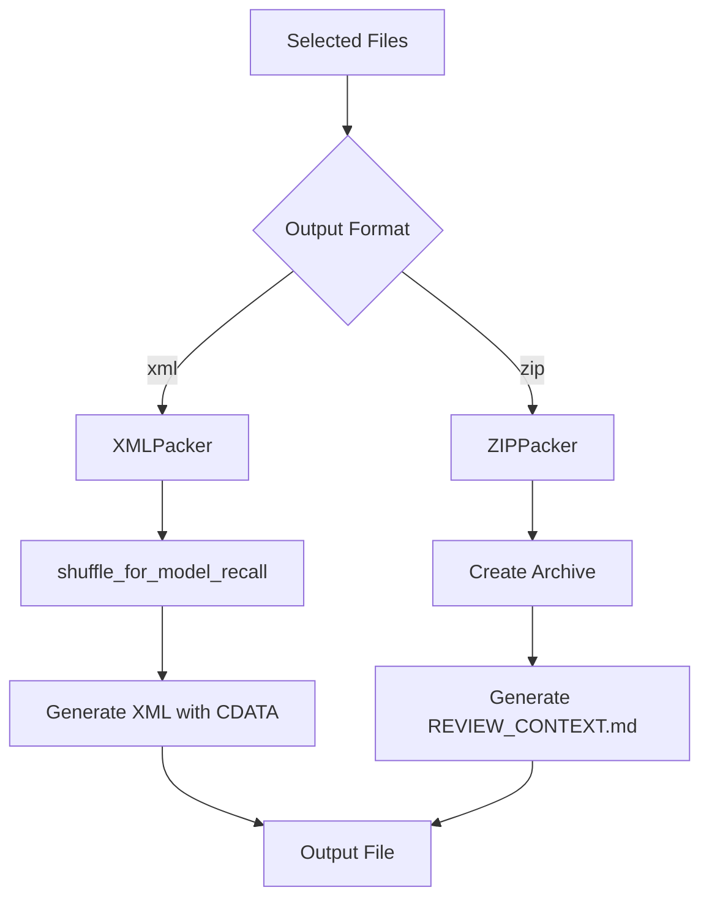

# Packer Module

> **Module Path**: `src/ws_ctx_engine/packer/`

The Packer module generates final output in XML or ZIP format, optimized for LLM consumption with features like context shuffling and smart compression.

## Purpose

The Packer module is the final stage of the ws-ctx-engine pipeline. It transforms selected files into LLM-ready output formats:

1. **XML Format**: Repomix-compatible XML with CDATA sections
2. **ZIP Format**: Archive with preserved directory structure and review manifest

## Architecture



### File Structure

```
packer/
├── __init__.py          # Exports XMLPacker, ZIPPacker
├── xml_packer.py        # Repomix-style XML generation
└── zip_packer.py        # ZIP archive with manifest
```

## Key Function: shuffle_for_model_recall()

This critical function combats the **"Lost in the Middle"** phenomenon documented by Liu et al. (2023).

### The Problem

LLMs have significantly better recall for information at the **beginning** and **end** of their context window, with degraded performance for middle content:

```
Recall Quality:  HIGH ████████░░░░░░░████████ HIGH
Position:        [START]   [MIDDLE]   [END]
```

### The Solution

```python
def shuffle_for_model_recall(
    files: List[T],
    top_k: int = 3,
    bottom_k: int = 3,
) -> List[T]:
    """
    Reorder files so highest-ranked appear at both top AND bottom of context.

    Layout:
        [TOP]    → files[:top_k]      (highest relevance — best recall)
        [MIDDLE] → files[top_k:-bottom_k]  (supporting context)
        [BOTTOM] → files[-bottom_k:]  (2nd highest relevance — still good recall)

    Args:
        files: List of file paths already sorted by relevance (descending).
        top_k: Number of highest-rank files to place at the top.
        bottom_k: Number of highest-rank files to place at the bottom.

    Returns:
        Reordered list. If len(files) <= top_k + bottom_k, returns unchanged.
    """
```

### Example Transformation

**Input (sorted by relevance):**

```
1. auth.py       (0.95)  ← Most important
2. user.py       (0.90)
3. session.py    (0.85)
4. config.py     (0.70)
5. utils.py      (0.65)
6. helpers.py    (0.50)
7. db.py         (0.45)
8. models.py     (0.40)
9. routes.py     (0.35)  ← Least important
```

**Output (shuffled for recall):**

```
1. auth.py       (0.95)  ← TOP 3 (best recall)
2. user.py       (0.90)
3. session.py    (0.85)
4. config.py     (0.70)  ← MIDDLE (lower recall)
5. utils.py      (0.65)
6. helpers.py    (0.50)
7. db.py         (0.45)  ← BOTTOM 3 (good recall)
8. models.py     (0.40)
9. routes.py     (0.35)
```

## Key Class: XMLPacker

Generates Repomix-compatible XML output with structured metadata and CDATA-wrapped file contents.

### Constructor

```python
def __init__(self, encoding: str = "cl100k_base"):
    """
    Initialize XMLPacker.

    Args:
        encoding: Tiktoken encoding name for token counting
    """
```

### Core Method: pack()

```python
def pack(
    self,
    selected_files: List[str],
    repo_path: str,
    metadata: Dict[str, Any],
    secret_scanner: Optional[Any] = None,
    content_map: Optional[Dict[str, str]] = None,
) -> str:
    """
    Generate XML output from selected files.

    Args:
        selected_files: List of file paths relative to repo_path
        repo_path: Absolute path to repository root
        metadata: Dictionary with repo_name, file_count, total_tokens, etc.
        secret_scanner: Optional scanner for redacting sensitive content
        content_map: Pre-processed content (compressed/deduped)

    Returns:
        XML string with Repomix-style structure
    """
```

### XML Output Structure

```xml
<?xml version="1.0" encoding="utf-8"?>
<repository>
  <metadata>
    <name>my-project</name>
    <file_count>42</file_count>
    <total_tokens>95000</total_tokens>
    <query>authentication logic</query>
    <changed_files>src/auth.py, src/user.py</changed_files>
    <index_health>
      <status>current</status>
      <files_indexed>150</files_indexed>
      <index_built_at>2024-01-15T10:30:00Z</index_built_at>
      <vcs>git</vcs>
    </index_health>
  </metadata>
  <files>
    <file path="src/auth.py" tokens="1234">
      <![CDATA[
import hashlib
from typing import Optional

class AuthManager:
    def __init__(self, secret_key: str):
        self.secret_key = secret_key

    def hash_password(self, password: str) -> str:
        return hashlib.sha256(password.encode()).hexdigest()
]]>
    </file>
    <file path="src/user.py" tokens="567">
      <![CDATA[
from dataclasses import dataclass

@dataclass
class User:
    id: int
    email: str
    name: str
]]>
    </file>
  </files>
</repository>
```

## Key Class: ZIPPacker

Generates ZIP archives with preserved directory structure and a human-readable manifest.

### Constructor

```python
def __init__(self, encoding: str = "cl100k_base"):
    """
    Initialize ZIPPacker.

    Args:
        encoding: Tiktoken encoding name for token counting
    """
```

### Core Method: pack()

```python
def pack(
    self,
    selected_files: List[str],
    repo_path: str,
    metadata: Dict[str, Any],
    importance_scores: Dict[str, float],
    secret_scanner: Optional[Any] = None,
) -> bytes:
    """
    Generate ZIP archive from selected files.

    Args:
        selected_files: List of file paths relative to repo_path
        repo_path: Absolute path to repository root
        metadata: Dictionary with repo_name, file_count, total_tokens, etc.
        importance_scores: Dictionary mapping file paths to importance scores
        secret_scanner: Optional scanner for redacting sensitive content

    Returns:
        ZIP archive as bytes
    """
```

### ZIP Output Structure

```
ws-ctx-engine.zip
├── files/
│   ├── src/
│   │   ├── auth.py
│   │   ├── user.py
│   │   └── config.py
│   ├── tests/
│   │   └── test_auth.py
│   └── README.md
└── REVIEW_CONTEXT.md
```

### REVIEW_CONTEXT.md Manifest

```markdown
# Review Context

## Repository Information

- **Repository**: my-project
- **Files Included**: 42
- **Total Tokens**: 95,000
- **Query**: authentication logic
- **Index Status**: current
- **Files Indexed**: 150
- **Index Built At**: 2024-01-15T10:30:00Z

## Included Files

The following files were selected based on their importance scores:

| File                 | Importance Score | Reason                |
| -------------------- | ---------------- | --------------------- |
| `src/auth.py`        | 0.9500           | Semantic match        |
| `src/user.py`        | 0.8200           | Semantic match        |
| `src/session.py`     | 0.7500           | Semantic match        |
| `tests/test_auth.py` | 0.6000           | Dependency            |
| `src/config.py`      | 0.4500           | Transitive dependency |

## Suggested Reading Order

Files are listed in order of importance (highest first):

1. `src/auth.py` (score: 0.9500)
2. `src/user.py` (score: 0.8200)
3. `src/session.py` (score: 0.7500)
4. `tests/test_auth.py` (score: 0.6000)
5. `src/config.py` (score: 0.4500)

---

_This context was generated by ws-ctx-engine_
```

## Smart Compression

When `--compress` is enabled, the packer applies intelligent compression:

| File Relevance | Treatment              |
| -------------- | ---------------------- |
| Score > 0.7    | Full content           |
| Score 0.3-0.7  | Signature + docstrings |
| Score < 0.3    | Signature only         |

### Signature-Only Example

**Original file (500 tokens):**

```python
class UserService:
    """Handle user CRUD operations."""

    def __init__(self, db: Database):
        self.db = db
        self._cache = {}
        self._initialized = False

    def get_user(self, user_id: int) -> Optional[User]:
        """Fetch user by ID with caching."""
        if user_id in self._cache:
            return self._cache[user_id]
        user = self.db.query(User).filter_by(id=user_id).first()
        if user:
            self._cache[user_id] = user
        return user

    # ... 200 more lines ...
```

**Compressed (50 tokens):**

```python
class UserService:
    """Handle user CRUD operations."""
    def __init__(self, db: Database): ...
    def get_user(self, user_id: int) -> Optional[User]:
        """Fetch user by ID with caching."""
        ...
    # [COMPRESSED: 15 methods, 450 tokens saved]
```

## Secret Redaction

When a `SecretScanner` is provided, files with detected secrets are redacted:

```xml
<file path="src/config.py" tokens="0">
  [REDACTED: detected secrets (api_key, password)]
</file>
```

## Code Examples

### Generate XML Output

```python
from ws_ctx_engine.packer import XMLPacker

packer = XMLPacker()

xml_output = packer.pack(
    selected_files=["src/main.py", "src/utils.py"],
    repo_path="/path/to/repo",
    metadata={
        "repo_name": "my-project",
        "file_count": 2,
        "total_tokens": 5000,
        "query": "main entry point"
    }
)

with open("output.xml", "w") as f:
    f.write(xml_output)
```

### Generate ZIP Output

```python
from ws_ctx_engine.packer import ZIPPacker

packer = ZIPPacker()

zip_bytes = packer.pack(
    selected_files=["src/main.py", "src/utils.py"],
    repo_path="/path/to/repo",
    metadata={
        "repo_name": "my-project",
        "file_count": 2,
        "total_tokens": 5000
    },
    importance_scores={
        "src/main.py": 0.95,
        "src/utils.py": 0.82
    }
)

with open("output.zip", "wb") as f:
    f.write(zip_bytes)
```

### With Context Shuffling

```python
from ws_ctx_engine.packer.xml_packer import shuffle_for_model_recall

files = ["a.py", "b.py", "c.py", "d.py", "e.py", "f.py", "g.py", "h.py"]
shuffled = shuffle_for_model_recall(files, top_k=3, bottom_k=3)
# Result: ['a.py', 'b.py', 'c.py', 'd.py', 'e.py', 'f.py', 'g.py', 'h.py']
# (No change for small lists - shuffling only applies when len > top_k + bottom_k)
```

## Dependencies

```python
# External
from lxml import etree     # XML generation (XMLPacker)
import tiktoken            # Token counting

# Standard library
import io
import os
import zipfile
from typing import Any, Dict, List, Optional
```

## Configuration

Relevant `.ws-ctx-engine.yaml` settings:

```yaml
# Output format
format: xml # "xml" | "zip" | "json" | "md" | "yaml" | "toon"

# Output directory
output_path: ./output
```

## Related Modules

- **[Budget](budget.md)**: Provides selected files as input
- **[Workflow](workflow.md)**: Orchestrates packing in query phase
- **[Config](config.md)**: Provides format and output_path settings
- **[Session](supporting-modules.md#session)**: Provides deduplication markers
