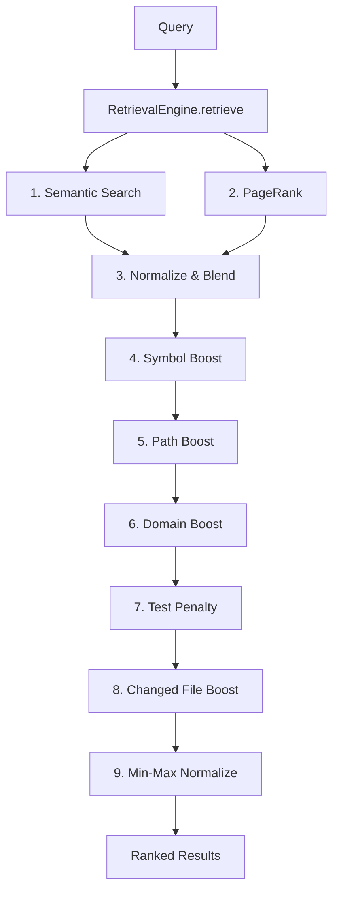

# Retrieval Module

> **Module Path**: `src/ws_ctx_engine/retrieval/`

## Purpose

The Retrieval module merges semantic search scores and PageRank structural importance scores into a single hybrid ranking. It applies additional signals including symbol matching, path boosting, domain boosting, and test file penalties to produce context-aware file importance rankings for code navigation and context generation.

## Architecture

```
retrieval/
├── __init__.py      # Public exports
└── retrieval.py     # RetrievalEngine, DomainKeywordMap, stop words, test patterns
```



## Key Classes

### RetrievalEngine

The main class that orchestrates hybrid retrieval:

```python
class RetrievalEngine:
    """
    Hybrid retrieval engine combining semantic and structural ranking.

    The RetrievalEngine merges semantic similarity scores from vector search
    with structural importance scores from PageRank to produce base importance
    scores, then applies additional signals.
    """

    def __init__(
        self,
        vector_index: VectorIndex,
        graph: RepoMapGraph,
        semantic_weight: float = 0.6,
        pagerank_weight: float = 0.4,
        symbol_boost: float = 0.3,
        path_boost: float = 0.2,
        domain_boost: float = 0.25,
        test_penalty: float = 0.5,
        domain_map: Optional[DomainKeywordMap] = None,
        config: Optional[Any] = None,
    ):
```

**Constructor Parameters:**

| Parameter         | Default  | Description                                                       |
| ----------------- | -------- | ----------------------------------------------------------------- |
| `vector_index`    | Required | VectorIndex instance for semantic search                          |
| `graph`           | Required | RepoMapGraph instance for structural ranking                      |
| `semantic_weight` | 0.6      | Weight for semantic scores (must sum to 1.0 with pagerank_weight) |
| `pagerank_weight` | 0.4      | Weight for PageRank scores                                        |
| `symbol_boost`    | 0.3      | Additive weight for exact symbol matches                          |
| `path_boost`      | 0.2      | Additive weight for path keyword matches                          |
| `domain_boost`    | 0.25     | Additive weight for domain directory matches                      |
| `test_penalty`    | 0.5      | Multiplicative penalty for test files (0-1)                       |

**Validation:**

```python
# Weights must be in [0, 1]
if not (0 <= semantic_weight <= 1):
    raise ValueError(...)

# Weights must sum to 1.0
if abs(semantic_weight + pagerank_weight - 1.0) > 0.001:
    raise ValueError(...)
```

### Core Method: retrieve()

```python
def retrieve(
    self,
    query: Optional[str] = None,
    changed_files: Optional[List[str]] = None,
    top_k: int = 100,
) -> List[Tuple[str, float]]:
    """
    Retrieve files with hybrid importance scores.

    Args:
        query: Optional natural language query for semantic search
        changed_files: Optional list of changed files for PageRank boosting
        top_k: Maximum number of results to return (default 100)

    Returns:
        List of (file_path, importance_score) tuples sorted by score descending,
        with scores in [0, 1].
    """
```

### DomainKeywordMap

Lightweight domain keyword to directory mapping:

```python
class DomainKeywordMap:
    """Lightweight domain keyword to directory mapping for query classification."""

    def __init__(self):
        self._keyword_to_dirs: Dict[str, Set[str]] = {}

    def load(self, path: str) -> None:
        """Load from pickle file."""

    @property
    def keywords(self) -> Set[str]:
        """Return all registered keywords."""

    def directories_for(self, keyword: str) -> List[str]:
        """Return directories associated with keyword."""

    def keyword_matches(self, token: str) -> bool:
        """Check if token matches any keyword (exact or prefix)."""
```

## Hybrid Scoring Pipeline

The retrieval process follows a 9-step pipeline:

### Step 1: Semantic Score

Query the vector index for similarity scores:

```python
semantic_scores: Dict[str, float] = {}
if query:
    semantic_results = self.vector_index.search(query, top_k)
    semantic_scores = dict(semantic_results)
```

### Step 2: PageRank Score

Compute structural importance from the dependency graph:

```python
pagerank_scores: Dict[str, float] = {}
pagerank_scores = self.graph.pagerank(changed_files)
```

### Step 3: Normalize and Blend

Min-max normalize both score sets, then compute weighted sum:

```python
semantic_normalized = self._normalize(semantic_scores)
pagerank_normalized = self._normalize(pagerank_scores)
merged = self._merge_scores(semantic_normalized, pagerank_normalized)
```

**Merge Formula:**

```
merged[file] = semantic_weight × semantic[file] + pagerank_weight × pagerank[file]
```

### Step 4: Symbol Boost

Add bonus for files defining symbols mentioned in query:

```python
file_symbols = self.vector_index.get_file_symbols()
symbol_scores = self._compute_symbol_scores(tokens, file_symbols)
for file_path, score in symbol_scores.items():
    merged[file_path] += effective_symbol_weight × score
```

**Symbol Score Formula:**

```
symbol_score[file] = (count of query tokens matching file's symbols) / (total query tokens)
```

### Step 5: Path Boost

Add bonus for files whose paths contain query keywords:

```python
path_scores = self._compute_path_scores(tokens, all_files)
for file_path, score in path_scores.items():
    merged[file_path] += effective_path_weight × score
```

**Path Matching Strategies:**

1. **Exact match**: token equals path part (`"python"` → `python.py`)
2. **Substring**: token contained in path part (`"auth"` → `authenticate`)
3. **Shared prefix ≥ 5 chars**: (`"chunking"` matches `"chunker"`)

### Step 6: Domain Boost

Add bonus for files in directories matching domain keywords:

```python
domain_scores = self._compute_domain_scores(tokens, all_files)
for file_path, score in domain_scores.items():
    merged[file_path] += effective_domain_weight × score
```

Files under matched directories receive score 1.0, others 0.0.

### Step 7: Test Penalty

Reduce scores for test files:

```python
for file_path in merged:
    if self._is_test_file(file_path):
        merged[file_path] *= (1.0 - test_penalty)  # e.g., × 0.5
```

**Test File Patterns:**

```python
_TEST_FILE_PATTERNS = [
    re.compile(r'(^|/)tests?/', re.IGNORECASE),      # tests/ or test/
    re.compile(r'(^|/)test_', re.IGNORECASE),        # test_*.py
    re.compile(r'_test\.(py|js|ts|rs)$', re.IGNORECASE),  # *_test.py
    re.compile(r'\.spec\.(js|ts)$', re.IGNORECASE),  # *.spec.js
]
```

### Step 8: Changed File Boost

Changed files already receive boost via PageRank (Step 2).

### Step 9: Min-Max Normalize

Final normalization to [0, 1] range:

```python
final_scores = self._normalize(merged)
```

**Normalization Formula:**

```
normalized[file] = (score[file] - min_score) / (max_score - min_score)
```

## Scoring Formulas

### Base Hybrid Score

```
base_score = semantic_weight × normalized_semantic + pagerank_weight × normalized_pagerank
```

**Default:** `base_score = 0.6 × semantic + 0.4 × pagerank`

### Full Scoring Formula

```
final_score = normalize(
    (base_score
     + eff_symbol_weight × symbol_score
     + eff_path_weight × path_score
     + eff_domain_weight × domain_score)
    × (1 - test_penalty if is_test_file else 1)
)
```

### Query Type Classification

The engine classifies queries for adaptive boosting:

```python
def _classify_query(self, query: str, tokens: Set[str]) -> str:
    """Returns: "symbol" | "path-dominant" | "semantic-dominant" """

    # 1. Path-dominant: domain keywords present
    for token in tokens:
        if self.domain_map.keyword_matches(token):
            return "path-dominant"

    # 2. Symbol: PascalCase or snake_case
    if re.search(r'\b[A-Z][a-z]+[A-Z]', query):  # PascalCase
        return "symbol"
    if any('_' in t and len(t) > 4 for t in tokens):  # snake_case
        return "symbol"

    # 3. Default
    return "semantic-dominant"
```

### Effective Weights by Query Type

| Query Type        | Symbol Multiplier | Path Multiplier | Domain Multiplier |
| ----------------- | ----------------- | --------------- | ----------------- |
| symbol            | 1.5               | 0.5             | 0.3               |
| path-dominant     | 0.5               | 1.5             | 0.5               |
| semantic-dominant | 0.2               | 0.2             | 0.2               |

**Example with default weights:**

- Query type: `path-dominant`
- Base weights: symbol=0.3, path=0.2, domain=0.25
- Effective: symbol=0.15, path=0.30, domain=0.125

## Stop Words

Common words filtered from query tokens:

```python
_STOP_WORDS = frozenset({
    'the', 'a', 'an', 'in', 'for', 'of', 'and', 'or', 'is', 'are', 'how',
    'does', 'what', 'where', 'show', 'me', 'find', 'get', 'use', 'uses',
    'used', 'to', 'from', 'with', 'this', 'that', 'it', 'its', 'by', 'be',
    'do', 'did', 'has', 'have', 'not', 'can', 'all', 'any', 'my', 'our',
    'which', 'when', 'then', 'there', 'their', 'about', 'into', 'should',
    'would', 'could', 'will', 'may', 'might', 'was', 'were', 'been', 'being',
    'just', 'also', 'more', 'like', 'than', 'but', 'so', 'if', 'at', 'on',
})
```

## Test File Patterns

Regex patterns identifying test files (from `retrieval.py:_TEST_FILE_PATTERNS`):

| Pattern (simplified) | Full Regex | Matches |
| -------------------- | ---------- | ------- |
| `tests?/` at path boundary | `(^|/)tests?/` | `tests/`, `test/` directories |
| `test_` at path boundary | `(^|/)test_` | `test_*.py` style files |
| `_test.EXT` at end | `_test\.(py|js|ts|rs)$` | `*_test.py` style files |
| `.spec.EXT` at end | `\.spec\.(js|ts)$` | `*.spec.ts` style files |

## Code Examples

### Basic Usage

```python
from ws_ctx_engine.vector_index import create_vector_index
from ws_ctx_engine.graph import create_graph
from ws_ctx_engine.retrieval import RetrievalEngine
from ws_ctx_engine.chunker import parse_with_fallback

# Build indexes
chunks = parse_with_fallback("/path/to/repo")

vector_index = create_vector_index()
vector_index.build(chunks)

graph = create_graph()
graph.build(chunks)

# Create retrieval engine
engine = RetrievalEngine(
    vector_index=vector_index,
    graph=graph,
    semantic_weight=0.6,
    pagerank_weight=0.4,
    symbol_boost=0.3,
    path_boost=0.2,
    domain_boost=0.25,
    test_penalty=0.5,
)

# Retrieve relevant files
results = engine.retrieve(
    query="authentication logic",
    changed_files=["src/auth.py"],
    top_k=50
)

for file_path, score in results[:10]:
    print(f"{file_path}: {score:.3f}")
```

### Custom Weights

```python
# Emphasize semantic search over structure
engine = RetrievalEngine(
    vector_index=vector_index,
    graph=graph,
    semantic_weight=0.8,
    pagerank_weight=0.2,
    symbol_boost=0.5,    # Strong symbol matching
    path_boost=0.1,      # Weak path matching
    test_penalty=0.7,    # Strong test penalty
)
```

### Query Without Semantic Search

```python
# Use only PageRank (structure-based)
results = engine.retrieve(
    query=None,  # No semantic query
    changed_files=["src/auth.py", "src/models.py"],
    top_k=100
)
```

### With Domain Map

```python
from ws_ctx_engine.retrieval.retrieval import DomainKeywordMap

# Load domain keyword mapping
domain_map = DomainKeywordMap()
domain_map.load(".ws-ctx-engine/domain_map.pkl")

engine = RetrievalEngine(
    vector_index=vector_index,
    graph=graph,
    domain_map=domain_map,
    domain_boost=0.3,  # Strong domain boosting
)

# Queries with domain keywords get boosted for matching directories
results = engine.retrieve("chunker implementation")
# Files in 'chunker/' directory get boosted
```

## Configuration

Relevant YAML configuration options:

```yaml
# .ws-ctx-engine.yaml
retrieval:
  # Base score weights (must sum to 1.0)
  semantic_weight: 0.6
  pagerank_weight: 0.4

  # Additional signal weights
  symbol_boost: 0.3
  path_boost: 0.2
  domain_boost: 0.25

  # Test file penalty (0-1)
  test_penalty: 0.5

  # Maximum results to return
  default_top_k: 100

# Domain keyword mapping
domain_map:
  path: .ws-ctx-engine/domain_map.pkl
```

## Internal Methods

### Token Extraction

```python
def _extract_query_tokens(self, query: str) -> Set[str]:
    """Extract meaningful identifier-like tokens from a query string."""
    raw = set(re.findall(r'[a-zA-Z_][a-zA-Z0-9_]*', query))
    return {t.lower() for t in raw if len(t) >= 3 and t.lower() not in _STOP_WORDS}
```

### Normalization

```python
def _normalize(self, scores: Dict[str, float]) -> Dict[str, float]:
    """Min-max normalize scores to [0, 1]."""
    if not scores:
        return {}

    min_score = min(scores.values())
    max_score = max(scores.values())

    if max_score - min_score < 1e-9:
        return {file: 1.0 for file in scores}

    return {
        file: (score - min_score) / (max_score - min_score)
        for file, score in scores.items()
    }
```

### Score Merging

```python
def _merge_scores(
    self,
    semantic_scores: Dict[str, float],
    pagerank_scores: Dict[str, float],
) -> Dict[str, float]:
    """Merge normalized scores using configured weights."""
    all_files = set(semantic_scores.keys()) | set(pagerank_scores.keys())

    return {
        file: (
            self.semantic_weight * semantic_scores.get(file, 0.0)
            + self.pagerank_weight * pagerank_scores.get(file, 0.0)
        )
        for file in all_files
    }
```

## Dependencies

### Internal Dependencies

- `ws_ctx_engine.vector_index.VectorIndex` - Semantic search
- `ws_ctx_engine.graph.RepoMapGraph` - PageRank computation
- `ws_ctx_engine.ranking.ranker` - AI rule boosting (optional)

### External Dependencies

| Package   | Purpose          | Required     |
| --------- | ---------------- | ------------ |
| `re`      | Pattern matching | Yes (stdlib) |
| `logging` | Logging          | Yes (stdlib) |

## Performance Considerations

### Scoring Complexity

| Step            | Complexity | Notes                     |
| --------------- | ---------- | ------------------------- |
| Semantic Search | O(n × d)   | n=docs, d=embedding dim   |
| PageRank        | O(V + E)   | V=vertices, E=edges       |
| Symbol Boost    | O(t × s)   | t=tokens, s=total symbols |
| Path Boost      | O(t × f)   | t=tokens, f=files         |
| Normalization   | O(f)       | f=files                   |

### Typical Latency

| Codebase Size | Retrieval Time |
| ------------- | -------------- |
| 1k files      | <100ms         |
| 10k files     | <500ms         |
| 100k files    | <2s            |

## Related Modules

- [Chunker](./chunker.md) - Provides CodeChunks for indexing
- [Vector Index](./vector-index.md) - Semantic search component
- [Graph](./graph.md) - PageRank computation
- [Ranking](./ranking.md) - AI rule boost applied after retrieval scores
