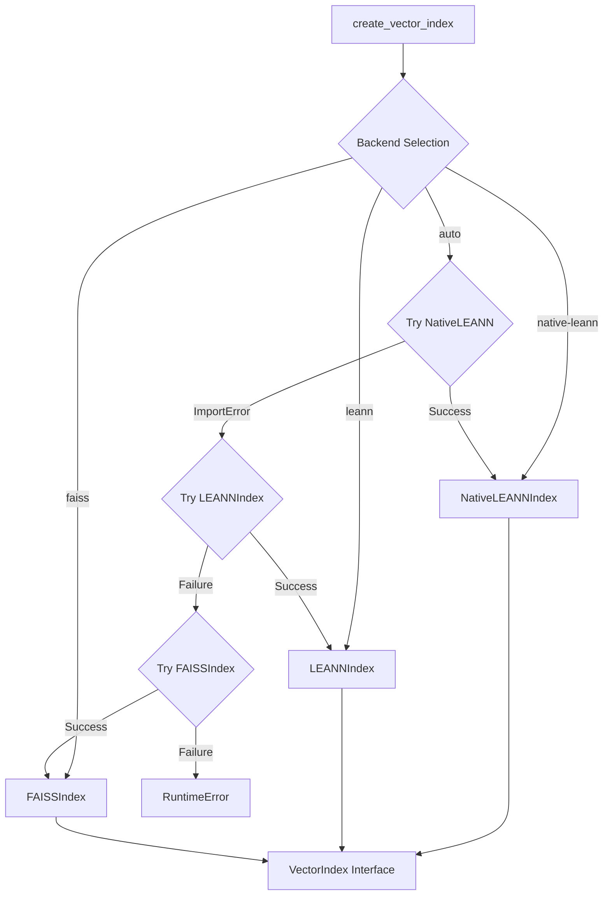
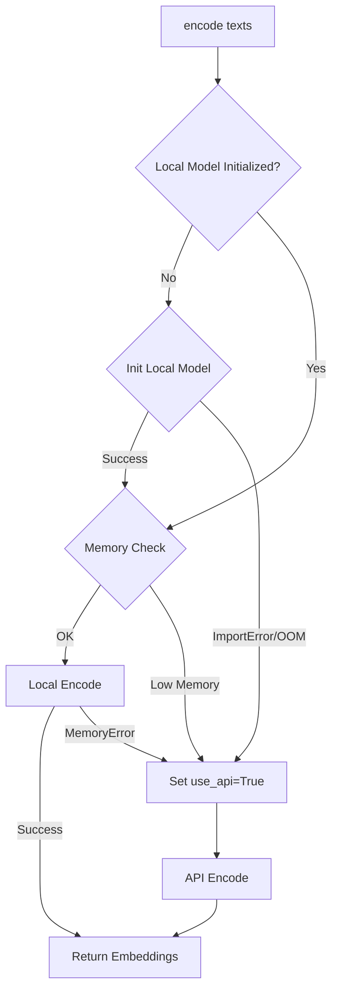

# Vector Index Module

> **Module Path**: `src/ws_ctx_engine/vector_index/`

## Purpose

The Vector Index module builds semantic search indexes over code chunks using embeddings. It enables natural language queries against the codebase by encoding chunks into vector representations and performing similarity search. The module provides multiple backend implementations with automatic fallback for robustness.

## Architecture

```
vector_index/
├── __init__.py          # Public exports
├── vector_index.py      # VectorIndex ABC, EmbeddingGenerator, LEANNIndex, FAISSIndex, factory functions
├── leann_index.py       # NativeLEANNIndex using actual LEANN library
└── embedding_cache.py   # EmbeddingCache for incremental indexing
```



## Key Classes

### VectorIndex Abstract Base

The abstract base class defining the vector index interface:

```python
class VectorIndex(ABC):
    """Abstract base class for vector index implementations.

    Provides semantic search over code chunks using embeddings.
    Implementations must support build, search, save, and load operations.
    """

    @abstractmethod
    def build(self, chunks: List[CodeChunk]) -> None:
        """Build vector index from code chunks."""
        pass

    @abstractmethod
    def search(self, query: str, top_k: int = 10) -> List[Tuple[str, float]]:
        """Search for relevant code chunks.

        Returns:
            List of (file_path, similarity_score) tuples, ordered by descending similarity
        """
        pass

    @abstractmethod
    def save(self, path: str) -> None:
        """Persist index to disk."""
        pass

    @classmethod
    @abstractmethod
    def load(cls, path: str) -> 'VectorIndex':
        """Load index from disk."""
        pass

    def get_file_symbols(self) -> Dict[str, List[str]]:
        """Get mapping of file paths to symbols defined in those files."""
        return {}
```

### EmbeddingGenerator

Generates embeddings with automatic fallback from local to API:

```python
class EmbeddingGenerator:
    """Generate embeddings for text using local model or API fallback.

    Tries sentence-transformers first, falls back to OpenAI API on OOM.
    """

    def __init__(
        self,
        model_name: str = "all-MiniLM-L6-v2",  # 384-dimensional embeddings
        device: str = "cpu",                    # or "cuda" for GPU
        batch_size: int = 32,
        api_provider: str = "openai",
        api_key_env: str = "OPENAI_API_KEY"
    ):
```

**Key Features:**

| Feature                | Description                                         |
| ---------------------- | --------------------------------------------------- |
| Memory-aware fallback  | Checks available memory before loading local model  |
| Automatic API fallback | Falls back to OpenAI API when local embedding fails |
| Memory threshold       | 500MB minimum for local model loading               |
| Batch processing       | Configurable batch size for efficient encoding      |

**Embedding Flow:**



### LEANNIndex

Primary implementation using cosine similarity with file-level grouping:

```python
class LEANNIndex(VectorIndex):
    """LEANN-based vector index with 97% storage savings.

    Uses graph-based approach to store only a subset of vectors,
    recomputing others on-the-fly using graph traversal.
    """

    def __init__(
        self,
        model_name: str = "all-MiniLM-L6-v2",
        device: str = "cpu",
        batch_size: int = 32
    ):
```

**Implementation Details:**

- Groups chunks by file path before embedding
- Concatenates all chunks from same file into single embedding
- Stores file → symbols mapping for symbol boost
- Uses cosine similarity for search

**Cosine Similarity Implementation:**

```python
@staticmethod
def _cosine_similarity(query: np.ndarray, embeddings: np.ndarray) -> np.ndarray:
    """Compute cosine similarity between query and embeddings."""
    # Normalize query
    query_norm = query / (np.linalg.norm(query) + 1e-8)

    # Normalize embeddings
    embeddings_norm = embeddings / (np.linalg.norm(embeddings, axis=1, keepdims=True) + 1e-8)

    # Compute dot product
    return np.dot(embeddings_norm, query_norm)
```

### FAISSIndex

Fallback implementation using Facebook's FAISS library with HNSW algorithm:

```python
class FAISSIndex(VectorIndex):
    """FAISS-based vector index using HNSW algorithm.

    Fallback implementation using faiss-cpu library.
    """
```

**HNSW Parameters:**

| Parameter      | Value | Description                                           |
| -------------- | ----- | ----------------------------------------------------- |
| M              | 32    | Number of bi-directional links per node               |
| efConstruction | 40    | Size of dynamic candidate list for index construction |

**Index Construction:**

```python
self._index = faiss.IndexHNSWFlat(self._embedding_dim, 32)  # M=32
self._index.hnsw.efConstruction = 40
self._index.add(embeddings.astype('float32'))
```

**Incremental Update Support (M6):**

FAISSIndex supports incremental updates via `IndexIDMap2`:

```python
def update_incremental(
    self,
    deleted_paths: List[str],
    new_chunks: List[CodeChunk],
    embedding_cache: Optional[EmbeddingCache] = None,
) -> None:
    """
    Incrementally update the FAISS index.

    Removes vectors for deleted_paths, then adds vectors for new_chunks.
    Uses embedding_cache to skip re-embedding unchanged content.
    """
```

### NativeLEANNIndex

Production implementation using the actual LEANN library:

```python
class NativeLEANNIndex(VectorIndex):
    """Native LEANN vector index with 97% storage savings.

    Uses the actual LEANN library which implements graph-based selective
    recomputation instead of storing all embeddings.
    """

    def __init__(
        self,
        index_path: str = "./leann_index",
        backend: str = "hnsw",          # or "diskann"
        chunk_size: int = 256,
        overlap: int = 32,
    ):
```

**Features:**

- 97% storage savings via selective vector storage
- Two backend options: HNSW or DiskANN
- Metadata storage for file paths and symbols

### EmbeddingCache

Disk-backed cache for incremental indexing:

```python
class EmbeddingCache:
    """
    Disk-backed content-hash → embedding vector cache.

    Storage layout under .ws-ctx-engine/
        embeddings.npy          — numpy array of shape (N, embedding_dim)
        embedding_index.json    — {"hash_to_idx": {"<sha256>": <row_index>, ...}}
    """

    def __init__(self, cache_dir: Path) -> None:
        self._cache_dir = cache_dir
        self._embeddings_path = cache_dir / "embeddings.npy"
        self._index_path = cache_dir / "embedding_index.json"
```

**Methods:**

| Method                        | Description                   |
| ----------------------------- | ----------------------------- |
| `load()`                      | Load cache from disk          |
| `save()`                      | Persist current cache to disk |
| `lookup(content_hash)`        | Return cached vector or None  |
| `store(content_hash, vector)` | Add/update cached vector      |
| `content_hash(text)`          | SHA-256 hex digest of text    |

## Backend Selection

### Factory Function

```python
def create_vector_index(
    backend: str = "auto",
    model_name: str = "all-MiniLM-L6-v2",
    device: str = "cpu",
    batch_size: int = 32,
    index_path: str = "./leann_index",
) -> VectorIndex:
    """Create vector index with automatic backend selection and fallback.

    Backend priority in 'auto' mode:
    1. NativeLEANNIndex (LEANN library - 97% storage savings)
    2. LEANNIndex (cosine similarity fallback)
    3. FAISSIndex (HNSW fallback)
    """
```

**Backend Options:**

| Backend        | Description                                  | Storage     | Speed          |
| -------------- | -------------------------------------------- | ----------- | -------------- |
| `native-leann` | LEANN library with graph-based recomputation | 97% savings | Fast           |
| `leann`        | Cosine similarity with all embeddings        | Normal      | Fast           |
| `faiss`        | HNSW index via faiss-cpu                     | Normal      | Fastest search |
| `auto`         | Try backends in priority order               | Varies      | Varies         |

### Load Function

```python
def load_vector_index(path: str) -> VectorIndex:
    """Load vector index from disk with automatic backend detection.

    Detects the backend used when saving and loads with the appropriate implementation.
    """
```

## Embedding Generation

### Local Model (Preferred)

Uses `sentence-transformers` for local embedding generation:

```python
from sentence_transformers import SentenceTransformer

model = SentenceTransformer("all-MiniLM-L6-v2", device="cpu")
embeddings = model.encode(
    texts,
    batch_size=32,
    show_progress_bar=False,
    convert_to_numpy=True
)
```

**Model Details:**

| Property   | Value                         |
| ---------- | ----------------------------- |
| Model      | all-MiniLM-L6-v2              |
| Dimensions | 384                           |
| Max Tokens | 256                           |
| Speed      | ~14,000 sentences/sec on V100 |

### API Fallback (OpenAI)

Falls back to OpenAI API when local model unavailable:

```python
import openai

response = openai.Embedding.create(
    input=text,
    model="text-embedding-ada-002"  # 1536 dimensions
)
embedding = response['data'][0]['embedding']
```

## Storage

### Index Persistence

All backends use pickle for metadata with backend-specific index files:

**LEANNIndex Storage:**

```python
data = {
    'backend': 'LEANNIndex',
    'model_name': self.model_name,
    'device': self.device,
    'batch_size': self.batch_size,
    'file_paths': self._file_paths,
    'embeddings': self._embeddings,  # numpy array
    'file_symbols': self._file_symbols,
}
```

**FAISSIndex Storage:**

```
path.pkl       # Metadata (model_name, file_paths, file_symbols)
path.pkl.faiss # FAISS index file
```

**NativeLEANNIndex Storage:**

```
index_path.meta.json     # LEANN metadata
index_path.passages.jsonl # LEANN passages
path.pkl                 # Additional metadata (file_paths, file_symbols)
```

### Incremental Detection

Uses content hashing for change detection:

```python
# Check if file changed
old_hash = cached_hashes.get(file_path)
new_hash = hashlib.sha256(content.encode()).hexdigest()
if old_hash != new_hash:
    # Re-embed this file
```

## Performance

### Search Latency Targets

| Backend           | 1k files | 10k files | 100k files |
| ----------------- | -------- | --------- | ---------- |
| NativeLEANN       | <10ms    | <50ms     | <200ms     |
| LEANNIndex        | <5ms     | <20ms     | <100ms     |
| FAISSIndex (HNSW) | <1ms     | <5ms      | <20ms      |

### Memory Usage

| Backend     | 10k files (384-dim) |
| ----------- | ------------------- |
| NativeLEANN | ~3MB (97% savings)  |
| LEANNIndex  | ~15MB               |
| FAISSIndex  | ~20MB               |

## Code Examples

### Basic Usage

```python
from ws_ctx_engine.vector_index import create_vector_index
from ws_ctx_engine.chunker import parse_with_fallback

# Parse repository
chunks = parse_with_fallback("/path/to/repo")

# Create and build index
index = create_vector_index(backend="auto")
index.build(chunks)

# Search
results = index.search("authentication logic", top_k=10)
for file_path, score in results:
    print(f"{file_path}: {score:.3f}")

# Save for later
index.save(".ws-ctx-engine/vector_index.pkl")
```

### Loading Existing Index

```python
from ws_ctx_engine.vector_index import load_vector_index

# Auto-detects backend from saved metadata
index = load_vector_index(".ws-ctx-engine/vector_index.pkl")

# Search immediately
results = index.search("database connection handling")
```

### With Embedding Cache

```python
from pathlib import Path
from ws_ctx_engine.vector_index import FAISSIndex
from ws_ctx_engine.vector_index.embedding_cache import EmbeddingCache

# Initialize cache
cache = EmbeddingCache(Path(".ws-ctx-engine"))
cache.load()

# Build index with cache
index = FAISSIndex()
index.build(chunks)

# Incremental update
index.update_incremental(
    deleted_paths=["old_file.py"],
    new_chunks=new_chunks,
    embedding_cache=cache
)

# Save cache for next run
cache.save()
```

## Configuration

Relevant YAML configuration options:

```yaml
# .ws-ctx-engine.yaml
vector_index:
  # Backend selection: auto, native-leann, leann, faiss
  backend: auto

  # Embedding model
  model_name: all-MiniLM-L6-v2

  # Device for local embeddings
  device: cpu # or cuda

  # Batch size for encoding
  batch_size: 32

  # Path for LEANN index storage
  index_path: .ws-ctx-engine/leann_index

# For API fallback
api:
  provider: openai
  key_env: OPENAI_API_KEY
```

## Dependencies

### Internal Dependencies

- `ws_ctx_engine.models.CodeChunk` - Input data structure
- `ws_ctx_engine.logger` - Logging utilities

### External Dependencies

| Package                 | Purpose              | Required    |
| ----------------------- | -------------------- | ----------- |
| `numpy`                 | Array operations     | Yes         |
| `psutil`                | Memory checking      | Yes         |
| `sentence-transformers` | Local embeddings     | Recommended |
| `faiss-cpu`             | FAISS backend        | Optional    |
| `leann`                 | Native LEANN backend | Optional    |
| `openai`                | API fallback         | Optional    |

**Installation Options:**

```bash
# Basic (LEANNIndex only)
pip install ws-ctx-engine

# With FAISS
pip install ws-ctx-engine faiss-cpu

# With native LEANN (97% storage savings)
pip install ws-ctx-engine[leann]

# Full installation
pip install ws-ctx-engine[all]
```

## Related Modules

- [Chunker](./chunker.md) - Provides CodeChunk inputs for indexing
- [Graph](./graph.md) - Structural ranking component
- [Retrieval](./retrieval.md) - Combines vector search with PageRank
