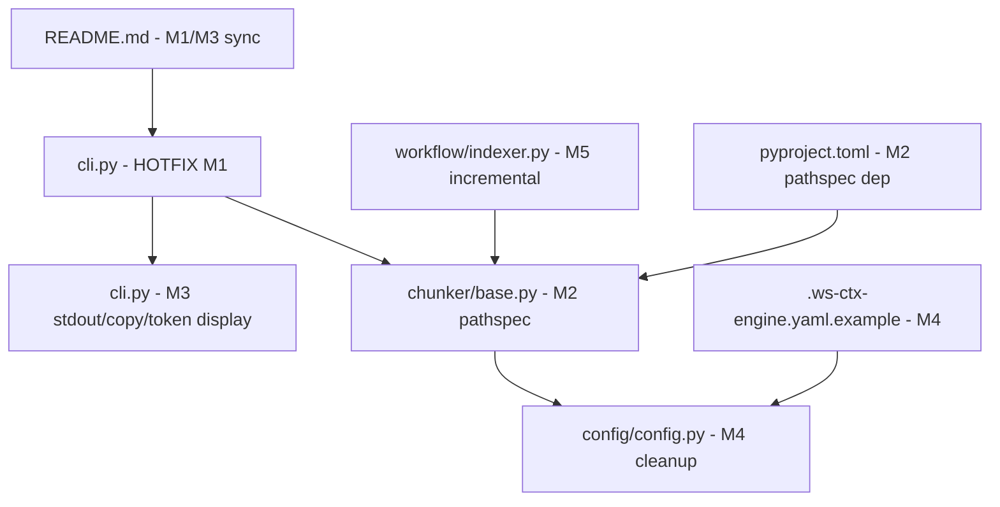

## Yêu cầu gốc

Nghiên cứu toàn diện các điểm yếu đã xác định trong `ws-ctx-engine` (qua report so sánh + code audit), sau đó tạo **plan chi tiết có thể review và implement** để khắc phục toàn bộ, hướng tới hai nhóm người dùng chính:

- **DEV**: developer tương tác qua CLI
- **AI AGENTS**: agent truy cập qua MCP hoặc tiêu thụ output

## Product Overview

`ws-ctx-engine` là một retrieval-first context engine: index codebase, xếp hạng file theo hybrid scoring (semantic + PageRank + heuristics), rồi đóng gói output phục vụ LLM/AI agent. Mục tiêu là khắc phục triệt để các điểm yếu hiện tại để nâng cấp từ "engine kỹ thuật" lên "product có thể dùng ngay", với output rõ ràng cho cả DEV lẫn AGENT.

## Core Features cần fix/nâng cấp

1. **Bug fix nghiêm trọng**: `_set_console_log_level` được gọi tại `cli.py:365` nhưng không được định nghĩa — crash khi `--quiet` (default=True) → tool không chạy được ở trạng thái default
2. **Docs/Config/Code/Version consistency**: version drift, README thiếu 6 commands, config fields aspirational chưa wired, README sai format options
3. **Ignore semantics chuẩn hóa**: thay custom `fnmatch` bằng `pathspec` library để hỗ trợ đầy đủ gitignore spec, bao gồm negation `!`, subdirectory `.gitignore`, `**` đúng spec
4. **Language support honesty**: loại `*.java`, `*.go`, `*.c`, `*.cpp`, `*.h` ra khỏi `include_patterns` default vì chunker không hỗ trợ; hoặc emit cảnh báo rõ ràng thay vì silent failure
5. **CLI UX improvements**: hiển thị token count sau pack/query; thêm `--stdout` mode cho XML/JSON; thêm clipboard copy option
6. **Output schema chính thức**: viết JSON Schema cho output `json` format và `REVIEW_CONTEXT.md` spec
7. **Incremental indexing thật sự**: wiring `performance.incremental_index` để chỉ reparse/reembed các file có hash thay đổi, thay vì luôn rebuild full
8. **Config cleanup**: remove hoặc implement các fields aspirational (`logging.*`, `advanced.*`, `max_workers`, `cache_embeddings`)

## Tech Stack Selection

Giữ nguyên stack hiện tại: Python 3.11+, Typer, Rich, tiktoken, PyYAML, lxml, pathspec (thêm mới).

## Implementation Approach

Chia thành 5 milestone theo thứ tự ưu tiên, từ "unblock người dùng ngay" → "nâng cao output quality" → "tối ưu hiệu năng". Mỗi milestone độc lập có thể ship và verify riêng.

**Milestone 1 — Hotfix & Unblock** (1–2 ngày): Sửa crash bug `_set_console_log_level`, đồng bộ version, fix README thiếu commands. Đây là prerequisite bắt buộc trước tất cả mọi thứ.

**Milestone 2 — Ignore Semantics & Language Honesty** (2–3 ngày): Thay `fnmatch` matcher bằng `pathspec` (đã có trong Python ecosystem, mature, hỗ trợ full gitignore spec). Xử lý language support gap bằng cách tách `include_patterns` default thành `indexed_patterns` (đã có parser) vs `tracked_patterns` (chỉ include vào output không index); hoặc đơn giản nhất: emit `[WARNING]` cho các file matched nhưng không có parser.

**Milestone 3 — CLI UX & Output Polish** (2–3 ngày): Thêm token count summary sau pack/query, `--stdout` flag, `--copy` clipboard flag; đồng bộ README với code; viết JSON Schema cho output format.

**Milestone 4 — Config Cleanup & Advanced Fields** (2–3 ngày): Xóa hoặc implement các fields aspirational. Implement `max_workers` cho parallel chunk parsing. Remove `logging.*` và `advanced.*` khỏi example config (hoặc đánh dấu experimental).

**Milestone 5 — Incremental Indexing** (3–5 ngày): Implement partial reindex dựa trên file hash diff — chỉ reparse + reembed các file mới/thay đổi, merge vào index hiện có thay vì rebuild full.

## Implementation Notes

**M1 — Hotfix `_set_console_log_level`**: Hàm này cần được định nghĩa trong `cli.py` trước `@app.callback()`. Cách đơn giản nhất là implement nó dùng logger level của `ws_ctx_engine.logger`. Phải test ngay với `wsctx --help` và `wsctx pack .` để đảm bảo không còn crash.

**M2 — Pathspec migration**: Thêm `pathspec>=0.12` vào `dependencies` trong `pyproject.toml`. Hàm `_should_include_file` trong `chunker/base.py` cần được refactor để nhận `pathspec.PathSpec` thay vì list string patterns. Hàm `_extract_gitignore_patterns` trong `cli.py` cần đọc cả subdirectory `.gitignore` files (recursive). Backward compat: nếu `pathspec` unavailable, fallback về fnmatch hiện tại với cảnh báo.

**M2 — Language honesty**: Cách ít rủi ro nhất là thêm một constant `INDEXED_EXTENSIONS` trong `chunker/base.py` và khi `_should_include_file` match một file mà extension không trong `INDEXED_EXTENSIONS`, log `WARNING: file X included but no AST parser available, skipping semantic index`. Không cần thay đổi default `include_patterns` để tránh breaking change.

**M3 — Token count display**: Sau khi `query_and_pack()` return, `tracker` đã có `total_tokens`. Trong `cli.py` commands `query` và `pack`, khi in success message, thêm dòng `console.print(f"  Tokens selected: {total_tokens:,} / {budget:,}")`. Cho agent mode: thêm field `total_tokens` vào NDJSON status payload.

**M3 — `--stdout` mode**: Với XML và JSON format, nếu `--stdout` flag được set, thay vì ghi file thì `typer.echo(output_content)` và skip file write. Log vẫn đi ra stderr. Cần guard: `--stdout` và `--agent-mode` không được dùng cùng nhau.

**M4 — Config cleanup**: Fields `logging.level`, `logging.file`, `advanced.pagerank_damping`, `advanced.pagerank_max_iterations`, `advanced.pagerank_tolerance`, `advanced.min_file_size`, `advanced.max_file_size`, `advanced.validate_roundtrip`, `advanced.changed_file_boost` cần được xóa khỏi `.ws-ctx-engine.yaml.example` hoặc move vào section `# EXPERIMENTAL (not yet implemented)` có chú thích rõ. Config class không cần thay đổi nhiều nếu các field này không được parse (chúng đơn giản là bị ignore).

**M5 — Incremental indexing**: `IndexMetadata.file_hashes` đã có. Cần thêm logic trong `index_repository()`: khi `performance.incremental_index == True` và index tồn tại, load existing chunks từ disk (cần serialize chunks), so sánh hash, chỉ reparse files có hash diff, merge chunks. Điểm phức tạp: vector index cần support `update(new_chunks)` và `remove(deleted_paths)` thay vì chỉ `build()`. Đây là thay đổi lớn nhất — nên implement theo approach đơn giản trước: partial reparse → rebuild vector/graph chỉ từ changed + unchanged chunks (không full scan disk lại).

## Architecture Design

Không thay đổi kiến trúc tổng thể. Các thay đổi là localized:



## Directory Structure

```
src/ws_ctx_engine/
├── cli/
│   └── cli.py                    # [MODIFY] M1: fix _set_console_log_level; M3: add --stdout, --copy, token count display; sync commands help text
├── chunker/
│   ├── base.py                   # [MODIFY] M2: replace fnmatch with pathspec, add INDEXED_EXTENSIONS constant, warn on unindexable files
│   └── tree_sitter.py            # [MODIFY] M2: minor — rely on base._should_include_file updated logic
├── config/
│   └── config.py                 # [MODIFY] M4: remove aspirational fields from defaults/validation; add pathspec lazy import guard
├── workflow/
│   └── indexer.py                # [MODIFY] M5: implement incremental reindex logic using hash diff + chunk serialization
├── models/
│   └── models.py                 # [MODIFY] M5: add chunk serialization support (to_dict/from_dict) for incremental index cache
├── output/
│   └── json_formatter.py         # [MODIFY] M3: ensure output conforms to JSON Schema
└── __init__.py                   # [MODIFY] M1: sync __version__ with pyproject.toml (0.1.10)

pyproject.toml                    # [MODIFY] M2: add pathspec>=0.12 to dependencies
README.md                         # [MODIFY] M1/M3: add missing 6 commands; fix format options; add token count in output section
.ws-ctx-engine.yaml.example       # [MODIFY] M4: remove/mark aspirational fields; add clear section labels

docs/
└── output-schema.md              # [NEW] M3: JSON Schema + REVIEW_CONTEXT.md spec for output formats
```