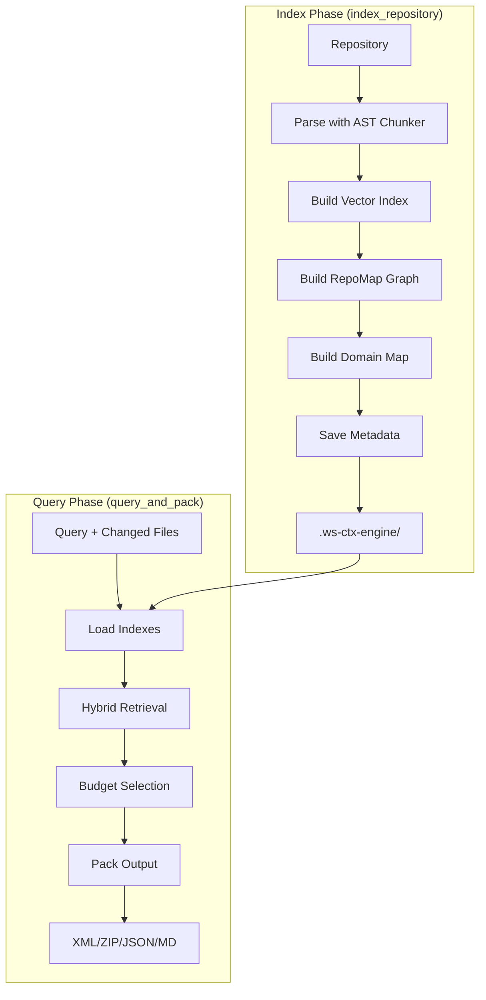
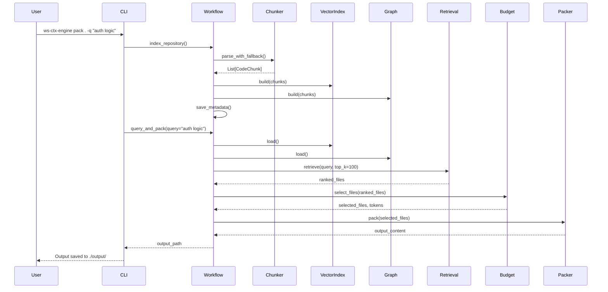

# Workflow Module

> **Module Path**: `src/ws_ctx_engine/workflow/`

The Workflow module coordinates the 6-stage pipeline, orchestrating all components from parsing through output generation.

## Purpose

The Workflow module provides high-level orchestration functions that coordinate the entire ws-ctx-engine pipeline:

1. **index_repository()**: Phases 1-3 (parse → index → graph → save)
2. **query_and_pack()**: Phases 4-6 (retrieve → budget → pack)
3. **search_codebase()**: High-level query API for programmatic use

## Architecture



### File Structure

```
workflow/
├── __init__.py      # Exports main functions
├── indexer.py       # index_repository(), load_indexes()
└── query.py         # query_and_pack(), search_codebase()
```

## Key Function: index_repository()

Builds and persists indexes for later queries. This function implements the complete indexing pipeline.

### Signature

```python
def index_repository(
    repo_path: str,
    config: Optional[Config] = None,
    index_dir: str = ".ws-ctx-engine",
    domain_only: bool = False,
    incremental: bool = False,
) -> PerformanceTracker:
    """
    Build and persist indexes for later queries.

    This function implements the index phase workflow:
    1. Parse codebase with AST Chunker (with fallback)
    2. Build Vector Index (with fallback)
    3. Build RepoMap Graph (with fallback)
    4. Save indexes to .ws-ctx-engine/
    5. Save metadata for staleness detection
    6. Build Domain Keyword Map

    Args:
        repo_path: Path to the repository root directory
        config: Configuration instance (uses defaults if None)
        index_dir: Directory to save indexes (default: .ws-ctx-engine)
        domain_only: If True, only rebuild domain_map.db (skip vector/graph)
        incremental: If True, only re-index changed files

    Returns:
        PerformanceTracker with indexing metrics

    Raises:
        ValueError: If repo_path does not exist or is not a directory
        RuntimeError: If indexing fails
    """
```

### Indexing Phases

| Phase | Component     | Output            |
| ----- | ------------- | ----------------- |
| 1     | AST Chunker   | `List[CodeChunk]` |
| 2     | Vector Index  | `vector.idx`      |
| 3     | RepoMap Graph | `graph.pkl`       |
| 4     | Metadata      | `metadata.json`   |
| 5     | Domain Map    | `domain_map.db`   |

### Index Directory Structure

```
.ws-ctx-engine/
├── vector.idx        # FAISS/LEANN vector index
├── graph.pkl         # NetworkX/igraph graph
├── metadata.json     # Index metadata for staleness detection
├── domain_map.db     # SQLite domain keyword map
├── leann_index/      # LEANN index files (if using native LEANN)
│   └── ...
└── logs/             # Operation logs
    └── ws-ctx-engine-*.log
```

### Incremental Indexing

When `incremental=True`, the workflow uses SHA256 hashes to detect changes:

```python
def _detect_incremental_changes(
    repo_path: str,
    index_path: Path,
) -> tuple[bool, List[str], List[str]]:
    """
    Compare stored file hashes against current disk state.

    Returns:
        (incremental_possible, changed_paths, deleted_paths)
    """
```

**Change Detection Flow:**

1. Load `metadata.json` with stored file hashes
2. For each stored file:
   - If file deleted → add to `deleted_paths`
   - If hash changed → add to `changed_paths`
3. Return lists for incremental processing

## Key Function: query_and_pack()

Queries indexes and generates output in the configured format.

### Signature

```python
def query_and_pack(
    repo_path: str,
    query: Optional[str] = None,
    changed_files: Optional[List[str]] = None,
    config: Optional[Config] = None,
    index_dir: str = ".ws-ctx-engine",
    secrets_scan: bool = False,
    compress: bool = False,
    shuffle: bool = True,
    agent_phase: Optional[str] = None,
    session_id: Optional[str] = None,
) -> tuple[str, dict[str, Any]]:
    """
    Query indexes and generate output in configured format.

    This function implements the query phase workflow:
    1. Load indexes with auto-detection
    2. Retrieve candidates with hybrid ranking
    3. Select files within budget
    4. Pack output in configured format (XML or ZIP)

    Args:
        repo_path: Path to the repository root directory
        query: Optional natural language query for semantic search
        changed_files: Optional list of changed files for PageRank boosting
        config: Configuration instance (uses defaults if None)
        index_dir: Directory containing indexes (default: .ws-ctx-engine)
        secrets_scan: Enable secret scanning and redaction
        compress: Apply smart compression for low-relevance files
        shuffle: Reorder files for better model recall
        agent_phase: Agent mode ('discovery', 'edit', 'test')
        session_id: Session ID for deduplication cache

    Returns:
        Tuple of (output_path, query_metadata)
    """
```

### Query Phases

| Phase | Component        | Description                     |
| ----- | ---------------- | ------------------------------- |
| 1     | Index Loading    | Load vector, graph, metadata    |
| 2     | Hybrid Retrieval | Semantic + PageRank ranking     |
| 3     | Budget Selection | Greedy knapsack file selection  |
| 4     | Output Packing   | Generate XML/ZIP/JSON/MD output |

### Session Deduplication

When `session_id` is provided, the workflow tracks sent files:

```python
# Files already sent in this session are replaced with markers
if session_id:
    cache = SessionDeduplicationCache(session_id=session_id, cache_dir=index_path)
    for file_path in content_map:
        is_dup, result = cache.check_and_mark(file_path, content_map[file_path])
        if is_dup:
            content_map[file_path] = result  # "[DEDUPLICATED: ...]"
```

## Key Function: search_codebase()

High-level query API for programmatic search without output generation.

### Signature

```python
def search_codebase(
    repo_path: str,
    query: str,
    config: Optional[Config] = None,
    limit: int = 10,
    domain_filter: Optional[str] = None,
    index_dir: str = ".ws-ctx-engine",
) -> tuple[list[dict[str, Any]], dict[str, Any]]:
    """
    Search the indexed codebase and return ranked file paths.

    Args:
        repo_path: Path to repository root
        query: Natural language query
        config: Configuration instance
        limit: Maximum results (1-50)
        domain_filter: Optional domain to filter by

    Returns:
        Tuple of (results, index_health) where:
        - results: List of dicts with path, score, domain, summary
        - index_health: Dict with status, stale_reason, files_indexed, etc.
    """
```

### Result Format

```python
results = [
    {
        "path": "src/auth.py",
        "score": 0.9500,
        "domain": "auth",
        "summary": "class AuthManager: ..."
    },
    {
        "path": "src/user.py",
        "score": 0.8200,
        "domain": "user",
        "summary": "from dataclasses import dataclass"
    }
]

index_health = {
    "status": "current",           # "current" | "stale" | "unknown"
    "stale_reason": None,          # Reason if stale
    "files_indexed": 150,
    "index_built_at": "2024-01-15T10:30:00Z",
    "vcs": "git"
}
```

## Pipeline Orchestration

### Full Pipeline Flow



### Auto-Rebuild on Staleness

The workflow automatically rebuilds stale indexes:

```python
def load_indexes(
    repo_path: str,
    index_dir: str = ".ws-ctx-engine",
    auto_rebuild: bool = True,
    config: Optional[Config] = None,
) -> tuple[VectorIndex, RepoMapGraph, IndexMetadata]:
    """
    Load indexes from disk with automatic staleness detection and rebuild.

    If indexes are stale and auto_rebuild=True:
    1. Log warning about staleness
    2. Call index_repository() to rebuild
    3. Recursively reload fresh indexes
    """
```

## Code Examples

### Basic Indexing

```python
from ws_ctx_engine.workflow import index_repository

# Index a repository
tracker = index_repository(repo_path="/path/to/repo")

print(f"Indexed {tracker.metrics.files_processed} files")
print(f"Index size: {tracker.metrics.index_size / 1024:.1f} KB")
print(f"Duration: {tracker.metrics.indexing_time:.2f}s")
```

### Incremental Indexing

```python
from ws_ctx_engine.workflow import index_repository

# Only re-index changed files
tracker = index_repository(
    repo_path="/path/to/repo",
    incremental=True
)
```

### Query and Pack

```python
from ws_ctx_engine.workflow import query_and_pack
from ws_ctx_engine.config import Config

config = Config.load()
config.format = "xml"
config.token_budget = 50000

output_path, metadata = query_and_pack(
    repo_path="/path/to/repo",
    query="authentication and user management",
    changed_files=["src/auth.py"],  # Boost recently changed files
    config=config,
    shuffle=True,
    compress=True
)

print(f"Output: {output_path}")
print(f"Files: {metadata['file_count']}")
print(f"Tokens: {metadata['total_tokens']:,}")
```

### Programmatic Search

```python
from ws_ctx_engine.workflow import search_codebase

results, health = search_codebase(
    repo_path="/path/to/repo",
    query="database connection pooling",
    limit=20,
    domain_filter="database"
)

for r in results:
    print(f"{r['score']:.2f} | {r['path']} | {r['domain']}")

if health['status'] == 'stale':
    print(f"Warning: Index is stale - {health['stale_reason']}")
```

### CLI Usage

```bash
# Index repository
ws-ctx-engine index /path/to/repo

# Index with incremental mode
ws-ctx-engine index /path/to/repo --incremental

# Query and pack
ws-ctx-engine query "authentication logic" --repo /path/to/repo --format xml

# Full pipeline (auto-index + query)
ws-ctx-engine pack /path/to/repo -q "error handling" --budget 50000

# Search only (no output file)
ws-ctx-engine search "database queries" --repo /path/to/repo --limit 20
```

## Dependencies

```python
# Internal modules
from ..backend_selector import BackendSelector
from ..chunker import parse_with_fallback
from ..config import Config
from ..domain_map import DomainKeywordMap, DomainMapDB
from ..graph import RepoMapGraph
from ..logger import get_logger
from ..models import CodeChunk, IndexMetadata
from ..monitoring import PerformanceTracker
from ..vector_index import VectorIndex
from ..budget import BudgetManager
from ..retrieval import RetrievalEngine
from ..packer import XMLPacker, ZIPPacker

# Standard library
import hashlib
import json
import os
import time
from datetime import datetime
from pathlib import Path
```

## Configuration

The workflow respects all settings from `.ws-ctx-engine.yaml`:

```yaml
# Output settings
format: xml
token_budget: 100000
output_path: ./output

# Scoring weights (must sum to 1.0)
semantic_weight: 0.6
pagerank_weight: 0.4

# Backend selection
backends:
  vector_index: auto # auto | native-leann | leann | faiss
  graph: auto # auto | igraph | networkx
  embeddings: auto # auto | local | api

# Performance (planned)
performance:
  incremental_index: true
  cache_embeddings: true
```

## Performance Characteristics

| Operation                      | Typical Duration | Complexity |
| ------------------------------ | ---------------- | ---------- |
| Full index (1000 files)        | 30-60s           | O(n)       |
| Incremental index (10 changed) | 2-5s             | O(k)       |
| Query + pack                   | 1-3s             | O(n log n) |
| Search only                    | 0.5-1s           | O(n log n) |

## Related Modules

- **[Chunker](chunker.md)**: Provides parsed code chunks
- **[Vector Index](vector-index.md)**: Semantic search capability
- **[Graph](graph.md)**: Dependency graph and PageRank
- **[Retrieval](retrieval.md)**: Hybrid ranking algorithm
- **[Budget](budget.md)**: Token-aware file selection
- **[Packer](packer.md)**: Output generation
- **[Config](config.md)**: Configuration management
- **[CLI](cli.md)**: User-facing commands
